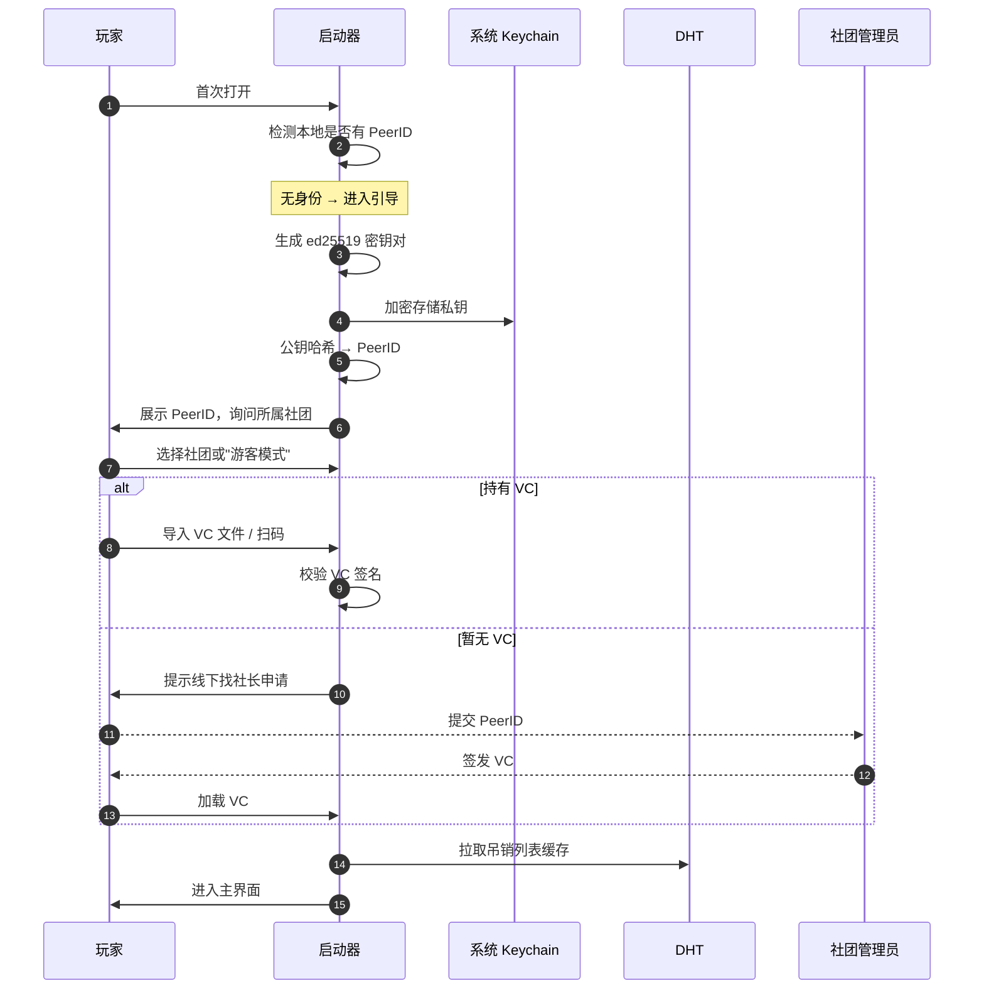
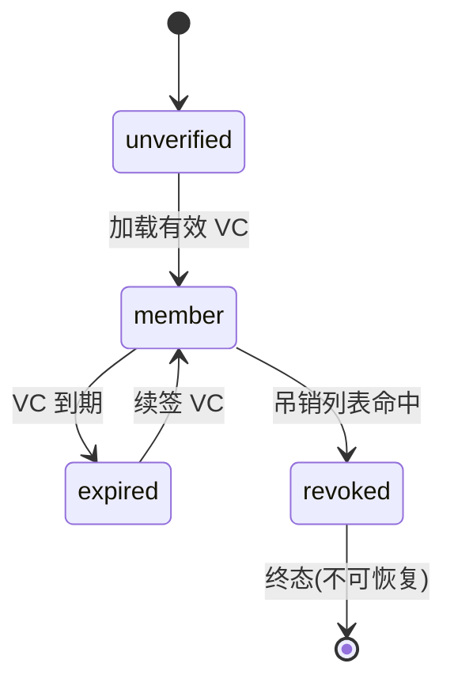
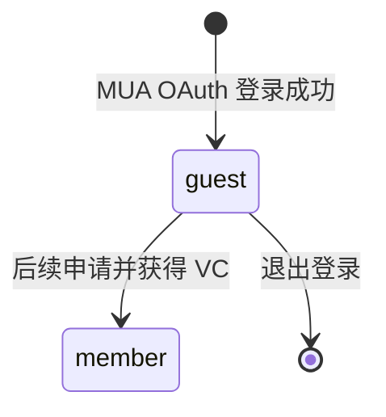
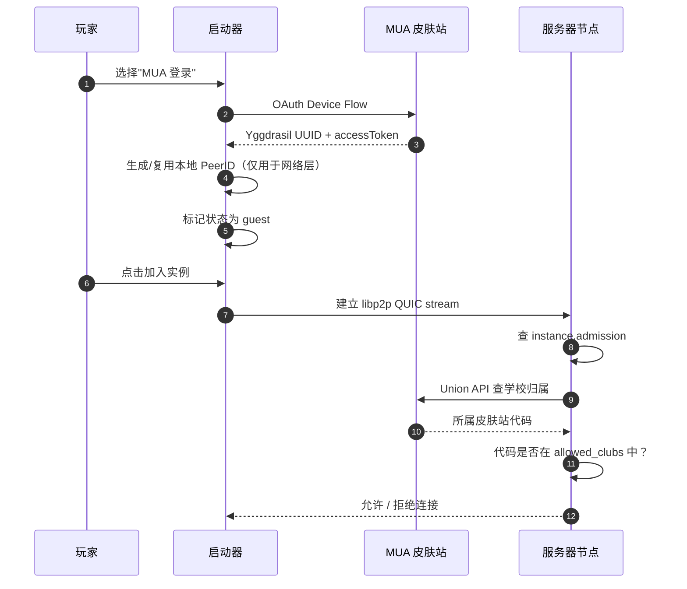

# 身份系统

启动器在本地生成并保管一对 ed25519 密钥（私钥经系统 keychain 加密后落盘），公钥派生 PeerID。社团 VC 由管理员签发后导入本地。

## 首次启动流程

私钥由系统 keychain 保护(macOS Keychain / Windows DPAPI / Linux libsecret),启动器只在签名时短暂解锁。导出私钥需要二次确认 + 系统认证，且会被记录到本地审计日志。

## 状态机

### VC 持有者状态

| 状态 | 玩家可见行为 |
| --- | --- |
| `unverified` | 仅可加入"公共服务器"标签下的实例 |
| `member` | 完整功能（游戏 + 治理） |
| `expired` | 仅可访问历史会话，需续签恢复 |
| `revoked` | 阻止所有连接，本地清空 VC |

### MUA 访客状态

未持有 VC 的玩家通过 MUA Yggdrasil 登录时，启动器标记其为 `guest`：

| 状态 | 玩家可见行为 |
| --- | --- |
| `guest` | 可加入 `mua_member` / `public` 实例；无治理权限；无积分 |

启动器每次打开时会异步刷新吊销列表；若设备长期离线，有效期超过 7 天后会强制要求联网。

## MUA 登录与身份桥接

启动器支持直接从 MUA 联合皮肤站登录，无需本地 VC：

同一 Yggdrasil UUID 在多台设备上登录时，启动器会生成本地 PeerID 用于网络层（DHT 缓存、连接状态），但这些 PeerID 不承载 VC，不参与治理。

## 本地 VC 校验范围

启动器**不在本地深度校验 VC 的颁发者权限**——这是服务器节点和共识层的职责。本地只做三件事：

1. 校验 VC 的签名(防止本地篡改)
2. 校验 `notBefore` / `expiresAt`
3. 在连接前查吊销列表

服务器节点收到玩家连接时会再次完整校验 VC、追溯颁发者权限链、检查共识层最新吊销状态。这种"本地预检 + 远端把关"的双层结构，既防止启动器伪造身份，也避免客户端因网络抖动错判正常 VC。

## 多设备

一个玩家可以在多台设备各自生成密钥，每台设备独立向社团申请 VC——同一玩家可以拥有多张 VC，**任一设备都可以独立连接**,任一设备的 VC 可以单独吊销而不影响其他设备。

启动器**不做账号同步**:两台设备的存档、好友列表、设置都互不影响。这与传统 launcher 的体验差异较大，需要在 UI 中明确告知玩家。
