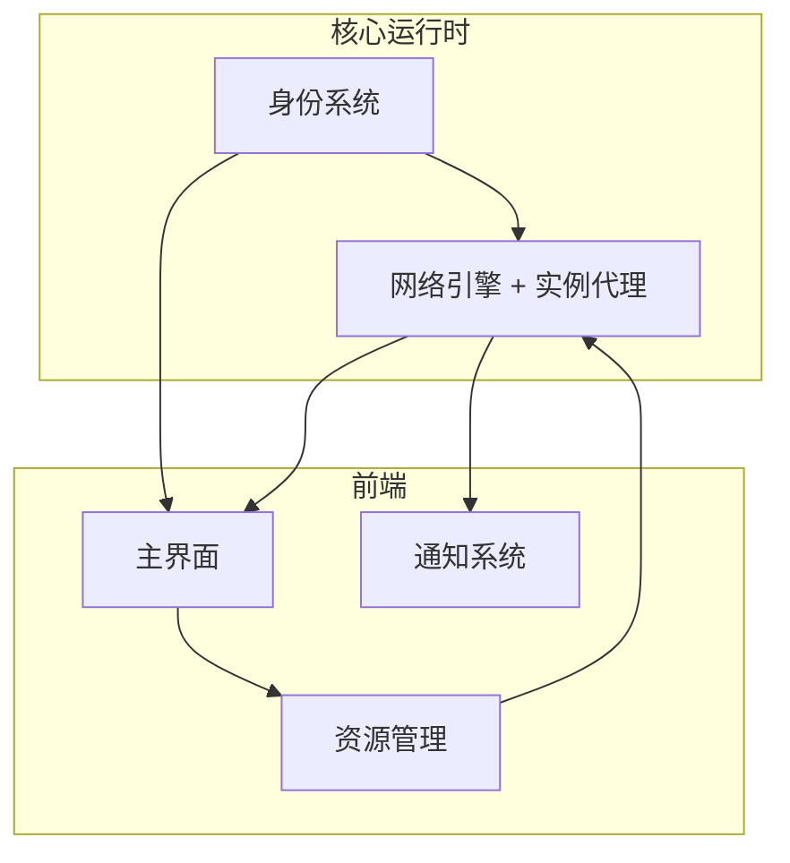

# FollyLauncher

FollyLauncher 是玩家接入本系统的入口。它在本地完成密钥派生、节点发现、协议代理、资源同步，让 MC 原版客户端"无修改"地接入对等网络。

::: info 关于 FollyLauncher
FollyLauncher 改自 [SJMCL](https://github.com/UNIkeEN/SJMCL)（上海交通大学 Minecraft 社团开发的启动器）。我们在 SJMCL 的基础上增加了 libp2p 网络层、VC 身份系统和 DHT 寻址能力，以适配八校互通的去中心化架构。
:::

启动器是一台**完整的对等节点**：持有自己的密钥，参与 DHT 寻址，与服务器节点进行 QUIC 直连或中继通信。所有功能模块在本地协作完成，不依赖任何中心化 API。

## 模块构成

| 模块 | 职责 |
| --- | --- |
| [身份系统](./identity) | PeerID 派生、社团 VC 持有与吊销验证、多设备 |
| [网络引擎与实例代理](./network) | libp2p Host、DHT 寻址、NAT 穿透、本地 TCP 代理、迁移期重连 |
| [主界面](./ui) | 服务器 / 房间 / 联赛 / 我的 四大页面、通知系统、资源管理 |

## 架构原则

**本地优先**
玩家身份、连接缓存、DHT 路由表全部驻留本地。即便所有引导节点不可达，启动器仍能展示历史状态、加入已缓存的实例。

**透明代理**
不修改 MC 客户端，不要求玩家手动配置网络。所有 P2P 寻址、中继切换、加密握手都在本地代理内部完成，MC 客户端只看到 `localhost:port` 这一个普通的局域网地址。

**最小权限**
启动器只请求必要的系统权限：网络栈、读写 MC 安装目录、调用系统 keychain。它不读取无关文件、不上传遥测、不安装后台服务。

**离线可达**
断网时不崩溃。已缓存的实例标记为"不可用"，可重新连接的会话保留 token，网络恢复后自动重连而不需要玩家干预。
