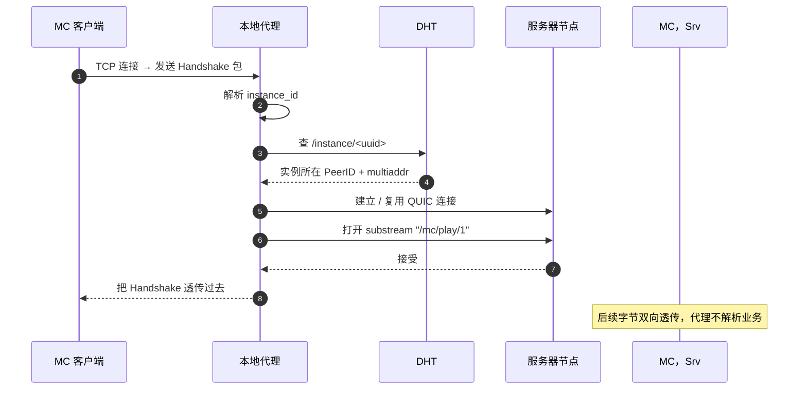

# 网络引擎与实例代理

启动器在 UI 启动前异步初始化 libp2p Host，并启动一个本地 TCP 代理，让 MC 客户端"无修改"地接入对等网。这两个模块共同实现了"原版 MC 连接 localhost:port"等价于"加入远端某节点上的实例"。

## libp2p Host 配置

| 配置项 | 取值 | 说明 |
| --- | --- | --- |
| Transport | QUIC + DCUtR | 不带 TCP fallback;QUIC 单一栈降低多路径复杂度 |
| Security | Noise | 比 TLS 握手少一轮 RTT |
| StreamMuxer | yamux | 控制流 / 数据流 / 心跳走不同 substream |
| RoutingTable | DHT 客户端模式 | 仅查询，不存储他人记录 |
| Identify | 启用 | 周期性交换 multiaddr,辅助 NAT 检测 |

DHT 选**客户端模式**的原因是玩家设备频繁离线，持有别人的路由记录会污染 DHT;客户端模式下启动器只发起查询，不响应他人的查询请求。

## 引导节点连接

启动器内置一份 `bootstrap_peers.toml`(3–5 个公网 VPS 上的 DHT 种子节点)。启动顺序：

1. 并发向所有引导节点发起 QUIC 连接，首个成功的视为可用入口
2. 拉取 DHT 路由表
3. Announce 自身 multiaddr,以便其他节点反向连接
4. 全部失败 → 标记网络离线，后续 UI 走"仅本地缓存"分支

引导节点**只承担 DHT 入口**,不存储业务数据、不路由游戏流量。即便它们同时下线，既有连接也不会断；新玩家则需等到任一引导节点恢复或本地配置新地址。

## 服务器节点发现

启动器在主界面打开后周期性查询 DHT `/server/` 前缀：

- 启动后 5 秒内首次查询
- 之后每 60 秒增量刷新(只拉取 `last_seen` 比本地缓存更新的记录)
- 本地缓存按 PeerID 分桶，TTL 5 分钟

每个服务器节点会通过 `SubscribeEvents` 的 protobuf over libp2p 事件流发送实例上下线变更。该事件只用于让启动器失效本地缓存；实例列表的权威内容仍通过 `ListInstances` / `GetInstance` 拉取。

## 延迟测量

加入实例前向玩家展示"延迟 (ms)"。直接发 ICMP 在校园网常被阻断，因此采用 **QUIC 0-RTT handshake timing**:

1. 对每个候选节点尝试一次 QUIC 0-RTT 握手
2. 测量从 `ClientHello` 到 `ServerHello` 的 RTT
3. 缓存结果，5 分钟过期

并发度限制为 8（避免在校园网下触发流量整形）。失败的节点显示"延迟未知"，UI 中明确区分。

## 中继优先级

启动器在 [NAT 穿透策略](../../design/network#nat-穿透策略) 中担任发起方，具体的中继候选选择规则：

1. 与目标节点**同社团**的服务器节点(网络位置邻近，跳数最少)
2. 同社团之外、有公网 IP 的服务器节点
3. `relay` 角色的专用节点

中继切换通过快速重连实现：代理检测到 relay 节点切换信号后，断开当前 TCP 桥接并重建到新中继的 QUIC 连接。MC 客户端会触发内置重连逻辑，重新连接到本地代理，此时代理已路由至新中继。玩家体验为一次短暂的"连接断开/重连"周期（通常 3–10 秒），而非透明的连接迁移。

## 连接缓存

每条成功建立的 QUIC 连接缓存 5 分钟：

- 同一服务器节点的多个实例**共享一条 QUIC 连接**,通过不同 substream 区分
- 玩家退出实例时连接保留，30 秒内再次进入相同节点免握手
- 长时间不活跃的连接由 keepalive 自动 GC

## 本地 TCP 代理

启动 MC 客户端前，启动器在 `127.0.0.1` 上开一个临时 TCP 监听端口，然后调用 `minecraft --server localhost:<port>`。MC 客户端把这个端口当成普通局域网服务器，代理在内部把它桥接到远端实例。



握手包字段提取：

| 字段 | 类型 | 用途 |
| --- | --- | --- |
| Packet Length | VarInt | 框定包边界 |
| Packet ID | 0x00 | 必须为 Handshake |
| Protocol Version | VarInt | 版本协商参考 |
| Server Address | String | 提取 `instance=<uuid>` 参数 |
| Server Port | u16 | 忽略(代理已固定本地端口) |
| Next State | VarInt | 1 = status,2 = login |

代理只读取握手包的前几十字节就能拿到 `instance_id`,之后所有字节都是**双向透传**——零拷贝转发，延迟接近原生 TCP。

## 多实例并发

玩家可能同时打开多个 MC 窗口（主存档 + 联赛对战房），代理为每个窗口分配独立的会话（ProxySession），记录实例 ID、本地端口、MC 进程 ID、服务器节点 PeerID、子流 ID、连接状态（connecting / active / migrating / closed）和进出字节数。

会话表对外不暴露，但"我的页 → 网络诊断"会以表格形式展示当前所有活跃 session,排查多开冲突时直接看这张表。

## 迁移期重连

当服务器节点通知客户端实例已迁移到新宿主时，代理采用**快速重连**策略（而非透明字节流切换）：

### 状态机

```
Active ──(MIGRATION_PENDING 帧)──▶ MigrationPending
MigrationPending ──(DHT 重解析 + QUIC 建连)──▶ Reconnecting
Reconnecting ──(成功)──▶ Active（session 已指向新 peer）
Reconnecting ──(超时 > 30s)──▶ Failed
```

### 迁移流程

1. **检测**: 旧 substream 收到 `migration_pending` 控制帧 → 代理标记 session 为 `MigrationPending`，开始缓冲到达字节（上限 64 KiB）
2. **健康检查**: 通过 ControlClient 向当前节点发起 `probe_migration`，确认目标节点状态为 `ready`
3. **DHT 重解析**: 重新查询 DHT `/instance/<uuid>` 获取实例的新 PeerID
4. **建连**: 与新节点建立 QUIC 连接并打开 substream（若 5 分钟内有缓存连接则免握手）
5. **状态更新**: 新 stream 验证通过后，更新 session 的 `target_peer_id` 指向新节点，并将 session 状态切回 `active`
6. **触发客户端重连**: 新 stream 被**丢弃**（`drop(new_stream)`）——当前无法在不中断 TCP 连接的前提下原子性地切换字节流。随后旧 TCP 桥接因缓冲区溢出或超时而断开，MC 客户端的内置 TCP 重连逻辑被触发
7. **重连路由**: MC 客户端重新连接到本地代理 (`127.0.0.1:<port>`)，代理此时已持有指向新节点的 session 状态，将新连接路由至正确的目标

### 玩家体验

MC 客户端会经历一次完整的"连接断开 → 重新连接"周期：
- 屏幕短暂显示连接丢失提示（取决于 MC 版本，约 3–10 秒）
- 如果新节点可达且响应正常，客户端自动重新加入实例
- 如果新节点在 30 秒内不可达，session 进入 `Failed` 状态，客户端停留在"连接失败"界面

### 设计说明

当前阶段采用快速重连策略而非透明字节流迁移。完全的连接迁移（如通过 QUIC connection migration 或应用层 stream splicing 实现无中断切换）需要 Minecraft 客户端侧的协议支持——例如客户端需能识别迁移信号并主动重建连接，或代理需实现完整的 TCP 状态序列化/反序列化。这属于后续阶段的规划范围。
