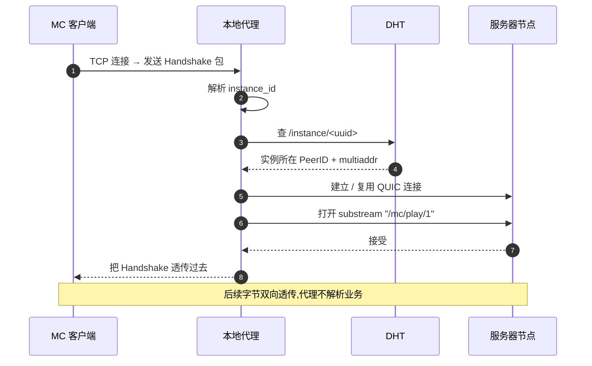

# 网络引擎与实例代理

启动器在 UI 启动前异步初始化 libp2p Host,并启动一个本地 TCP 代理把 MC 客户端"无修改"地接入对等网。这两个模块共同把"原版 MC 连接 localhost:port"等价于"加入运行在远端某节点上的实例"。

## libp2p Host 配置

| 配置项 | 取值 | 说明 |
| --- | --- | --- |
| Transport | QUIC + DCUtR | 不带 TCP fallback;QUIC 单一栈降低多路径复杂度 |
| Security | Noise | 比 TLS 握手少一轮 RTT |
| StreamMuxer | yamux | 控制流 / 数据流 / 心跳走不同 substream |
| RoutingTable | DHT 客户端模式 | 仅查询,不存储他人记录 |
| Identify | 启用 | 周期性交换 multiaddr,辅助 NAT 检测 |

DHT 选**客户端模式**的原因是玩家设备频繁离线,持有别人的路由记录会污染 DHT;客户端模式下启动器只发起查询,不响应他人的查询请求。

## 引导节点连接

启动器内置一份 `bootstrap_peers.toml`(3–5 个公网 VPS 上的 DHT 种子节点)。启动顺序:

1. 并发向所有引导节点发起 QUIC 连接,首个成功的视为可用入口
2. 拉取 DHT 路由表
3. Announce 自身 multiaddr,以便其他节点反向连接
4. 全部失败 → 标记网络离线,后续 UI 走"仅本地缓存"分支

引导节点**只承担 DHT 入口**,不存储业务数据、不路由游戏流量。即便它们同时下线,既有连接也不会断;新玩家则需等到任一引导节点恢复或本地配置新地址。

## 服务器节点发现

启动器在主界面打开后周期性查询 DHT `/server/` 前缀:

- 启动后 5 秒内首次查询
- 之后每 60 秒增量刷新(只拉取 `last_seen` 比本地缓存更新的记录)
- 本地缓存按 PeerID 分桶,TTL 5 分钟

每个服务器节点会再通过 PubSub `mc.events.cluster` 推送实例上下线变更,启动器订阅后即可在不轮询的前提下保持实例列表新鲜。

## 延迟测量

加入实例前向玩家展示"延迟 (ms)"。直接发 ICMP 在校园网常被阻断,因此采用 **QUIC 0-RTT handshake timing**:

1. 对每个候选节点尝试一次 QUIC 0-RTT 握手
2. 测量从 `ClientHello` 到 `ServerHello` 的 RTT
3. 缓存结果,5 分钟过期

并发度限制为 8(避免在校园网下触发流量整形)。失败的节点显示"延迟未知"而非超大数值,UI 中明确区分。

## 中继优先级

启动器在 [NAT 穿透策略](../../design/network.md#nat-穿透策略) 中担任发起方,具体的中继候选选择规则:

1. 与目标节点**同社团**的服务器节点(网络位置邻近,跳数最少)
2. 同社团之外、有公网 IP 的服务器节点
3. `relay` 角色的专用节点

中继切换不需要 MC 客户端感知:QUIC 连接迁移会让玩家体验到一次约 100–200 ms 的卡顿,然后透明恢复。

## 连接缓存

每条成功建立的 QUIC 连接缓存 5 分钟:

- 同一服务器节点的多个实例**共享一条 QUIC 连接**,通过不同 substream 区分
- 玩家退出实例时连接保留,30 秒内再次进入相同节点免握手
- 长时间不活跃的连接由 keepalive 自动 GC

## 本地 TCP 代理

启动 MC 客户端前,启动器在 `127.0.0.1` 上开一个临时 TCP 监听端口,然后调用 `minecraft --server localhost:<port>`。MC 客户端把这个端口当成普通局域网服务器,代理在内部把它桥接到远端实例。



握手包字段提取:

| 字段 | 类型 | 用途 |
| --- | --- | --- |
| Packet Length | VarInt | 框定包边界 |
| Packet ID | 0x00 | 必须为 Handshake |
| Protocol Version | VarInt | 版本协商参考 |
| Server Address | String | 提取 `instance=<uuid>` 参数 |
| Server Port | u16 | 忽略(代理已固定本地端口) |
| Next State | VarInt | 1 = status,2 = login |

代理只读取握手包的前几十字节就能拿到 `instance_id`,之后所有字节都是**双向透传**——零拷贝转发,延迟接近原生 TCP。

## 多实例并发

玩家可能同时打开多个 MC 窗口(主存档 + 联赛对战房),代理为每个窗口分配独立的 `ProxySession`:

```ts
interface ProxySession {
  instance_id: string;
  local_port: number;
  mc_pid: number;
  peer_id: string;          // 当前承载该实例的服务器节点
  substream_id: string;
  state: "connecting" | "active" | "migrating" | "closed";
  bytes_in: number;
  bytes_out: number;
}
```

会话表对外不暴露,但"我的页 → 网络诊断"会以表格形式展示当前所有活跃 session,排查多开冲突时直接看这张表。

## 迁移期重连

服务器节点向客户端通知实例迁移时,流程对 MC 客户端透明:

1. 旧 substream 收到 `migration_pending` 控制帧 → 代理标记 session 为 `migrating`
2. 代理重新查 DHT,拿到新的 PeerID
3. 与新节点建立 QUIC + substream(若 5 分钟内有缓存连接则免握手)
4. 把已经发送但未确认的字节重发,然后切换字节流
5. session 切回 `active`,MC 客户端只感受到 1–3 秒的网络抖动

如果新节点暂时不可达,代理会在本地缓存 30 秒待发字节,期间 MC 客户端只显示卡顿;超时后才向 MC 抛出连接重置,触发"返回主界面"。
