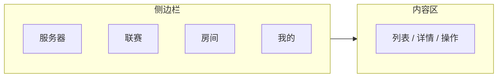

# 主界面

启动器面向的玩家既包括没有任何 P2P 概念的普通同学,也包括运维节点的社团技术骨干。界面要做到三件事:

1. **掩盖去中心化的复杂性**——首屏看到的是"一堆服务器"而不是"一堆 PeerID"
2. **暴露足够的诊断信息**——延迟、所属社团、节点信誉分都可见
3. **保持平台原生体验**——使用各 OS 原生窗口装饰、菜单项、快捷键

## 布局结构



侧边栏始终可见,4 个一级入口固定;内容区根据所选入口切换。窗口最小宽度 960 px——更窄时侧边栏自动收起为顶部 Tab。

## 服务器页

主功能页,默认入口。展示当前可加入的所有实例。

每个实例卡片显示:

| 字段 | 来源 | 用途 |
| --- | --- | --- |
| 名称 + 类型图标 | 服务器节点声明 | 一眼区分房间 / 服务 |
| 游戏模式 | 实例配置 | 生存 / 创造 / 小游戏 |
| 玩家在线 | PubSub 订阅 | 实时,2 秒级延迟 |
| 延迟 | QUIC RTT 测量 | 毫秒级 |
| 主机社团 | VC 标签 | 帮助玩家选"自己人"的实例 |
| Mod 状态 | 本地比对 | ✅ 已就绪 / ⚠️ 缺失 / ⛔️ 版本不匹配 |

筛选维度:类型、游戏模式、延迟范围、社团、Mod 状态。搜索按名称匹配。点击卡片展开详情(描述 / mod 列表 / 在线玩家 / 地图预览)。

"加入"按钮的实际行为:

1. 比对资源 → 若缺失先同步
2. 启动本地代理
3. 调起 MC 客户端

## 房间页

快速创建临时实例的入口。表单字段:

- 游戏模式(下拉)
- 地图模板(社团预设 + 自定义上传)
- 可见性(公开 / 社团内 / 仅邀请链接)
- 最大玩家数(滑动条)
- 持续时长(默认 6 小时,无人后 15 分钟自动销毁)

点击"创建"→ 启动器向最近的服务器节点提交 `CreateRoom` 请求 → 节点触发去中心化调度 → 返回实例 ID → 启动器自动跳转到"加入"流程。

> 房间是临时实例,玩家全部退出后销毁。需要持续运行的服务应在管理终端申请。

## 联赛页

赛季维度的内容入口:

- 顶部:**当前赛季概览** ——总积分榜 Top 10、个人排名变化曲线
- 中部:**进行中比赛** ——按时间倒序,显示对阵双方、剩余时间、是否已报名
- 底部:**我的赛事** ——已报名 / 已完赛,支持一键查看战绩

组队管理通过侧边面板进入,支持创建战队 / 加入战队(基于邀请码)、战队成员列表、战队赛季积分。

## 我的页

玩家的"控制台"。

| 区块 | 内容 |
| --- | --- |
| 身份信息 | PeerID 摘要、社团徽章、角色(玩家 / 管理员)、注册时间 |
| 积分 | 总积分、当前赛季积分、积分明细(可下钻到产生记录) |
| VC 管理 | 已加载 VC 列表、查看详情、导出、刷新吊销状态 |
| 设置 | MC 客户端路径、语言、缓存目录、自动更新、网络诊断 |
| 关于 | 版本号、引导节点列表、libp2p Host 地址 |

"网络诊断"是面向技术用户的入口,展示当前 DHT 路由表大小、各连接的中继状态、最近一次穿透尝试日志。日常玩家不会用到,出问题时社团运维可以直接读取。

## 加入实例的关键链路

```mermaid
flowchart TB
  U[用户点击"加入"] --> R[检查 mod / MC 版本]
  R -->|缺失| D[下载资源]
  R -->|齐全| P[启动本地代理]
  D --> P
  P --> M[启动 MC 客户端 --server localhost:port]
  M --> H[代理解析握手包]
  H --> Q[DHT 查实例位置 → 建 QUIC stream]
  Q --> J[玩家进入服务器]
```

## 通知系统

启动器订阅以下 PubSub 频道,把消息分类后投放到原生通知中心或应用内:

| 频道 | 通知类型 | 投放 |
| --- | --- | --- |
| `mc.events.cluster` | 关注的实例上下线、迁移 | 系统通知 + 应用内 |
| `mc.events.tournament` | 联赛报名、对阵、结果 | 系统通知 + 应用内 |
| `mc.events.governance` | 影响自己的提案(如 VC 续签) | 仅应用内 |
| `mc.events.system` | 客户端版本更新、维护公告 | 系统通知 + 应用内 |

每条通知本地保留 7 天。"我的 → 通知中心"统一展示历史,可按频道筛选。原生通知投放在 macOS 走 `UNUserNotificationCenter`、Windows 走 `ToastNotificationManager`、Linux 走 `libnotify`,失败时降级到应用内红点。

订阅在 libp2p Host 启动后立即开启,断网期间消息直接丢弃——启动器不实现可靠队列,因为治理类消息共识层已有冗余,游戏类消息错过即过时。

## 资源管理

启动器把 mod、客户端配置、地图预览、自定义资源包视作**内容寻址资源**,实例 metadata 中声明每个文件的 SHA256:

```ts
interface ResourceManifest {
  instance_id: string;
  mc_version: string;
  files: Array<{
    path: string;        // 相对 .minecraft 的路径
    hash: string;        // SHA256
    size: number;
    required: boolean;   // 是否阻塞加入
  }>;
}
```

加入实例前的资源同步流程:

1. 拉取目标实例的 `ResourceManifest`
2. 对照本地 `~/.jlucraft/resources/<hash>` 缓存,列出缺失文件
3. **BitSwap 分块下载**——同时从所有持有该 chunk 的节点拉取
4. 校验 SHA256,通过则硬链接到 `.minecraft/<path>`
5. 失败的非 `required` 文件可跳过,玩家手动确认是否继续

资源缓存按内容寻址(`<hash>` 命名),不同实例如果使用相同 mod 文件不会重复占用磁盘。缓存上限默认 5 GB,LRU 淘汰;超过 90 天未访问的资源即便未达上限也会清理,避免老旧 mod 永久驻留。

MC 版本由启动器统一管理:首次需要某版本时从镜像仓库下载 `client.jar` 与启动器 manifest;同一大版本的多个实例共享同一 jar,只在 `--game-dir` 上做隔离。
