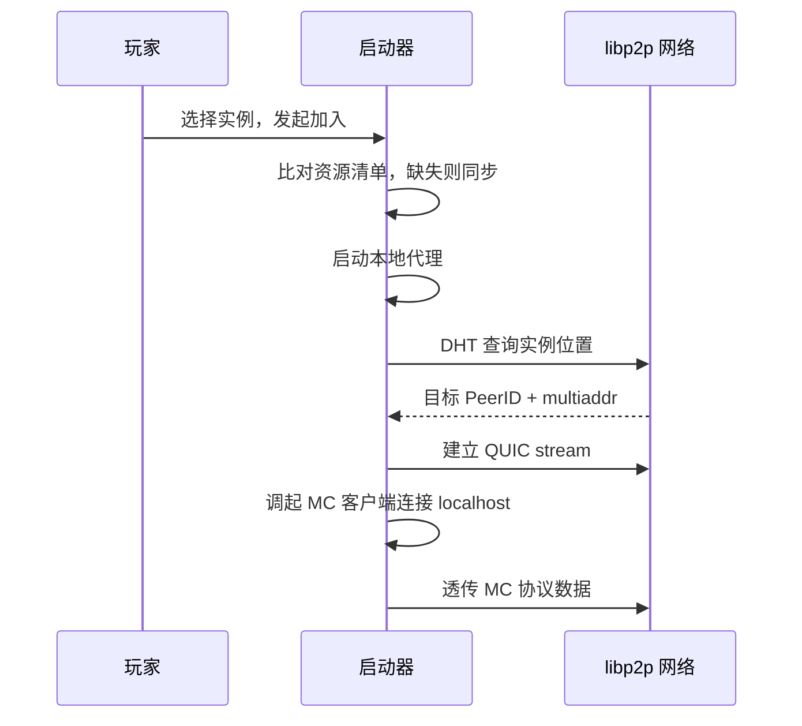

# 主界面

启动器面向的玩家既有不懂 P2P 的普通同学，也有运维节点的社团技术骨干；持有平台 VC 的普通成员也在这里参与链上治理。主界面承担三项职责：

1. **掩盖去中心化的复杂性**——将底层 PeerID 抽象为玩家熟悉的服务器列表
2. **暴露足够的诊断信息**——延迟、所属社团、节点信誉分都可见
3. **保持平台原生体验**——使用各 OS 原生窗口装饰、菜单项、快捷键

## 功能入口

主界面划分四个功能区：

| 入口 | 职责 |
| --- | --- |
| 实例浏览 | 展示当前可加入的所有实例，提供筛选与搜索 |
| 房间创建 | 快速创建临时实例的入口，提交 `CreateRoom` 请求后由调度器分配节点 |
| 联赛面板 | 赛季概览、进行中比赛、个人赛事记录、战队管理 |
| 治理 | 查看链上提案、参与成员投票 / 反馈、提交身份 / 房间 / 联赛相关申请 |
| 个人中心 | 身份信息、积分、VC 管理、设置、网络诊断 |

## 加入实例流程

资源同步使用 BitSwap 协议分块下载，同时从持有该 chunk 的所有节点拉取，通过 SHA256 校验。详见下文资源管理。

## 事件订阅

启动器通过 `SubscribeEvents` 建立 protobuf over libp2p 事件流，订阅以下 topic 过滤：

| topic 过滤 | 事件 |
| --- | --- |
| `cluster` | 关注的实例上下线、迁移 |
| `tournament` | 联赛报名、对阵、结果 |
| `governance` | 影响自己的提案 |
| `system` | 版本更新、维护公告 |

事件流用于刷新 UI 和生成本地系统通知。它不是权威状态源；启动器收到事件后按需通过 protobuf over libp2p 拉取实例、赛事或治理详情。订阅在 libp2p Host 启动后开启，断网期间不补发通知；恢复在线后先同步快照再继续订阅事件流。

## 资源管理

启动器将 mod、客户端配置、地图预览、自定义资源包视作**内容寻址资源**，实例 metadata 中声明每个文件的 SHA256。

资源同步流程：

1. 拉取目标实例的 `ResourceManifest`
2. 对照本地 `~/.follylauncher/resources/<hash>` 缓存，列出缺失文件
3. **BitSwap 分块下载**——同时从所有持有该 chunk 的节点拉取
4. 校验 SHA256，通过则硬链接到 `.minecraft/<path>`
5. 失败的非 `required` 文件可跳过，玩家手动确认是否继续

资源缓存按内容寻址，不同实例如果使用相同 mod 文件不会重复占用磁盘。缓存上限默认 5 GB，LRU 淘汰；超过 90 天未访问的资源也会清理。

MC 版本由启动器统一管理：首次需要某版本时从镜像仓库下载 `client.jar`；同一大版本的多个实例共享同一 jar，只在 `--game-dir` 上做隔离。
