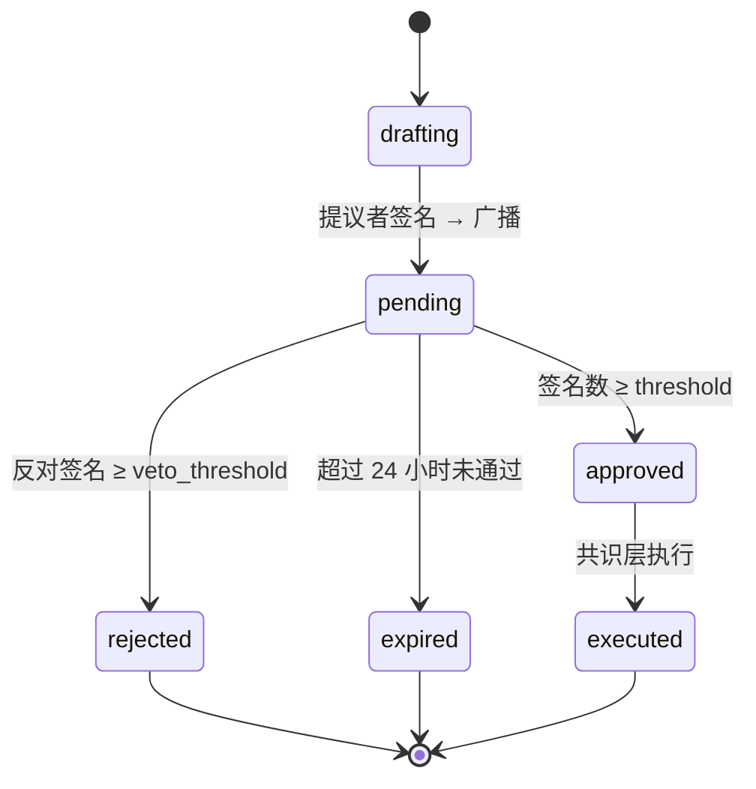
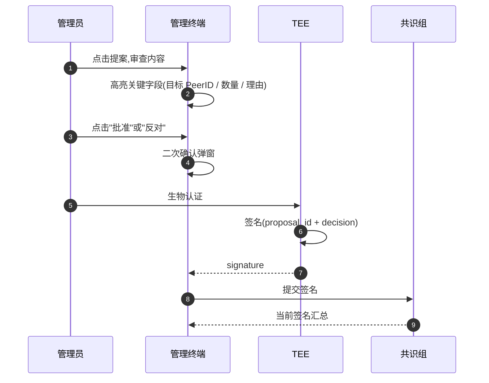
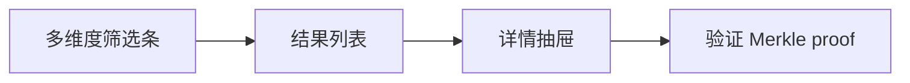
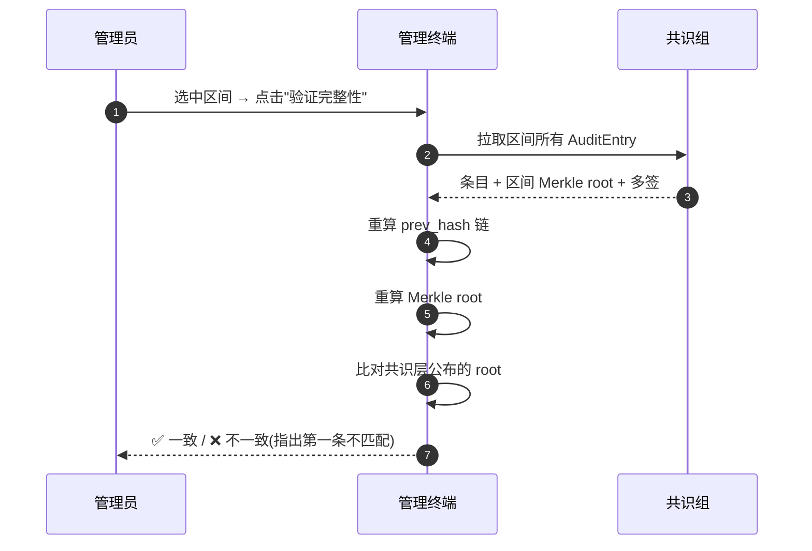

# 治理中心与审计

治理中心是管理员行使**集体权力**的入口:节点准入、管理员任免、配置变更、积分发放——一切跨越权限边界的动作都在这里以"提案 + 多签"的方式发生。审计日志则把所有已执行的动作沉淀为可追溯、不可篡改的记录。

## 提案状态机

[治理层](../../design/governance.md) 定义了多签提案的密码学语义。终端在 UI 层把提案抽象成一个有限状态机,方便管理员快速判断当前能做什么:



| 状态 | 含义 | 是否可操作 |
| --- | --- | --- |
| `drafting` | 创建中,仅本地 | ✅ 可编辑 |
| `pending` | 已广播,等待签名 | ✅ 可签名 / 反对 |
| `approved` | 多签门槛达成 | ⏳ 等待执行 |
| `rejected` | 反对票超过否决阈值 | ❌ 不可恢复 |
| `expired` | 超过 24 小时未通过 | ❌ 不可恢复 |
| `executed` | 共识层已应用 | ✅ 可查审计 |

提案的多签门槛、否决阈值、过期时间在共识层硬编码,管理员**不能通过提案修改这些参数**——这是平台治理的不可变基石。

## 待签名提案列表

主屏幕展示需要本管理员关注的提案:

| 字段 | 说明 |
| --- | --- |
| 标题 / 类型 | 一眼判断是否相关 |
| 提议者 | PeerID + 社团徽章 |
| 已签名 / 所需 | 例:2/3 |
| 反对票 | 例:0/2 |
| 剩余时间 | 24h 倒计时 |
| 紧急度 | 红 / 黄 / 灰(由提案类型决定) |

按"紧急度 + 剩余时间"排序,确保关键提案不会被淹没。已签名 / 已反对的提案默认折叠,可一键展开复审。

## 签名 / 反对操作



**审查内容**这一步在 UI 中刻意做得"慢":关键字段比常规字号更大、有色块、必须滑动到提案末尾才能解锁按钮。这避免管理员"批量秒批"——一次手滑可能让一台来路不明的节点入网。

## 提案模板

提案类型采用模板化,降低出错概率:

| 类型 | 提议门槛 | 多签门槛 | Payload 字段 |
| --- | --- | --- | --- |
| 添加节点 | 单管理员 | 1/2 社长 | `{peer_id, role, labels, justification}` |
| 移除节点 | 单管理员 | 1/2 社长 | `{peer_id, reason}` |
| 任命管理员 | 单社长 | 2/3 社长 | `{target_peer_id, club, scope}` |
| 罢免管理员 | 单管理员 | 2/3 社长 | `{target_peer_id, reason}` |
| 修改配置 | 单管理员 | 1/2 社长 | `{config_path, new_value, justification}` |
| 积分发放 | 单管理员 | 视金额定 | `{player_id, amount, reason}` |
| 紧急吊销 | 单本人 | 当事人 + 1 社长 | `{target_pubkey, reason}` |

每个模板有针对性的字段校验:例如"积分发放"金额超过 10000 自动升级为更高门槛、"修改配置"会显示当前值与新值的 diff。

## 成员管理

提供按社团筛选的成员视图:

| 字段 | 说明 |
| --- | --- |
| PeerID 摘要 | 一眼区分 |
| 角色 | 玩家 / 管理员 / 社长 |
| VC 状态 | 有效 / 过期 / 吊销 |
| 当前赛季积分 | 链接到积分明细 |
| 活跃度 | 30 天内在线时长 |

操作:

- **签发社员 VC**:管理员对玩家的本社团 VC 申请,通过后单签即生效
- **吊销 VC**:走多签提案
- **任命管理员**:发起 [任命管理员](#提案模板) 提案
- **设置自定义字段**:在 VC 中嵌入额外属性,如赛季冠军徽章

VC 模板管理在子页面内展开,允许管理员自定义新的 VC 类型(例如某个限定活动的临时通行证),模板上链审批后才能在签发界面使用。

## 审计日志

任何被执行的写操作都会在共识层落下一条 `AuditEntry`,管理终端为这些条目提供查询、追踪、防篡改验证的入口。

### 字段定义

```ts
interface AuditEntry {
  id: string;                       // 共识层全局递增
  ts: number;                       // 毫秒时间戳
  actor_pubkey: string;             // 触发者 / 多签提议者
  actor_role: "president" | "admin" | "member" | "node";
  cmd_type: string;                 // stop_instance / migrate / grant_vc / ...
  target: string;                   // 实例 ID / PeerID / VC ID
  payload_hash: string;             // 完整参数的 SHA256
  signatures: Array<{               // 多签条目可能多份
    pubkey: string;
    sig: string;
  }>;
  outcome: "success" | "rejected" | "error";
  error?: string;                   // 失败原因
  prev_hash: string;                // 链式哈希,指向上一条
}
```

`prev_hash` 让审计日志构成一条**单向哈希链**:任何中段被篡改都会让后续 hash 全部对不上。即便共识层被入侵、有人想抹掉某条记录,也必须重写之后所有条目并让超过 2/3 社长重新多签。

### 查询界面



| 维度 | 取值 |
| --- | --- |
| 时间范围 | 任意起止时间 |
| 操作类型 | `cmd_type` 多选 |
| 触发者 | PeerID / 角色 |
| 目标 | 实例 ID / 玩家 PeerID / VC ID |
| 结果 | success / rejected / error |
| 关键词 | payload 中的全文模糊匹配 |

结果列表只展示摘要(操作 + 触发者 + 时间 + 结果),点击展开查看完整 payload、签名列表、关联的 Match / 提案。每条记录默认展示前后各 5 条作为时间上下文,便于追踪一连串相关动作(比如"先停服 → 再迁移 → 再启动"是否合理)。

### 不可篡改性验证

任何管理员都可以本地校验某段审计日志没有被改动:



每天 00:00 共识层把当日全部 `AuditEntry` 计算 Merkle root 并对外公告。审计验证只需要拉取条目和已公告的 root,就能在不依赖共识组诚实的前提下证明记录完整性——这等同于把链上记录"钉死"。

### 异常检测

终端后台周期性扫描审计流,触发以下规则时把对应条目高亮提醒:

- 短时间内同一管理员的高频敏感操作(> 10 次 / 小时)
- 非工作时段的写操作(凌晨 1–5 点)
- 同一目标(节点 / 玩家)在 24 小时内被多次操作
- 失败率突然上升(可能在试探权限边界)

提醒不会自动阻断——异常不等于恶意,但能让其他社长更快知会。
