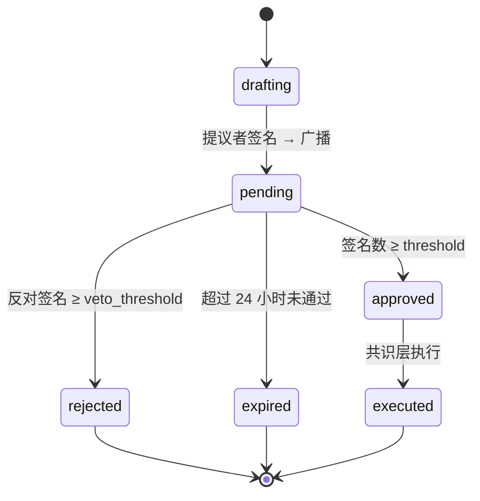
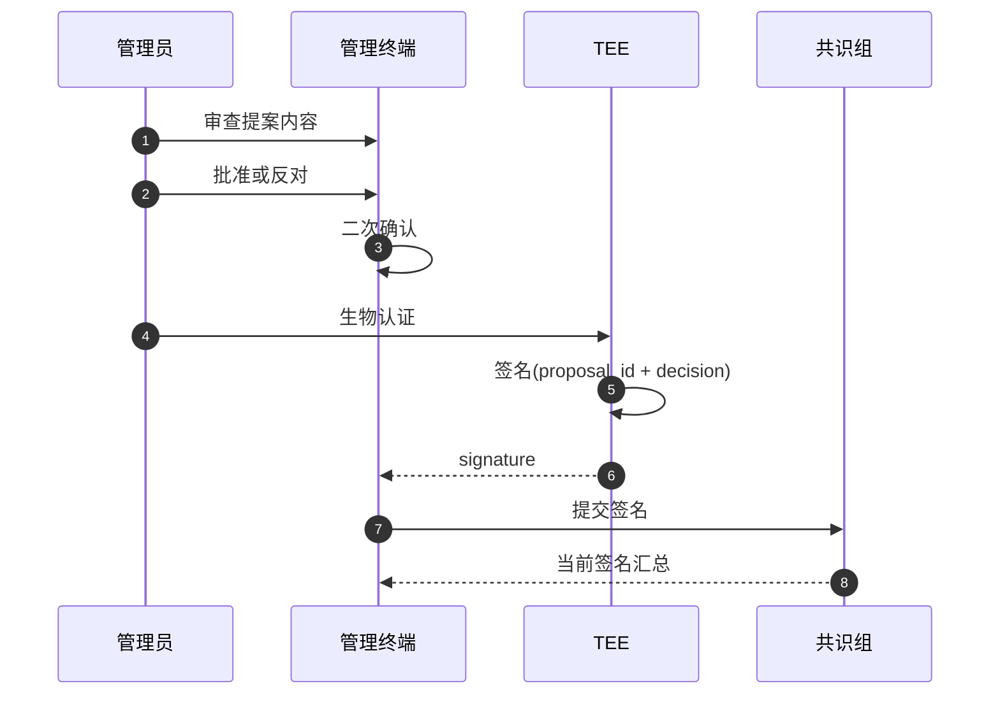
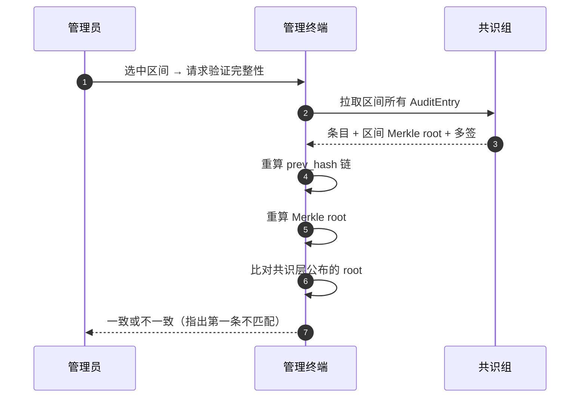

# 治理中心与审计

治理中心是管理员行使**集体权力**的入口：节点准入、管理员任免、配置变更、积分发放——一切跨越权限边界的动作都在这里以"提案 + 多签"的方式发生。审计日志则把所有已执行的动作沉淀为可追溯、不可篡改的记录。

## 提案状态机

[治理层](../../design/governance.md) 定义了多签提案的密码学语义。终端将提案抽象为有限状态机，方便管理员快速判断当前能做什么：

| 状态 | 语义 | 行为约束 |
| --- | --- | --- |
| `drafting` | 创建中，仅本地 | 可编辑 |
| `pending` | 已广播，等待签名 | 可签名或反对 |
| `approved` | 多签门槛达成 | 等待执行 |
| `rejected` | 反对票超过否决阈值 | 不可恢复 |
| `expired` | 超过 24 小时未通过 | 不可恢复 |
| `executed` | 共识层已应用 | 可查审计 |

多签门槛、否决阈值、过期时间等**治理参数在共识层存储为可调配置**，可通过 `update_governance_params` 类型提案修改。该类型提案本身受最高级别保护：需要 **≥ 3/4 社长签名（或全体一致，取较大值）**，且生效前有 **48 小时冷静期**。

## 提案签名流程

签名操作的权限链：管理员需持有对应级别的 VC，且 VC 在共识层未被吊销。

## 提案模板

提案类型采用模板化以降低出错概率：

| 类型 | 提议门槛 | 默认多签门槛 | Payload 字段 |
| --- | --- | --- | --- |
| 添加节点 | 单管理员 | 1/2 社长 | `{peer_id, role, labels, justification}` |
| 移除节点 | 单管理员 | 1/2 社长 | `{peer_id, reason}` |
| 任命管理员 | 单社长 | 2/3 社长 | `{target_peer_id, club, scope}` |
| 罢免管理员 | 单管理员 | 2/3 社长 | `{target_peer_id, reason}` |
| 修改配置 | 单管理员 | 1/2 社长 | `{config_path, new_value, justification}` |
| 积分发放 | 单管理员 | 视金额定 | `{player_id, amount, reason}` |
| 紧急吊销 | 单本人 | 当事人 + 1 社长 | `{target_pubkey, reason}` |
| **修改治理参数** | **单社长** | **≥ 3/4 社长（或全体）+ 48h 冷静期** | `{param_key, new_value, justification}` |

每个模板有针对性校验：例如积分发放金额超过 10000 自动升级门槛，修改配置会校验字段只读属性。

## 成员管理

提供按社团筛选的成员视图，支持以下操作：

- **签发社员 VC**：管理员对玩家的本社团 VC 申请，通过后单签即生效
- **吊销 VC**：需走多签提案
- **任命管理员**：发起任命管理员提案
- **设置自定义字段**：在 VC 中嵌入额外属性
- **VC 模板管理**：自定义新的 VC 类型，模板上链审批后可用

## 审计日志

任何被执行的写操作都会在共识层落下一条 `AuditEntry`，管理终端为这些条目提供查询、追踪、防篡改验证。

### 字段定义

| 字段 | 类型 | 说明 |
| ---- | ---- | ---- |
| `id` | string | 共识层全局递增 |
| `ts` | number | 毫秒时间戳 |
| `actor_pubkey` | string | 触发者 / 多签提议者 |
| `actor_role` | string | president / admin / member / node |
| `cmd_type` | string | 操作类型 |
| `target` | string | 实例 ID / PeerID / VC ID |
| `payload_hash` | string | 完整参数的 SHA256 |
| `signatures` | 数组 | 多签条目，每项包含公钥和签名 |
| `outcome` | string | success / rejected / error |
| `error` | string（可选） | 失败原因 |
| `prev_hash` | string | 链式哈希，指向上一条 |

`prev_hash` 让审计日志构成一条**单向哈希链**：任何中间条目被篡改，后续 hash 全都对不上。

### 查询能力

审计日志支持以下维度筛选：时间范围、操作类型、触发者、目标、结果、关键词全文模糊匹配。结果展示摘要信息，可展开查看完整 payload、签名列表、关联记录。

### 不可篡改性验证

每天 00:00 共识层计算当日全部 `AuditEntry` 的 Merkle root 并对外公告。审计验证不需要依赖共识组诚实即可证明记录完整性。

### 异常检测

终端后台周期性扫描审计流，对以下模式标记提醒：

- 短时间内同一管理员的高频敏感操作（> 10 次 / 小时）
- 非工作时段的写操作（凌晨 1–5 点）
- 同一目标在 24 小时内被多次操作
- 失败率突然上升

提醒不会自动阻断，仅供其他社长了解。
