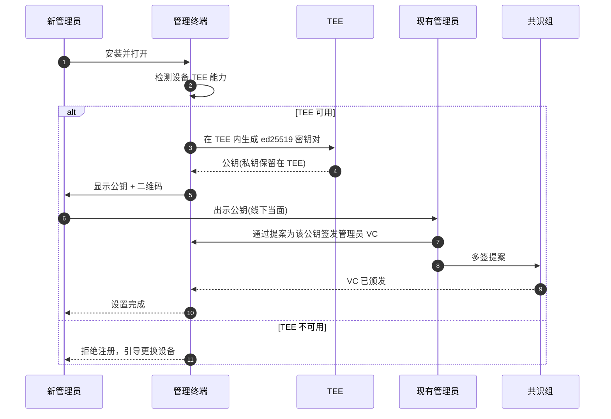
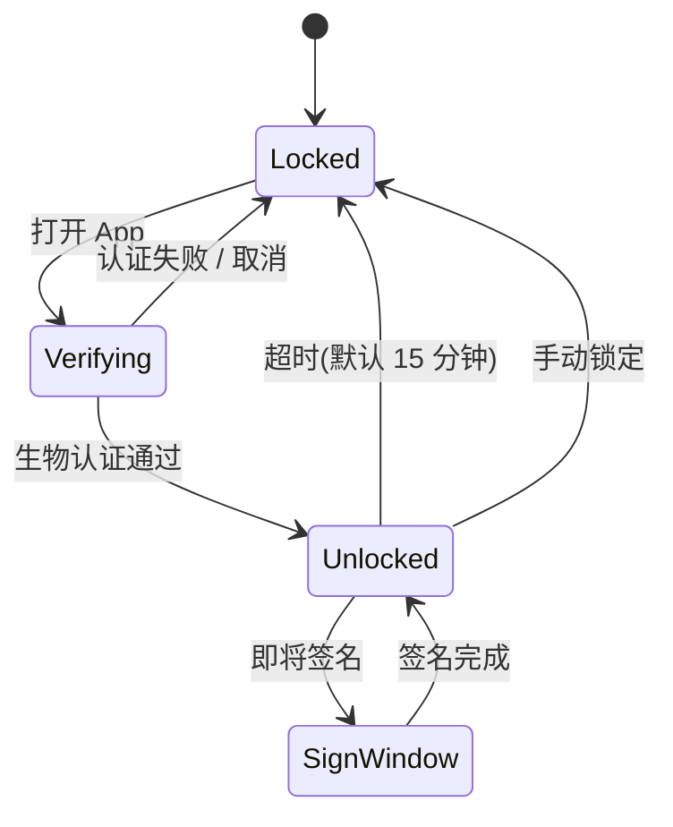
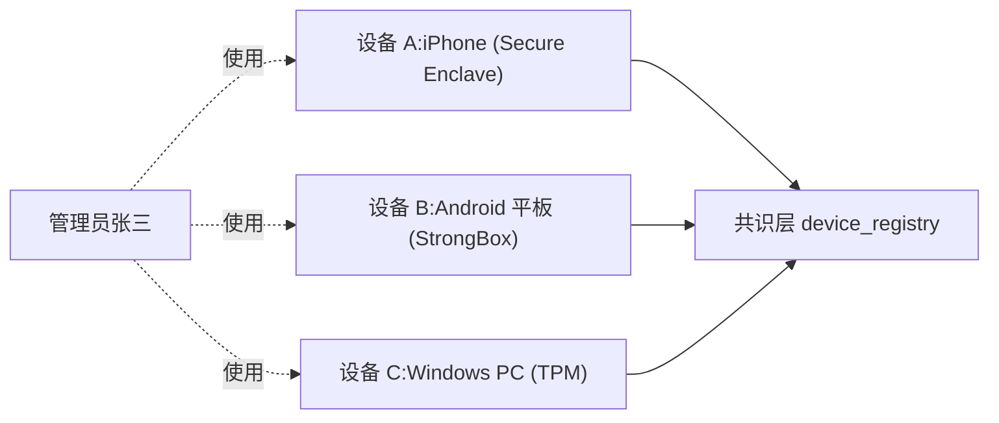
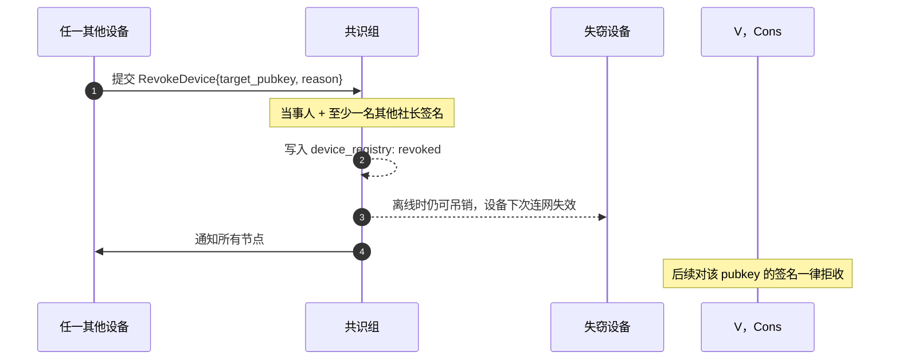
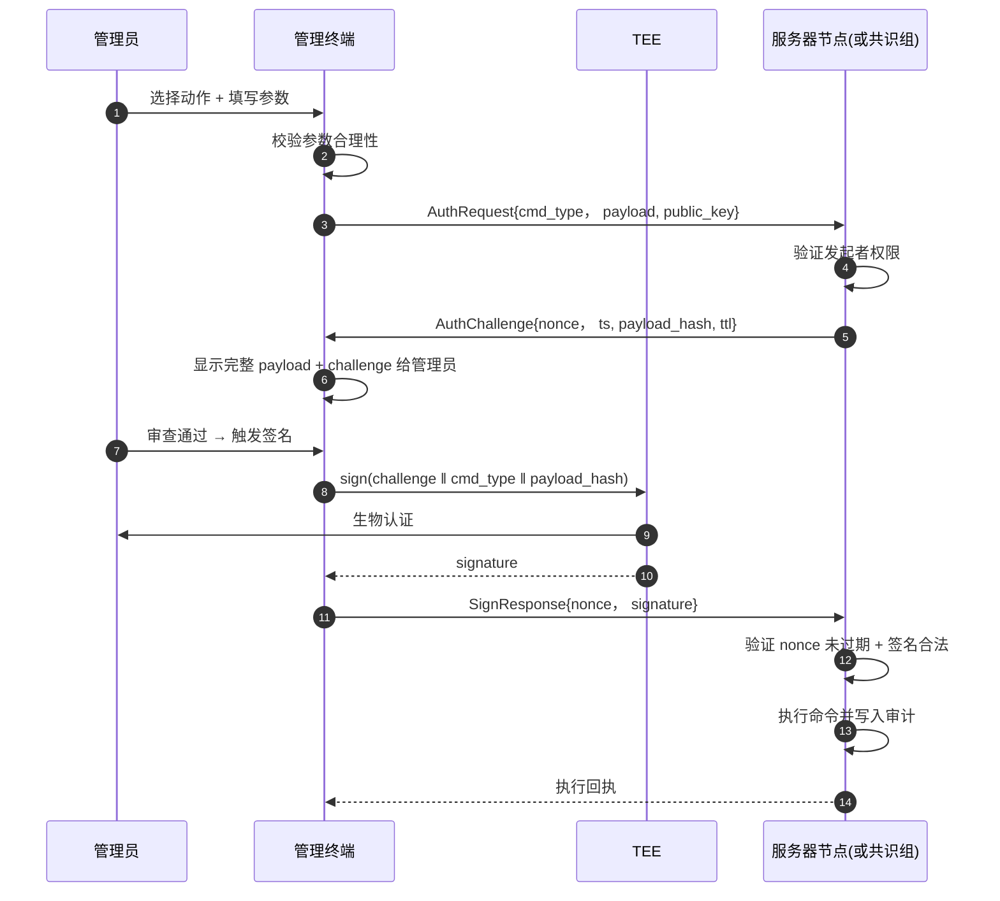

# 身份与安全

管理员身份是系统**最高权限的私钥**，其安全性基于两个条件：**密钥永远不离开 TEE**，且**每次签名都需要在线生物认证**。本页把这两件事落实到具体的初始化、登录、签名、多设备、推送授权等流程里。

## 首次设置

**线下当面交换公钥** 是目前推荐的做法——这一步骤不可被中间人攻击，即便整个网络被监听。如果实在需要远程，会走"两个现任管理员通过视频确认"的兜底流程。

## TEE 内的密钥操作

私钥永远不会被读取出来。管理终端通过 TEE API 间接调用：

| 平台 | 调用接口 |
| --- | --- |
| iOS | Keychain `kSecAttrTokenIDSecureEnclave` |
| Android | `KeyStore` + `setIsStrongBoxBacked(true)` |
| macOS | Keychain Secure Enclave Access Group |
| Windows | NCrypt + TPM provider(`Microsoft Platform Crypto Provider`) |
| Linux | PKCS#11(对接 Yubikey / 同类硬件 token) |

签名操作的输入是消息哈希，输出是签名字节串——管理终端只能"使用"私钥，不能"看到"私钥。这意味着即便管理终端二进制被反编译甚至被逆向篡改，攻击者最多能让你点击错误的"签名"按钮，但拿不到密钥本身。

## 登录与解锁

一次解锁有两个层次：

1. **App 解锁**:解锁后可查看大部分只读信息(实例列表、提案详情、审计记录)
2. **签名解锁(Sign Window)**:每次实际调用 TEE 签名前**额外**做一次生物认证，无论 App 是否已解锁

第二层认证不可关闭——无论用户在设置里选什么，签名时都要确认。这是为了让"App 已解锁但临时离开手机"的场景下攻击者无法直接发起签名。

签名会话**默认有效期 15 分钟**,可在设置中调整为 5 / 15 / 60 分钟。超过时长后，后续操作要求重新生物认证。

## 多设备支持

一个管理员可以在多台设备上工作——比如手机、平板、家用 PC。每台设备：

- 在自己的 TEE 内生成独立的密钥对
- 独立向社团申请管理员 VC
- 在共识层登记为同一身份的不同设备

每个设备的签名独立有效——任一设备签的多签结果都被识别为"张三"参与的多签，**但不允许同一身份用多台设备一起凑多签门槛**(共识层会去重)。这避免了"丢一台设备就能伪造多人多签"的攻击。

## 设备吊销

设备丢失、被盗、退役都需要走**吊销流程**:

吊销是单向操作——一旦吊销，不允许撤销。如果设备失而复得想恢复使用，需要走重新注册流程(重新生成密钥对、申请新 VC)。这避免了"被盗设备短暂下线、恢复后又能用"的灰色地带。

紧急情况下(设备已确认在攻击者手中)可以走**单签紧急吊销**,只需要当事人本人在另一设备发起、并加上当前其他活跃设备的备份签名。响应时间 < 5 分钟。

## 推送授权流程

管理员对实例 / 共识层发起的关键命令(停止服务、迁移、修改配置、签发 VC、签名提案)都走"挑战–应答"模式，确保签名只对**特定服务器、特定时刻、特定指令**生效。

### 为什么要 challenge / response 而不是直接签

直接签名 → 管理员每输入一次密码，攻击者可以拿这个签名重放任何命令；challenge / response 把"管理员意图"和"服务器随机数"绑定：

| 安全保证 | 来源 |
| --- | --- |
| 不可重放 | challenge 包含 nonce + ts + ttl(默认 60 秒) |
| 不可伪造 | challenge 包含 `payload_hash`,管理员签的是确切的指令体 |
| 不可越权 | 服务器在颁发 challenge 前就先校验请求者的 VC 权限，签名只是最后一步 |
| 不可代签 | TEE 强制本地生物认证，网络对面拿不到私钥 |

ttl 之内未应答的 challenge 自动作废，管理员需要重新发起请求。这给了管理员"看一下，觉得不对再放弃"的窗口，而不是"签了之后才发现签错"。

### 审计副本

每条 AuthChallenge / SignResponse 都进入共识层审计日志，字段包含 `cmd_type`、`payload`、`requester_peer_id`、`signer_pubkey`、`server_peer_id`、`ts`、`outcome`。即便管理员事后否认，签名 + nonce 仍然唯一锚定他在那一刻的授权。
