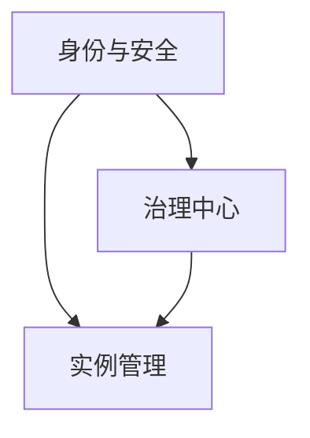
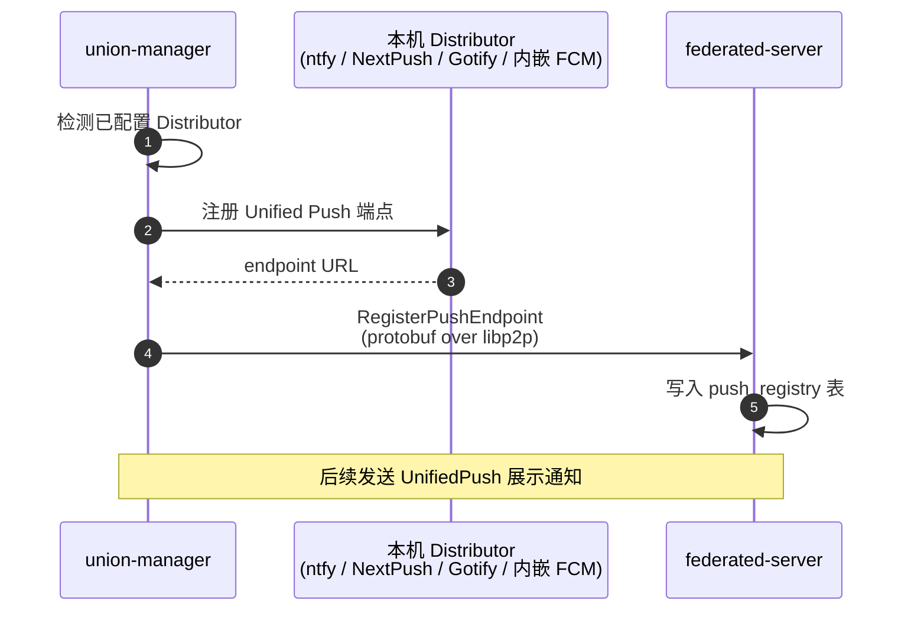

# 管理终端

管理终端目前仅实现 Android，是社长和管理员的移动工具，承载系统的全部高权限管理职能：身份签发、节点运维、提案多签、联赛组织、审计追溯。管理终端是一台**带 TEE 保护的对等节点**，私钥不出设备，所有操作走多签共识。

## 模块构成

| 模块 | 职责 |
| --- | --- |
| [身份与安全](./identity) | TEE 密钥、生物认证、多设备、授权与唤醒流程 |
| [实例管理](./instances) | 控制台总览、实例列表、停止 / 迁移 / 配置、联赛运营 |
| [治理中心](./governance) | 提案签名、提案模板、成员管理、审计日志 |

## TEE 强制要求

管理终端是系统中**权限最高**的角色，管理员单签或多签可以决定节点准入、资金 / 积分发放、实例存活。这种权力不能只靠普通的密码学密钥保护——一台被植入木马的手机就能让攻击者拿到控制权。

因此管理终端**必须运行在具备 TEE 的设备上**:

| 平台 | TEE 实现 |
| --- | --- |
| Android | StrongBox / TEE Keymaster |

不满足条件的设备可以查看只读视图，但不能签名。

## 设计原则

**操作不可否认**
所有签名经过 TEE 完成，公钥唯一对应一个物理设备 + 生物认证。共识层留下完整签名记录，事后无法抵赖。

**先审核后执行**
关键命令走"管理员发起 → 服务器返回 challenge → 管理员审查并签 → 服务器执行"的四步流程，杜绝"幽灵指令"。

**多签为默认**
权限越大，默认要求的签名数越多。单签操作只限于本人专属事项(管理自己的设备列表)。

**审计第一**
任何写操作都进入共识日志，任何阅读 / 查询行为也会本地审计——后者用于检测设备失窃，前者用于事后追责。

## 推送通知机制

管理终端依赖即时通知提醒管理员处理 AuthChallenge、实例崩溃告警、提案变更、联赛争议等事件。推送通知可以携带系统通知栏展示所需的标题、正文和业务摘要；权威状态始终来自共识日志和服务器节点的 protobuf over libp2p 接口。

### Unified Push —— 去中心化推送

union-manager 内嵌 [Unified Push](https://unifiedpush.org/) 客户端，向服务器节点注册推送端点。设备必须显式配置可用的 UnifiedPush distributor；内嵌 FCM 只是可选 distributor 实现之一，不与 UnifiedPush 并列，也不作为独立通道。

### 推送通道

union-manager 仅通过 UnifiedPush 通道接收系统级推送通知，不实现 PubSub 手机推送或"双通道"策略。应用打开后必须通过 protobuf over libp2p 拉取完整内容；通知丢失、重复或延迟都不得改变业务状态。

| 通道 | 路径 |
|------|------|
| **UnifiedPush 通知** | `server → distributor → union-manager` |

### 推送事件类型

服务器节点在以下场景触发推送：

| 事件 | 推送展示内容 | 打开后拉取的权威数据 | 紧急度 |
|------|------|--------|--------|
| `AuthChallenge` | 命令摘要、风险级别、过期提示 | 等待管理员签名的 challenge | 高 |
| `InstanceCrash` | 实例名、节点、崩溃时间 | 实例状态、日志、迁移建议 | 高 |
| `ProposalCreated` | 提案标题、类型、发起人 | 提案详情和签名状态 | 中 |
| `MatchDispute` | 赛事名、比赛、提交人 | 争议详情和证据列表 | 中 |
| `NodeOffline` | 节点名、离线时长 | 节点健康状态和影响实例 | 低 |
| `ConfigHotReload` | 实例名、配置项、结果摘要 | 配置变更记录和审计条目 | 低 |

管理员可在设置中按事件类型开关推送通知、配置勿扰时段。无论通知偏好如何，打开管理终端后都必须通过 protobuf over libp2p 同步待处理 challenge、告警和提案列表。
