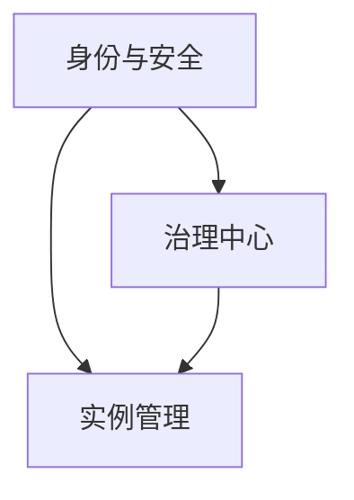

# 管理终端

管理终端是社长和管理员的移动 / 桌面工具，承载系统的全部管理职能：身份签发、节点运维、提案多签、联赛组织、审计追溯。管理终端是一台**带 TEE 保护的对等节点**，私钥不出设备，所有操作走多签共识。

## 模块构成

| 模块 | 职责 |
| --- | --- |
| [身份与安全](./identity.md) | TEE 密钥、生物认证、多设备、推送授权流程 |
| [实例管理](./instances.md) | 控制台总览、实例列表、停止 / 迁移 / 配置、联赛运营 |
| [治理中心](./governance.md) | 提案签名、提案模板、成员管理、审计日志 |

## TEE 强制要求

管理终端是系统中**权限最高**的角色，管理员单签或多签可以决定节点准入、资金 / 积分发放、实例存活。这种权力不能只靠普通的密码学密钥保护——一台被植入木马的手机就能让攻击者拿到控制权。

因此管理终端**必须运行在具备 TEE 的设备上**:

| 平台 | TEE 实现 |
| --- | --- |
| iOS | Secure Enclave |
| Android | StrongBox / TEE Keymaster |
| macOS | Secure Enclave(M 系列) |
| Windows | TPM 2.0 + Windows Hello |
| Linux Desktop | Yubikey / 类似硬件 token(软件 TEE 不予接受) |

不满足条件的设备可以查看只读视图，但不能签名——确保即使家人借手机用了一下，也不会出现绕开 TEE 的影子签名。

## 设计原则

**操作不可否认**
所有签名经过 TEE 完成，公钥唯一对应一个物理设备 + 生物认证。共识层留下完整签名记录，事后无法抵赖。

**先审核后执行**
关键命令走"管理员发起 → 服务器返回 challenge → 管理员审查并签 → 服务器执行"的四步流程，杜绝"幽灵指令"。

**多签为默认**
权限越大，默认要求的签名数越多。单签操作只限于本人专属事项(管理自己的设备列表)。

**审计第一**
任何写操作都进入共识日志，任何阅读 / 查询行为也会本地审计——后者用于检测设备失窃，前者用于事后追责。
