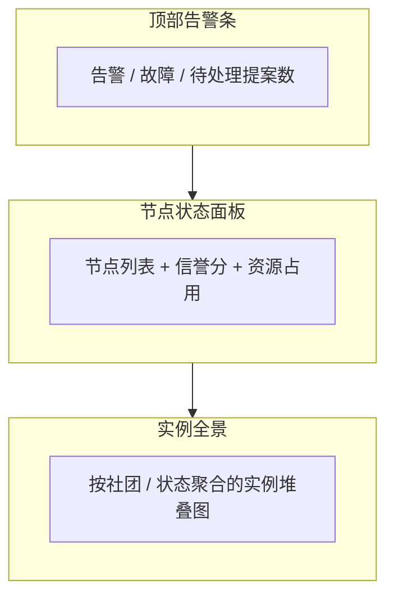
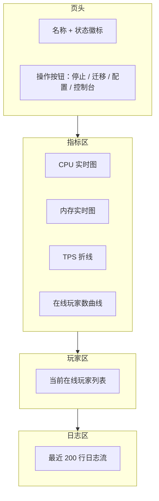
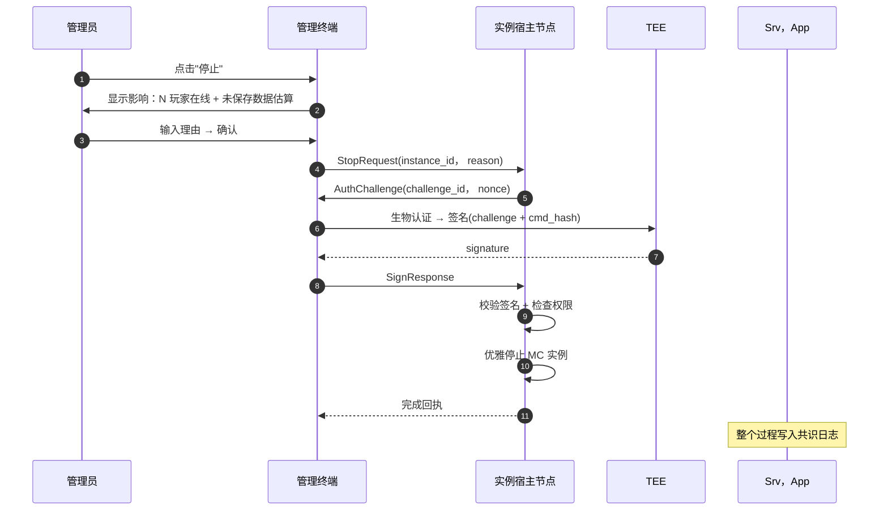
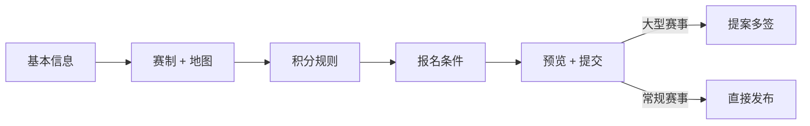

# 实例管理

实例管理是日常运维使用频率最高的页面，把分散在各服务器节点上的容器**集中呈现**，并提供管理员授权后的远程操作能力。本页同时承载控制台总览与联赛运营这两块"以实例为核心"的运营场景。

## 控制台总览

打开管理终端后的默认页，把节点和实例的整体状态压缩到一屏内：



| 区块 | 字段 | 数据源 |
| --- | --- | --- |
| 告警条 | 节点离线数、迁移失败、TPS 跌出阈值的实例 | 健康检查 + PubSub |
| 节点状态面板 | PeerID 摘要、角色、CPU / 内存使用、实例承载数、信誉分 | DHT + 共识层 |
| 实例全景 | 实例总数、按状态(running/migrating/degraded)堆叠 | 共识层快照 |
| 网络拓扑 | 节点间 Raft 连接、中继关系图 | libp2p 周期上报 |

告警按"严重度 → 时间倒序"排序，点击单条直接跳到对应节点 / 实例详情。拓扑图实时刷新（每 30 秒），可以放大看单条 Raft 连接的延迟与丢包。

## 实例列表

实例列表的字段比控制台更详细，适合对单个实例做深入操作：

| 字段 | 说明 |
| --- | --- |
| 名称 + 类型 | 房间 / 服务图标 |
| 状态 | running / provisioning / degraded / migrating / stopped |
| 当前宿主节点 | 链接到节点详情 |
| 创建者 | PeerID + 社团 |
| 创建时间 | 历史长短直接影响是否归档 |
| 在线玩家 | 实时数 |
| 资源使用 | CPU / 内存，环形或迷你图 |

筛选：状态、宿主节点、所属社团、游戏类型；搜索按名称、ID 模糊匹配。

## 实例详情

进入实例后：



页面通过 PubSub 订阅本实例的事件，**所有数据实时更新**——管理员不需要刷新就能看到玩家上下线、TPS 变化。

玩家列表点击单个玩家可下钻到玩家详情页(本赛季积分、活跃度、参与的实例)。日志区只展示最近 200 行，完整日志需要走单独的"导出"流程，日志中包含玩家行为，导出操作本身会被审计。

## 操作：停止



完整 challenge / 签名机制见 [推送授权流程](./identity.md#推送授权流程)。停止操作的权限链：发起者必须持有"管理员"或更高 VC，且 VC 在共识层未被吊销。

## 操作：迁移

迁移在管理员视角下分两种触发方式：

**手动迁移**:管理员选择目标节点。终端会先调用调度器查询满足实例 placement 约束的可用节点，管理员从候选列表选择，或勾选"自动选择最优"。

**自动迁移**:管理员只确认"迁移"动作，后续目标选择全权交给共识层调度器。

```mermaid
flowchart TB
  Pick[管理员选择"迁移"] --> Auto{自动选择}
  Auto -- 是 --> S[调度器决策目标节点]
  Auto -- 否 --> List[显示候选节点]
  List --> Op[管理员选择]
  Op --> S
  S --> Sign[管理员签名授权]
  Sign --> Migrate["执行迁移(详见服务器节点)"]
  Migrate --> Watch[终端展示迁移进度]
  Watch --> Done[完成通知]
```

迁移期间终端展示分阶段进度：`pre-dump → S3 同步 → 目标启动 → 流量切换 → 完成`。任何阶段失败都会显示明确错误并询问"重试 / 回滚"——回滚把实例标记回原节点，玩家无感知。

## 操作：配置修改

仅适用于服务类(`service` 类型)实例——房间(`room`)是临时的，不允许修改配置。

```mermaid
flowchart LR
  Op[管理员点击"修改配置"] --> E[编辑界面]
  E --> Diff[展示与当前配置的 diff]
  Diff --> Sign[管理员签名]
  Sign --> Apply{应用方式}
  Apply --> Hot[热重载]
  Apply --> Restart[重启生效]
```

某些 server.properties 字段(如 `level-name`)只能重启生效；其他(如 `view-distance`)可以热重载。终端会根据字段自动选择路径并提示影响。重启会通知所有在线玩家，默认延迟 60 秒，期间玩家可以保存当前状态。

## 操作：控制台输出

实例的实时日志流，供技术管理员排查问题。

| 操作 | 说明 |
| --- | --- |
| 跟随尾部 | 默认开启，新日志自动滚动 |
| 暂停 | 暂停滚动，方便阅读历史 |
| 关键词搜索 | 高亮匹配，跳转上一 / 下一条 |
| 导出 | 仅高级管理员可用，操作被审计 |

**控制台不接受输入**——不允许通过管理终端向 MC 实例发送 RCON 命令。所有写操作都必须走显式的"操作"按钮(停止 / 迁移 / 配置)，走完整的多签 / 单签授权流程。这避免了"通过 RCON 后门绕开审计"。

## 批量操作

夜间维护、大规模迁移等场景下，管理员可能需要对多个实例执行同一动作。批量操作的限制：

- 一次最多 20 个实例
- 同一动作只问一次签名(签名内容包含批次 hash)
- 每个实例的执行是**串行**的，允许中途中止
- 批量操作专用的审计条目类型，事后排查方便

批量操作不能跨权限：同一批次必须都属于同一权限级别——比如不能在一次批次里同时停止 PVE 服务器和 PVP 联赛实例，后者通常需要更高的权限审批。

## 联赛运营

[联赛系统](../../design/tournament.md) 定义了赛事 / 比赛 / 队伍的数据模型与流程。本节聚焦管理员在终端里的具体操作。

### 赛事创建向导



向导把赛事配置拆解成五个连续步骤，每步只问一类问题。"大型赛事"由系统自动识别(参赛上限 > 64 / 奖励池 > 一定积分)，自动转为提案进入 [治理中心](./governance.md)。

### 比赛运营面板

赛事开始后，管理员有专门的"对局看板":

- 当前进行中的所有 Match，按时间线排列
- 每场 Match 的实时玩家、TPS、剩余时间
- 异常告警(玩家掉线 > 30 秒、TPS 跌破阈值、争议举报)
- 一键介入：暂停 / 重置 / 判定胜负

**判定胜负** 是争议处理的兜底——预言机自动结算正常情况下不需要，但如果出现 mod 漏洞、网络瘫痪等导致预言机数据不可信，管理员可以人工裁决。这种裁决会作为一条独立提案进入治理流程，需要至少两名管理员签名。

### 争议工作台

玩家通过启动器提交的比赛争议在这里集中处理：

| 字段 | 内容 |
| --- | --- |
| 争议编号 | 自动生成，与原始 Match 关联 |
| 提交人 | 玩家 PeerID + 队伍 |
| 类型 | 作弊举报 / 结算错误 / 玩家行为 |
| 证据 | 玩家上传的截图、日志片段、视频链接 |
| 状态 | open / investigating / resolved / rejected |

每条争议附带的"调查"按钮会拉取该 Match 的完整服务器日志、预言机事件流、相关玩家近期活动，呈现在同一面板内。处理结论(包括驳回)同样要签名，杜绝"私自结案"。

### 赛季管理

每个赛季有起止日期、关联赛事列表、排行榜数据，但赛季本身的数据由共识层维护——终端只做**展示和管理**:

- 赛季概览：本赛季所有赛事汇总、排行榜 Top 50
- 赛季归档：赛季结束时一键打包(把排行榜快照、所有 Match 结果导出到 S3 历史归档目录)
- 新赛季准备：复制上赛季的赛事模板、调整积分规则后发布

赛季切换是系统层面的大动作，需要全体核心成员多签——这条入口在治理中心，实例管理只展示"赛季已就绪 / 赛季已结束"的状态。
