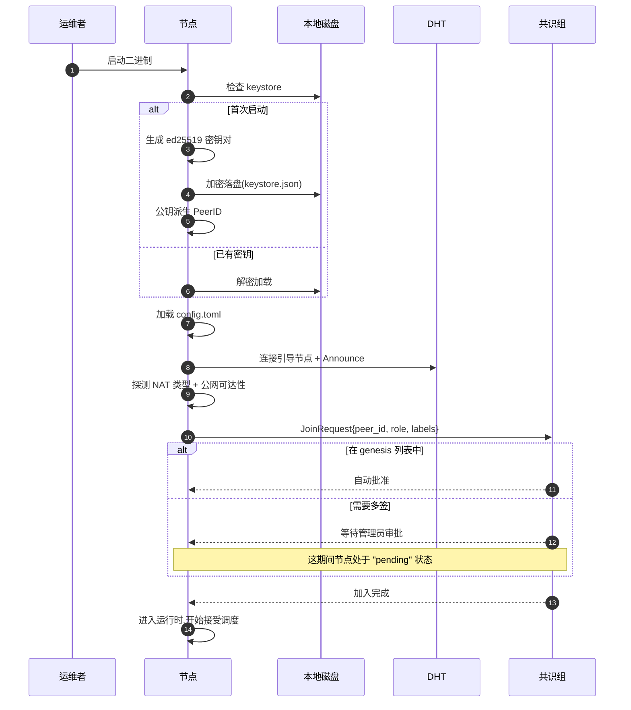
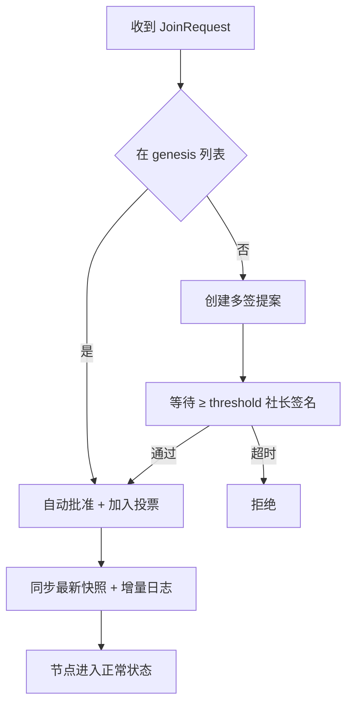

# 节点初始化

节点初始化负责把一台空白主机转变为**已注册、已加入共识组、已就绪承载实例**的服务器节点。运维者只需要写好配置文件、运行二进制,剩下的步骤都由节点自动完成。

## 首次启动流程



整个流程典型耗时 10–30 秒。`pending` 状态下节点已经在 DHT 上可见,但调度器不会把实例分配给它——这给了管理员审批身份的时间窗口。

## 配置文件

节点通过 `config.toml` 声明全部行为。下面是关键段落的最小完整示例:

```toml
[node]
role = "consensus"           # consensus | worker | relay
data_dir = "/var/lib/jlucraft"

[network]
listen_addrs = ["/ip4/0.0.0.0/udp/4001/quic-v1"]
public_ips = ["1.2.3.4"]     # 留空则节点自行探测
nat_type = "auto"            # auto | public | cone | symmetric

[bootstrap]
peers = [
  "/dns4/boot1.jlucraft.example/udp/4001/quic-v1/p2p/12D3KooW...",
  "/dns4/boot2.jlucraft.example/udp/4001/quic-v1/p2p/12D3KooW..."
]

[resources]
max_cpu_cores = 8
max_memory_gb = 24
max_disk_gb   = 200

[docker]
endpoint = "unix:///var/run/docker.sock"
network_mode = "bridge"

[storage.s3]
endpoint   = "https://s3.cn-east-2.example.com"
bucket     = "jlucraft-prod"
access_key = "..."
secret_key = "..."

[labels]
club    = "jlu-mc"
campus  = "qianwei"
tier    = "performance"
```

配置文件支持热重载(`SIGHUP` 信号或管理终端推送),除少数项(`role`、`data_dir`)外其他都可在不停机的情况下生效。

## 角色细节

[概览](./index.md#节点角色) 列出了三种角色的职责差异。运维时常踩的坑:

- **`worker` 不参与投票**,但仍然记录共识日志的尾部用于本地决策。这意味着断网恢复后它能感知最近的调度变化,而不需要从快照重新追日志
- **`relay` 节点不需要 Docker**——它仅做 L4 转发。在仅有公网 IP 但无算力的 VPS 上很常见
- **同一节点不能同时是 `consensus` 与 `relay`**——共识参与对延迟敏感,中继转发对带宽敏感,职责互相干扰

角色变更需要重启节点,且需要管理员通过提案确认(防止运维者私自把高信誉节点降级)。

## 节点标签

`[labels]` 是调度器选择宿主时的关键依据。建议至少声明:

| 标签 | 用途 |
| --- | --- |
| `club` | 所属社团 ID,影响实例的"亲和性" |
| `campus` | 校园 / 校区,玩家延迟优化 |
| `tier` | `performance` / `standard` / `economy`,影响调度优先级 |
| `gpu` | 是否具备 GPU(若有特殊渲染服务) |

标签是**自由文本** + **共识层校验**的组合:任何节点都可以声明任意标签,但 `tier` 等会影响信誉计算的标签需要管理员通过提案确认,防止节点自抬身价。

## 加入共识组

`consensus` 角色的节点首次启动时,会向共识组发送 `JoinRequest`。共识组的处理逻辑:



新加入的 `consensus` 节点不会立即获得投票权——它需要先把日志追上当前 leader 才参与下一轮选举。这避免了"刚加入就因日志落后导致投票发散"。

## 故障重启

节点已经初始化过、再次启动时:

1. 解密 keystore → 恢复 PeerID
2. 加载 config → 恢复角色与标签
3. 连接共识组 → 拉取最新快照(若本地快照过旧)
4. 拉取应当承载的实例清单 → 从 S3 恢复
5. 注册 DHT → 重新接受连接

整个过程通常在 1–2 分钟内完成。如果 S3 暂不可达,节点会进入"降级"状态:已运行的实例继续提供服务,但不接受新的实例调度,直到 S3 恢复。
