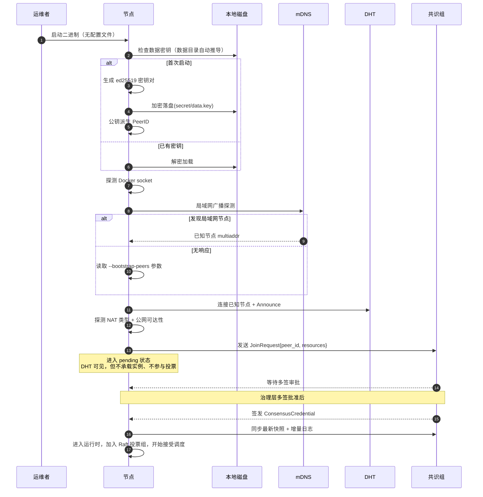
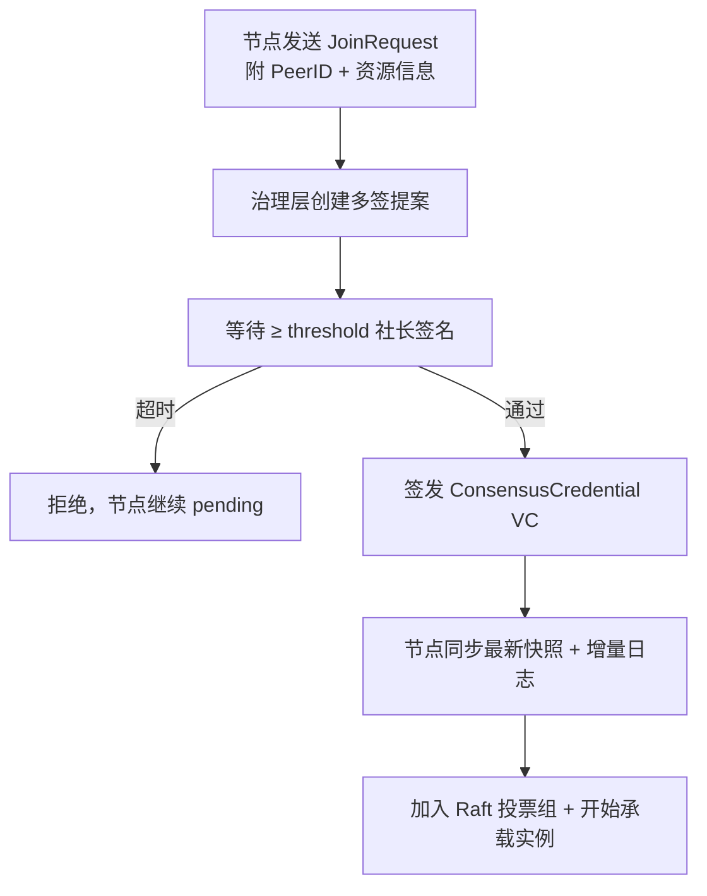

# 节点初始化

节点初始化负责将一台空白主机转变为**已注册、已加入 DHT、已就绪承载实例**的对等节点。运维者只需运行二进制，剩下的由节点自动完成。

::: warning 零配置原则
节点不读取任何本地配置文件。所有治理参数（准入规则、调度配置、S3 凭证等）从共识层加载；运行时环境参数（端口、数据目录、Docker socket）由节点自动推导。物理机控制者能做的最坏情况是让节点离线——无法通过修改本地文件提升权限或篡改系统行为。
:::

## 启动命令

最简情况下，节点无需任何参数：

```bash
federated-server
```

跨网段、局域网内无其他节点时，通过命令行参数指定已知节点：

```bash
federated-server --bootstrap-peers /ip4/1.2.3.4/udp/25566/quic-v1/p2p/QmXxx
```

这是节点唯一可接受的外部输入。

## 自动推导的运行时参数

节点启动时自动推导所有运行时参数，无需人工配置：

### 监听地址

固定监听 `0.0.0.0:25566`（QUIC/UDP）。公网 IP 和 NAT 类型在启动后自动探测。

### 数据目录

遵照操作系统最佳实践自动选择：

| 操作系统 | 路径 |
| -------- | ---- |
| Linux | `$XDG_DATA_HOME/jlucraft/federated-server`（默认 `~/.local/share/jlucraft/federated-server`） |
| macOS | `~/Library/Application Support/JLUCraft/federated-server` |
| Windows | `%APPDATA%\JLUCraft\federated-server` |

数据目录下自动创建 `secret/data.key` 存放 AES-256-GCM 数据加密密钥。首次启动时自动生成随机密钥。数据目录不存放任何治理参数。

### 数据密钥

节点自动在 `{data_dir}/secret/data.key` 生成 32 字节 AES-256-GCM 密钥。已有则读取使用。密钥绝不写入日志、libp2p 响应或共识消息。

### Docker socket

按平台默认路径探测：

1. `/var/run/docker.sock`（Linux / macOS 默认）
2. `npipe:////./pipe/docker_engine`（Windows 默认）
3. 探测失败 → 节点以**观察者模式**运行（`accept_workloads=false`），仍可参与 DHT、中继和管理 API

### 资源容量推导

当 Docker 可用时，节点自动推导：

- CPU = `available_parallelism()`（逻辑核心数）
- Memory = 系统总内存的 70%（至少 1 GiB）
- Disk = 数据目录所在磁盘可用空间的 70%（至少 1 GiB）

### 引导节点发现

按以下顺序尝试，首个成功的即停止：

1. **mDNS 局域网广播**：向局域网广播探测，发现同网段内已运行的节点
2. **命令行参数** `--bootstrap-peers`：若 mDNS 无响应，使用指定的 multiaddr 列表

### S3 凭证

从共识层加载，治理层通过多签提案写入。节点本地不存储任何 S3 凭证。

## 首次启动流程



整个流程中，pending 状态可能持续数分钟到数小时，取决于管理员何时审批。pending 期间节点对系统没有任何影响。

## 申请加入共识组

节点启动后自动向共识组发送 `JoinRequest`，进入 pending 状态等待多签审批。审批通过后节点一步到位获得全部能力：



撤销只需治理层多签吊销对应 VC，节点立即退出投票组并停止承载新实例，无需登录目标机器操作。

## 节点标签

节点标签由本机自动推导，不接受本地参数覆盖：

| 标签 | 来源 | 用途 |
| --- | --- | --- |
| `club` | 主机名 | 调度亲和性 |
| `campus` | Windows 为 `USERDOMAIN`，其他平台为主机名 | 校园 / 校区亲和性 |
| `gpu` | 当前默认 `false` | 预留 GPU 调度能力 |
| `tier` | 由 CPU / 内存自动推导 | 节点性能等级 |

标签只影响调度亲和性，不影响权限。调度器优先将实例分配到标签匹配的节点，但不强制。

## 故障重启

节点已经初始化过、再次启动时：

1. 解密 keystore → 恢复 PeerID
2. mDNS / bootstrap-peers → 重新加入 DHT
3. 检查本地 `ConsensusCredential` 是否有效
   - 有效 → 连接共识组，拉取最新快照 + 重新加载治理配置，恢复实例承载
   - 无效或已吊销 → 进入 pending 状态，等待重新审批
4. 从 S3 恢复应当承载的实例清单
5. 注册 DHT → 重新接受连接

整个过程通常在 1–2 分钟内完成。如果共识组暂不可达，节点会进入"降级"状态：已运行的实例继续提供服务，但不接受新的实例调度，直到共识组恢复。
