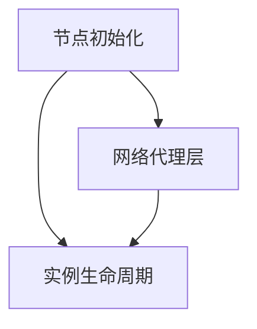

# 服务器节点

服务器节点是系统的**计算底座**：它运行在社团提供的物理机或云主机上，承载 Docker 化的 MC 实例、参与共识组、采集预言机数据、为客户端提供网络落地点。

对运维者而言，服务器节点配置完成后无需日常介入，异常时通过共识层和管理终端集中处理。

## 模块构成

| 模块 | 职责 |
| --- | --- |
| [节点初始化](./bootstrap.md) | 密钥派生、注册 DHT、加入共识组、加载配置 |
| [实例生命周期](./lifecycle.md) | 镜像管理、容器创建 / 销毁 / 迁移、健康检查、预言机数据采集 |
| [网络代理层](./network.md) | libp2p 入站、协议转发、DDoS 防护、共识参与、存储交互 |

## 节点角色

每个节点在配置中声明其**角色**,这决定了它参与的工作范围：

| 角色 | 共识 | 实例承载 | 预言机采集 | 中继 | 典型部署 |
| --- | --- | --- | --- | --- | --- |
| `consensus` | ✅ | ✅ | ✅ | ✅ | 长期在线、网络稳定的社团服务器 |
| `worker` | ❌ | ✅ | ✅ | 视情况 | 大算力但不稳定的临时机器 |
| `relay` | ❌ | ❌ | ❌ | ✅ | 仅有公网 IP 但算力有限的 VPS |

`consensus` 节点必须是奇数个(3 / 5 / 7),由共识组 genesis 列表确定；新增需要走多签提案。`worker` 与 `relay` 可以自由加入，提交一次身份注册即可被调度器纳入候选池。

## 架构原则

**无状态设计**
节点本身不持有不可丢失的状态。一切持久化数据(实例存档、配置、玩家数据、共识日志)都在 S3 和共识层。节点宕机后重启 = 读共识快照 + 从 S3 恢复分配的实例，不存在"恢复出厂"的失效模式。

**自愈**
节点崩溃 / OOM / 磁盘满 / 主机断电，共识层会在 30 秒内检测到并把承载的实例迁移到其他节点。运维者可以在不到岗的情况下，让节点自行从绝大多数故障中恢复。

**资源隔离**
每个 MC 实例独立 Docker 容器，cgroup 限制 CPU / 内存 / 磁盘。一个实例的失控不会影响同节点的其他实例，也不会拖垮宿主主机。

**可观测性**
所有运行时事件以**结构化日志 + Prometheus 兼容指标**输出。社团运维可以接到自己已有的 Grafana / Loki 栈，系统不强加观测后端。
