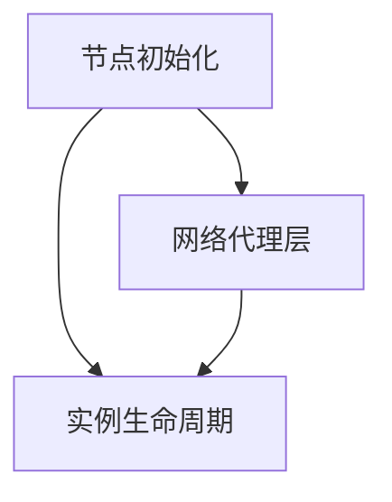

# 去中心化联邦服务器

去中心化联邦服务器是系统的**计算底座**：运行在社团提供的物理机或云主机上，承载 Docker 化的 MC 实例，参与共识组，采集预言机数据，为客户端与联合大厅桥接流量提供网络落地点。

对运维者而言，节点启动后无需日常介入，异常时通过共识层和管理终端集中处理。

## 模块构成

| 模块 | 职责 |
| --- | --- |
| [节点初始化](./bootstrap) | 密钥派生、节点发现、注册 DHT、从共识层加载治理配置 |
| [实例生命周期](./lifecycle) | 镜像管理、容器创建 / 销毁 / 迁移、健康检查、预言机数据采集 |
| [网络代理层](./network) | libp2p 入站、frp / 联合大厅桥接、协议转发、DDoS 防护、共识参与、存储交互 |

## 节点能力

所有节点软件相同，启动后进入 **pending** 状态，等待治理层多签批准：

| 状态 | 条件 | 能力 |
| ---- | ---- | ---- |
| **pending** | 节点启动，等待审批 | 仅 DHT 可见，不承载实例，不参与投票 |
| **已批准** | 治理层多签签发 `ConsensusCredential` | 参与 Raft 投票、承载实例、预言机采集、接受接入层连接 |

工作负载（实例调度）由共识层根据各节点上报的资源富余决定。物理机控制者无法通过修改本地配置提升自身权限；在获得批准之前，节点对系统没有任何影响。

## 架构原则

**无状态设计**
节点本身不持有不可丢失的状态。一切持久化数据(实例存档、配置、玩家数据、共识日志)都在 S3 和共识层。节点宕机后重启 = 读共识快照 + 从 S3 恢复分配的实例，不存在"恢复出厂"的失效模式。

**零配置防篡改**
节点不读取任何本地配置文件。运行时环境参数（端口、数据目录、Docker socket）由节点自动推导；所有治理参数（准入规则、调度配置、S3 凭证等）从共识层加载，启动时从 Raft 快照拉取，运行时通过共识日志更新。物理机控制者能做的最坏情况是让节点离线，共识层会在 30 秒内检测到并将实例迁移到其他节点。

**自愈**
节点崩溃 / OOM / 磁盘满 / 主机断电，共识层会在 30 秒内检测到并将承载的实例迁移到其他节点。运维者可以在不到岗的情况下，让节点自行从绝大多数故障中恢复。

**资源隔离**
每个 MC 实例独立 Docker 容器，cgroup 限制 CPU / 内存 / 磁盘。一个实例的失控不会影响同节点的其他实例，也不会拖垮宿主主机。

**可观测性**
所有运行时事件以**结构化日志 + Prometheus 兼容指标**输出。社团运维可以接到自己已有的 Grafana / Loki 栈，系统不强加观测后端。
