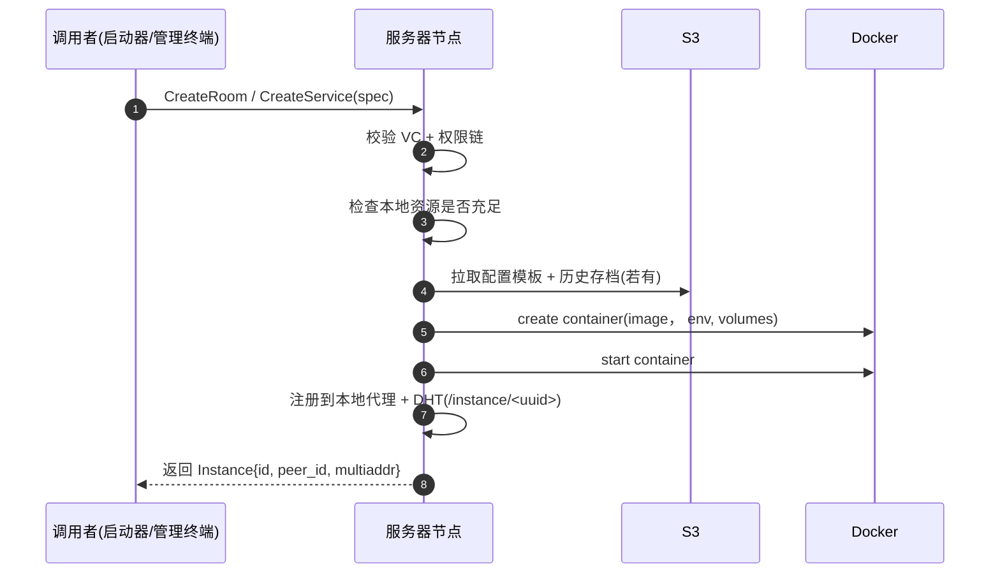
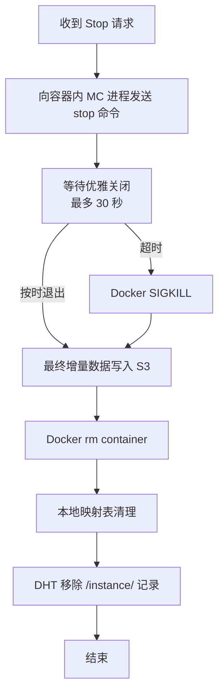
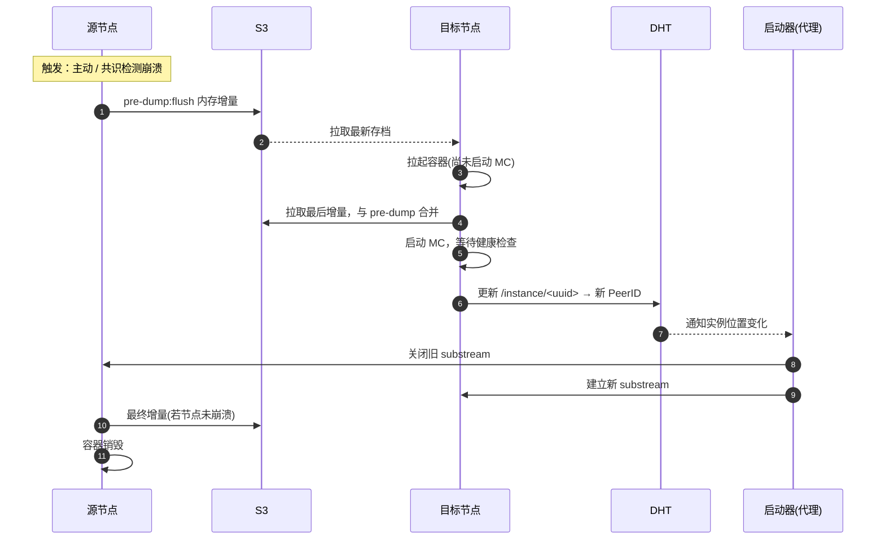
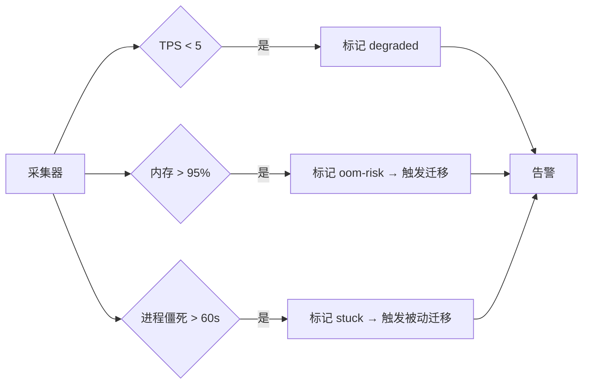
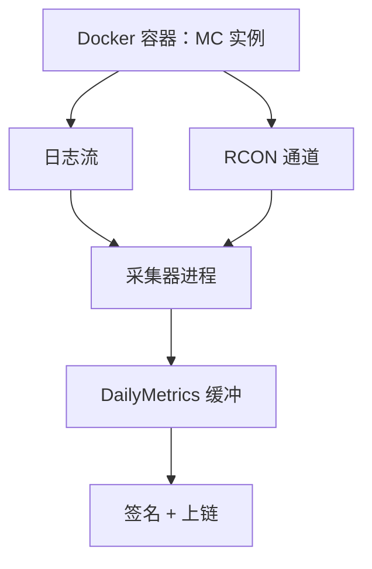

# 实例生命周期与数据采集

服务器节点将抽象的 Instance 描述转化为运行中的 Docker 容器，在节点宕机、资源不足、玩家迁移等场景下保持可用，并在容器旁路并行采集预言机原始数据。

## 镜像管理

系统预设若干官方 MC 镜像（如 `itzg/minecraft-server:java21`），社团可以注册自定义镜像。镜像由共识层维护一份白名单 + 哈希，节点不接受未通过审批的镜像——这避免了未被审批的恶意镜像在校园网内运行的风险。

| 镜像类别 | 来源 | 审核 |
| --- | --- | --- |
| 官方预设 | `itzg/minecraft-server` 等公共仓库 | 提交时通过多签提案审批 |
| 社团自定义 | 社团私有仓库 / Docker Hub | 同上，需附镜像 hash |
| 模板派生 | 上述基础上加 mod / 资源 | 模板 hash 一致即可，跳过审批 |

镜像层会被 Docker 自动缓存，常用底层(JDK、MC 服务端 jar)在节点之间复用。第一次拉取较慢，之后启动新实例可秒级完成。

## 创建实例

整个创建过程通常耗时 5–15 秒，绝大部分时间花在 Docker 启动和 MC 服务端的世界加载上。节点在 Docker `start` 后立即返回 `Instance`，但实例进入 `running` 状态还要等 MC 健康检查通过。

## 停止与销毁

设计策略是优先优雅关闭，超时后强制终止。MC 服务端正常的 stop 流程会保存世界、踢出玩家、清理 entity 状态。30 秒超时上限处理实例无响应的情况。

## 迁移

迁移分两类：

| 类型 | 触发 | 是否中断玩家 |
| --- | --- | --- |
| 主动迁移 | 管理终端命令 / 节点维护 | 1–3 秒抖动，不踢人 |
| 被动迁移 | 节点崩溃 / 共识层心跳超时 | 30–60 秒中断，可能丢最后几秒操作 |

**主动迁移**走双写过渡：源节点接受写入 → S3 → 目标节点拉取，中间存在重叠时间窗，玩家不会感知到中断。**被动迁移**没有主动 flush 阶段，只能用 S3 上的最近一次快照恢复。服务器节点默认每 60 秒做一次增量上传，将潜在数据丢失控制在分钟级以内。

## 健康检查

每分钟采集一次以下指标：

| 指标 | 来源 | 用途 |
| --- | --- | --- |
| CPU / 内存 / 磁盘使用 | cgroup | 资源调度 + 自动告警 |
| MC TPS | RCON `forge tps` 或日志 | 性能下降检测 |
| 在线玩家数 | RCON `list` | 调度决策、计费 |
| 进程心跳 | Docker exec `ps` | 检测僵死 |

异常分级：

`degraded` 不会立刻迁移——通常是临时高负载，迁移反而打断游戏。`oom-risk` 与 `stuck` 才进入迁移流程，避免实际崩溃带来的数据丢失。

## 预言机数据采集

服务器节点旁路读取每个本地实例的运行状态，转化成可上链的结构化指标。具体的指标维度、加权方式、抗作弊原则见 [预言机 & 积分系统](../../design/oracle.md);本节只描述节点侧的数据流。

### 数据来源

- 容器 stdout/stderr → 解析 MC 服务端日志中的玩家进入 / 离开、聊天、统计变更
- RCON 周期性查询(默认 30 秒一次)→ 获取在线列表、坐标、维度
- World 文件 diff(每日一次，基于区块时间戳)→ 估算建设变化量

### 本地聚合

采集器将原始事件按"玩家 + 24 小时窗口"聚合到内存中的每日指标：

| 字段 | 说明 |
| ---- | ---- |
| `player_id` | 玩家标识 |
| `date` | 日期（YYYY-MM-DD，UTC） |
| `online_minutes` | 在线分钟数 |
| `block_changes` | 方块放置与破坏总数 |
| `travel_blocks` | 移动距离（方块数） |
| `chat_msgs` | 聊天消息数 |
| `interactions` | 与其他玩家距离 < 5 格的次数 |
| `build_volume_delta` | 建筑规模变化量 |
| `source_log_root` | 当日原始日志的 Merkle root |

`source_log_root` 是当天所有原始事件的 Merkle root,事件本身保留 7 天。任何节点都可以索取原始事件并重新计算 root,以验证提交者没有捏造数据。

### 上链时点

每天 UTC 00:00，采集器：

1. 冻结当天的 `DailyMetrics`
2. 用节点私钥签名
3. 提交到 Raft 共识组，等待与其他节点的提交在共识层取中位数
4. 将原始日志归档到 `wal/<instance_id>/<date>.log` 写入 S3，保留 7 天后删除

提交失败(网络抖动、节点离线)会重试 3 次，每次间隔指数递增；最终失败的批次进入"离线缓冲",节点恢复后补提。

## 实例反馈通道

实例运行期间产生的事件统一通过 Docker 标签将容器与实例 UUID 关联，采集器既负责实例运行状态（健康检查），也负责玩家行为（预言机）——两条数据流共用同一个 Docker API 连接，避免重复占用容器资源。
