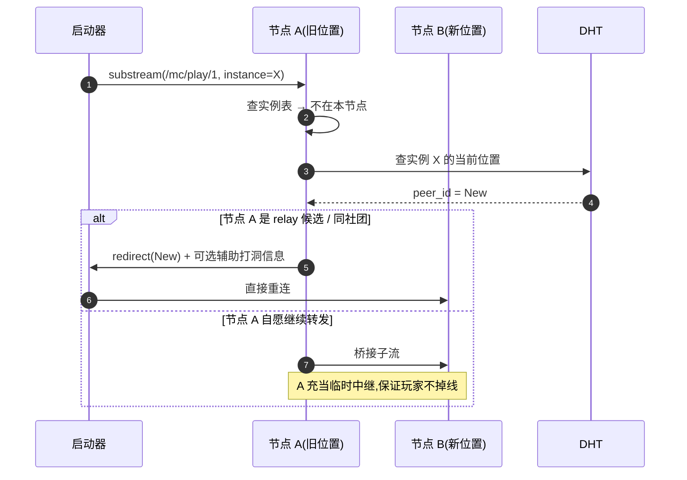
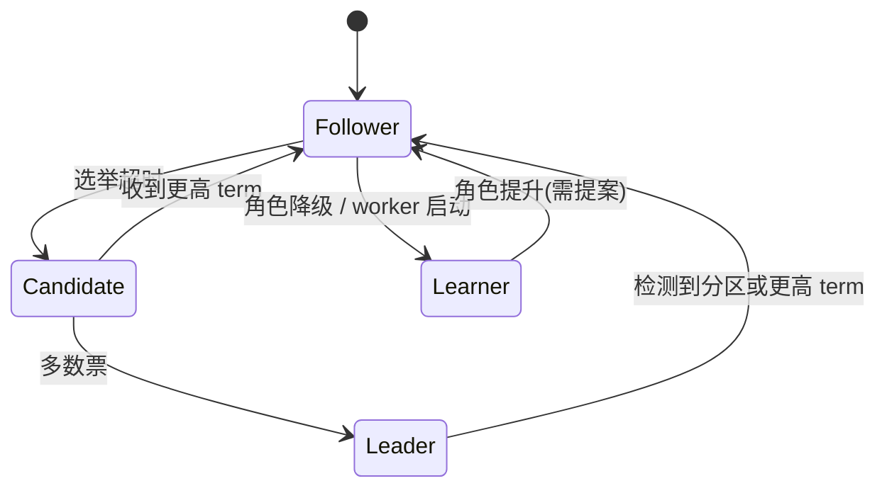

# 网络代理层与共识 / 存储

服务器节点的"对外面孔"是 libp2p Host:它把入站流量落地成 MC 实例的本地 TCP 连接,把跨节点协作流量(共识、中继、存储)分到对应的内部模块。

## 入站代理

```mermaid
flowchart LR
  Cli[启动器代理]
  L1[libp2p Host]
  P[入站代理模块]
  H[本地实例表]
  C[Docker 容器:MC 实例]

  Cli -->|"QUIC + libp2p stream"| L1
  L1 -->|substream "/mc/play/1"| P
  P --> H
  H -->|"instance_id → 容器内 IP:port"| P
  P -->|TCP| C
```

入站代理对每条 substream 做三件事:

1. **协商协议版本** ——目前是 `/mc/play/1`,未来兼容多版本
2. **解析 MC 握手前段** ——只读取 Handshake 包,提取 `instance_id`
3. **建立到容器的 TCP 连接** ——通过 Docker 网络访问容器的 MC 端口

握手解析后,后续所有字节都是**双向透传**——服务器节点不读、不解析 MC 业务包。这有两个好处:

- 性能:零拷贝转发,延迟接近原生 TCP
- 隐私:节点运维者无法窥探玩家聊天 / 操作

实例表(`instance_id → 容器地址`)由实例生命周期模块维护,容器销毁会同步删除。代理收到指向已销毁实例的 substream 时,主动关闭并通知启动器更新 DHT 缓存。

## 跨节点重定向

DHT 上的实例位置记录可能因迁移而过期。如果启动器拿着旧地址连过来:



第二种"桥接"分支只在源节点未承诺保留中继角色时启用,且只维持本次会话。这避免了已经迁移走的旧节点变成永久路由热点的问题。

## DDoS 防护

服务器节点在公网或半公网中常常成为攻击目标。三层防护:

### 第一层:libp2p 连接限流

| 限流维度 | 默认阈值 |
| --- | --- |
| 单 PeerID 新连接速率 | 10 / 秒 |
| 未验证身份的连接占比上限 | 20% |
| 单连接的并发 substream 数 | 16 |
| 入站握手等待 | 5 秒超时 |

超过阈值的连接被拒绝并把对方 PeerID 临时拉黑(默认 5 分钟),拉黑事件写入本地审计日志。

### 第二层:VC 优先级

持有有效 VC 的连接优先于无 VC 的连接,即便资源紧张也保证已知玩家先获得服务。这种"软优先级"让攻击者的伪造连接更容易被挤掉。

### 第三层:共识层信誉

[节点信誉分](../../design/consensus.md#节点信誉系统-node-score) 会影响其他节点对它的容忍度。频繁发出异常流量的节点会被全网共同降级,直到不能再发起新连接。

## 出站连接

服务器节点也会主动出站:

| 用途 | 协议 | 频率 |
| --- | --- | --- |
| Raft 日志复制 | libp2p stream `/raft/v1` | 持续,日志频率取决于事件 |
| DHT 维护 | libp2p stream `/kad/v1` | 周期性 |
| S3 读写 | HTTPS | 实例运行时按需 |
| Bootstrap 重连 | libp2p QUIC | 节点启动 + 周期性心跳 |
| 中继转发 | libp2p stream `/relay/v1` | 仅 relay 角色 |

出站方向不做特别限制,但所有出站请求都经过本地度量,异常出站(突然连接外部不在白名单的端点)会触发告警,运维者可以从中快速发现是否被入侵。

## 共识参与

`consensus` 节点在 libp2p Host 之上跑标准 Raft 协议,日志复制、心跳、选举都封装在 `/raft/v1` substream 里。

| 子协议 | substream | 数据 |
| --- | --- | --- |
| 心跳 / AppendEntries | `/raft/v1/append` | leader → followers,默认 50 ms 间隔 |
| 投票 | `/raft/v1/vote` | candidate → 全员 |
| 快照传输 | `/raft/v1/snapshot` | leader → 落后者,大对象时切到 S3 直链 |

`worker` 节点以 **Learner** 模式只读跟随。它不参与投票,但维护一份日志尾部用于本地决策——比如收到调度命令时知道这条日志已经被多数派确认,可以放心执行。



每 10000 条日志生成一次快照,快照本身上传到 S3 `consensus/snapshots/<term>-<index>.bin`,Raft 日志条目仅保留指针。新加入的节点先拉快照、再追增量日志,避免初次同步时拉爆 libp2p 带宽。

## 存储交互

服务器节点把所有持久化操作收敛到 `StorageClient` 模块——它封装 S3 API、本地磁盘缓存、写入并发控制三件事。

```ts
interface StorageClient {
  read(path: string, cache: "fresh" | "any"): Promise<Bytes>;
  write(path: string, data: Bytes, opts?: { lease: string }): Promise<void>;
  delete(path: string, opts?: { lease: string }): Promise<void>;
  acquireLease(path: string, ttl: number): Promise<string>;
}
```

### 本地缓存

每次读取后内容缓存到 `data_dir/cache/<sha256>`:

- 命中 → 直接返回,跳过 S3
- 未命中 → 拉取 + 落缓存
- 缓存上限默认 50 GB,LRU 淘汰
- 实例当前活跃数据(world、最近 WAL)永久驻留,不参与淘汰

世界数据按 region 分文件,每个 region 独立缓存,迁移时只需要传输被修改过的 region。

### 写入穿透与 Lease

S3 不提供并发写入互斥,服务器节点在共识层注册"实例 → 当前宿主节点"的 lease(默认 60 秒续期):


只有持有最新 lease 的节点才能写入对应实例的 S3 路径,避免"被动迁移恢复后旧节点恰好醒过来"造成的数据撕裂。读取不需要 lease,任何节点都可以拉取存档(只要 VC 允许)。

### 落盘故障兜底

实例运行期间 `StorageClient` 持续把 WAL(玩家操作流)异步写入 S3 `wal/<instance>/<ts>.log`。即便节点突然断电导致世界文件未同步,新宿主拉起来后可以从 WAL 重放最后几秒的玩家操作,把丢失数据控制在秒级而非分钟级。
