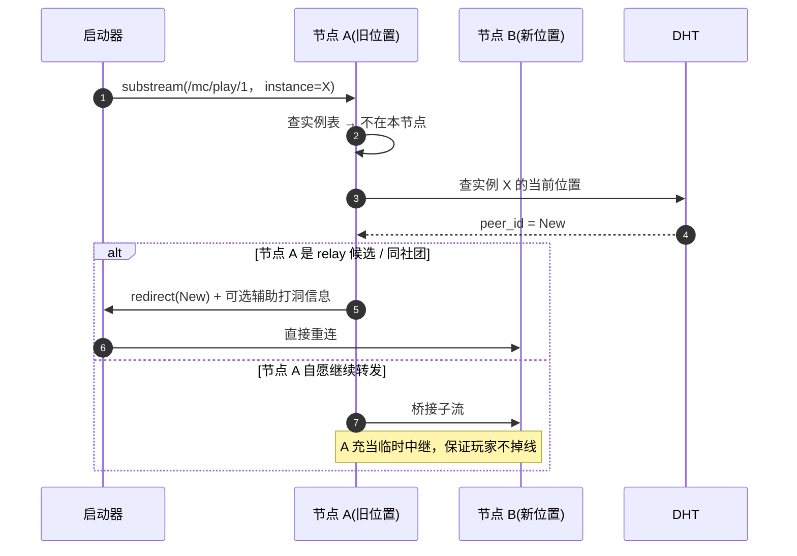
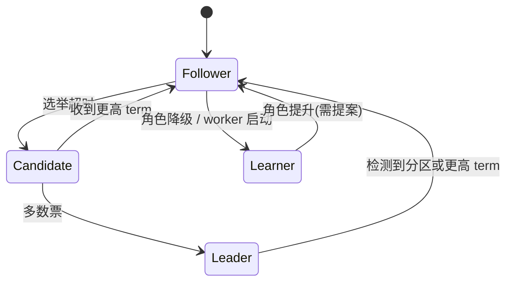
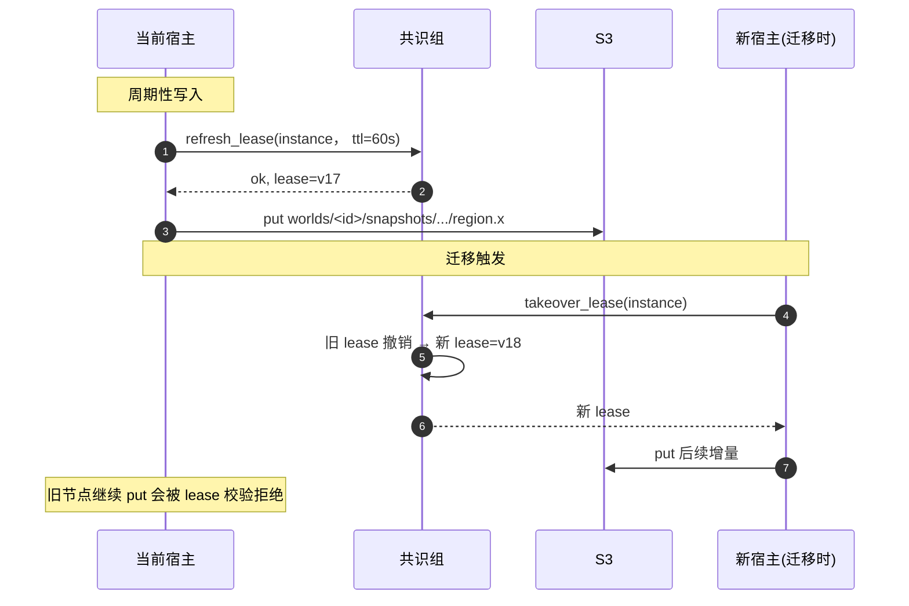
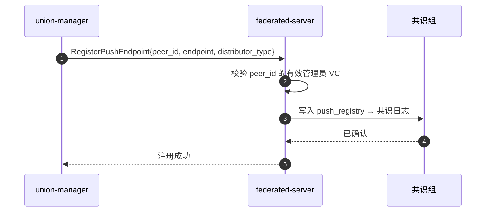
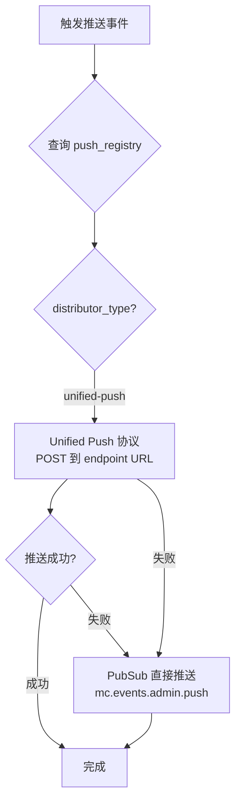

# 网络代理层与共识 / 存储

服务器节点以 libp2p Host 作为对外入口。启用联合大厅兼容模式时，该节点同时充当 **Lobby Bridge**，对外接入 MUA 联合大厅，对内将流量转换成本系统的实例路由与容器连接。

## 入站代理（两类入口，三种来源）

服务器节点支持**两种入站方式**，对应两类玩家：

```mermaid
flowchart LR
  subgraph A["libp2p 入口 (FollyLauncher)"]
    Cli[启动器代理]
    L1[libp2p Host]
    P1[入站代理模块]
  end

  subgraph B["TCP 入口 (标准启动器 + MUA)"]
    Std[HMCL / PCL]
    MUA[MUA API 查询 club]
    P2[TCP 代理模块]
  end

  H[本地实例表]
  C[Docker 容器：MC 实例]

  Cli -->|"QUIC + libp2p stream"| L1
  L1 -->|substream "/mc/play/1"| P1
  Std -->|TCP| P2
  P2 --> MUA
  MUA --> P2
  P1 --> H
  P2 --> H
  H -->|"instance_id → 容器内 IP:port"| P1
  H -->|"instance_id → 容器内 IP:port"| P2
  P1 -->|TCP| C
  P2 -->|TCP| C
```

联合大厅流量在活跃桥接节点上终止为一条**虚拟 TCP 会话**，复用同一套 TCP 入口管线。对服务器节点而言，入口类型始终只有 libp2p 和 TCP 两类；TCP 入口同时承载公网直连与联合大厅桥接两种来源。

### libp2p 入口（VC 玩家）

对每条 substream 依次执行以下步骤：
1. 协商协议版本 —— 目前使用 `/mc/play/1`
2. 解析 MC 握手前段，提取 `instance_id`
3. 验证 PeerID 的 VC 有效性，检查 `admission` 配置
4. 建立到容器的 TCP 连接

### TCP 入口（MUA 访客）

标准启动器直连服务器的公网 MC 端口：

1. MC 握手解析 —— 从 Server Address 字段提取 `instance_id`
2. Login Start 解析 —— 读取 MC Login Start 包，提取玩家 `username`
3. MUA API 查询 —— `GET {union_api_url}/api/mua/profile/name/{username}`（附带 `X-MUA-API-Key`），从返回的 `source` 字段获取玩家所属皮肤站代码
4. 准入检查 —— 查实例 `admission`，判断该皮肤站代码是否在 `allowed_clubs` 中
5. 建立到容器的 TCP 连接

> 标准启动器通过 MC 加密协议传输 accessToken，中间节点无法直接解密验证。改用 MUA API 按 username 查询 club 做身份过滤，与 UUID 验证的准入效果等效。

### 联合大厅桥接（MUA Lobby）

联合大厅路径适用于玩家从 MUA 大厅跳转至 JLUCraft 实例的场景。与直连路径不同：外层连接先抵达共识层选出的活跃桥接节点，再中转至实例宿主节点。

桥接链路如下：

1. 桥接节点选主 —— 多个公网 `consensus` / `relay` 节点可声明承担 Lobby Bridge 角色，但同一时刻只有一个节点持有 `mua_bridge/<cluster>` lease。
2. 外部隧道建立 —— 活跃桥接节点与 MUA `frps` 建立兼容的 `frp` 控制面 / 数据面连接，承接 JLUCraft 标签下的大厅流量。
3. 转发元数据解析 —— 解析联合大厅附加的转发元数据（legacy forwarding 字段、玩家 IP、UUID、username、目标 host 等）。
4. 可信入口校验 —— 使用 Union API 同步的 `entry_list` 校验上游接入点身份，语义上等价于 ProxiedProxy 的 `TrustedEntries.json`。
5. 目标实例解析 —— 将大厅标签、forced host 或握手包中的 `instance_id` 归一化为本系统的实例标识，再查询实例表和共识层映射。
6. 准入检查 —— 结合转发得到的 UUID / username，查询 Union 资料并执行 `allowed_clubs`、黑白名单和实例状态检查。
7. 内部桥接 —— 若实例在本地，则直接连接容器；若实例在其他节点，则由桥接节点主动向实例宿主建立 libp2p/QUIC 子流并双向透传字节。

桥接节点只负责接入层语义兼容。实例仍可运行在校园网、宿舍或其他工作节点上，联合大厅仅为它们增加一个统一入口。

### 联合大厅桥接的去中心化边界

该路径的边界如下：

- **MUA 侧保持中心化**：Union API、联合大厅入口及 `frps` 不在 JLUCraft 控制范围内。
- **JLUCraft 侧保持去中心化**：桥接节点的选择、标签到实例的映射、故障接管等决策均由共识层完成。
- **单活是架构上的有意选择**：大厅端口映射与 trusted entry 语义不适合多活竞争，系统采用“多候选 + 单活 lease”的高可用模型。

故障切换规则：

- 活跃桥接节点周期性刷新 lease；节点失联后 lease 超时，备用节点接管。
- 备用节点持续同步 `entry_list`、标签映射与准入配置版本，接管时可直接复用已有状态。
- 切换期间旧会话允许中断、客户端重连；新会话始终路由到新的活跃桥接者。

无论哪种入口，连接建立后的所有字节均为**双向透传**。实例表（`instance_id → 容器地址`）由实例生命周期模块维护，容器销毁时同步删除对应条目。代理收到指向已销毁实例的连接时会主动关闭并通知客户端更新缓存。

## 跨节点重定向

DHT 上的实例位置记录可能因迁移而过期。若启动器使用旧地址发起连接：



第二种桥接分支仅在源节点未承诺保留中继角色时启用，且作用域限于本次会话，避免已迁移的旧节点退化为永久路由热点。

联合大厅会话还需遵循一条约束：**不得将内部重定向暴露给玩家客户端**。大厅玩家仅知晓 MUA 入口地址，不应接触 JLUCraft 内部的 PeerID 或实例宿主地址。桥接节点发现目标实例不在本地时，在内部节点间完成二段桥接，对客户端完全透明。

## DDoS 防护

处于公网或半公网的服务器节点容易成为攻击目标。系统设置了三级防护：

### 第一层：libp2p 连接限流

| 限流维度 | 默认阈值 |
| --- | --- |
| 单 PeerID 新连接速率 | 10 / 秒 |
| 未验证身份的连接占比上限 | 20% |
| 单连接的并发 substream 数 | 16 |
| 入站握手等待 | 5 秒超时 |

超过阈值的连接被拒绝，对方 PeerID 临时拉黑（默认 5 分钟），拉黑事件写入本地审计日志。

### 第二层：VC 优先级

持有有效 VC 的连接优先于无 VC 的连接，在资源紧张时保证已知玩家先获得服务。这种软优先级使攻击者的伪造连接更容易被替换出队列。

### 第三层：共识层信誉

[节点信誉分](../../design/consensus#节点信誉系统-node-score) 影响其他节点对其的容忍度。频繁发出异常流量的节点会遭到全网降级，直至丧失发起新连接的能力。

## 出站连接

服务器节点也会主动出站：

| 用途 | 协议 | 频率 |
| --- | --- | --- |
| Raft 日志复制 | libp2p stream `/raft/v1` | 持续，日志频率取决于事件 |
| DHT 维护 | libp2p stream `/kad/v1` | 周期性 |
| S3 读写 | HTTPS | 实例运行时按需 |
| Bootstrap 重连 | libp2p QUIC | 节点启动 + 周期性心跳 |
| 中继转发 | libp2p stream `/relay/v1` | 仅 relay 角色 |

出站方向不施加特殊限制，但所有出站请求均受本地度量。异常出站（连接白名单外的外部端点）会触发告警，帮助运维者及时发现入侵迹象。

## 共识参与

`consensus` 节点在 libp2p Host 之上跑标准 Raft 协议，日志复制、心跳、选举都封装在 `/raft/v1` substream 里。

| 子协议 | substream | 数据 |
| --- | --- | --- |
| 心跳 / AppendEntries | `/raft/v1/append` | leader → followers，默认 50 ms 间隔 |
| 投票 | `/raft/v1/vote` | candidate → 全员 |
| 快照传输 | `/raft/v1/snapshot` | leader → 落后者，大对象时切到 S3 直链 |

`worker` 节点以 **Learner** 模式只读跟随，不参与投票，但维护日志尾部用于本地决策——例如收到调度命令时，可确认对应日志已被多数派确认并安全执行。



每 10000 条日志生成一次快照，快照本身上传到 S3 `consensus/snapshots/<term>-<index>.bin`，Raft 日志条目仅保留指针。新节点先拉取快照再追加增量日志，避免初次同步时耗尽 libp2p 带宽。

## 存储交互

服务器节点将所有持久化操作收拢到 `StorageClient` 模块，该模块统一管理 S3 API 调用、本地磁盘缓存与写入并发控制。

StorageClient 提供四项操作：按路径读取（支持 freshness 策略）、按路径写入（可选 lease 锁）、按路径删除（可选 lease 锁），以及为指定路径申请租约（返回 lease token）。

### 本地缓存

每次读取后内容缓存到 `data_dir/cache/<sha256>`:

- 命中 → 直接返回，跳过 S3
- 未命中 → 拉取 + 落缓存
- 缓存上限默认 50 GB，LRU 淘汰
- 实例当前活跃数据（world、最近 WAL）永久驻留，不参与淘汰

世界数据按 region 分文件，每个 region 独立缓存，迁移时只需要传输被修改过的 region。

### 写入穿透与 Lease

S3 不提供并发写入互斥，服务器节点在共识层注册“实例 → 当前宿主节点”的 lease（默认 60 秒续期）：



只有持有最新 lease 的节点才能写入对应实例的 S3 路径，避免被动迁移恢复后旧节点继续写入造成的数据撕裂。读取无需 lease，任何节点均可拉取存档（只要 VC 允许）。

### 落盘故障兜底

实例运行期间 `StorageClient` 持续将 WAL（玩家操作流）异步写入 S3 `wal/<instance>/<ts>.log`。即使节点突然断电导致世界文件未同步，新宿主启动后也可从 WAL 重放最近几秒的玩家操作，数据丢失控制在秒级以内。

## 去中心化推送 (Unified Push)

federated-server 向管理终端发送 AuthChallenge 或告警通知时，不依赖中心化推送平台（FCM / APNs），改用 **Unified Push 协议**直接送达管理员设备。

### 推送注册

union-manager 启动后向已知的服务器节点注册推送端点：



`push_endpoint` 必须是 unified-push distributor 的 URL（如 `https://gotify.jlucraft.club/UP?...`）。服务器仅支持 `unified-push` distributor_type，统一使用 HTTP POST 推送。

### 推送分发

当需要通知管理员时（AuthChallenge、实例崩溃、新提案等），federated-server 的 `PushDispatcher` 按以下流程分发：



### 去中心化的安全性

- 推送 payload **不包含敏感业务数据**，仅携带事件类型 + nonce，管理员收到推送后通过 libp2p 回连服务器拉取完整内容
- Unified Push 通道的数据面由 distributor 的 TLS 保护
- 推送端点注册写入共识日志，任何端点变更可追溯。端点随设备吊销自动失效
- 服务器节点间的推送注册表通过 Raft 共识保持同步——任何共识节点均可发起推送，消除单点依赖
- 若管理员设备网络不可达（离线 / 无 distributor），服务器默认退回到 **PubSub 推送**：通过 `mc.events.admin.push` 频道广播，管理终端在恢复连接后从 PubSub 历史缓存中重放未读事件
