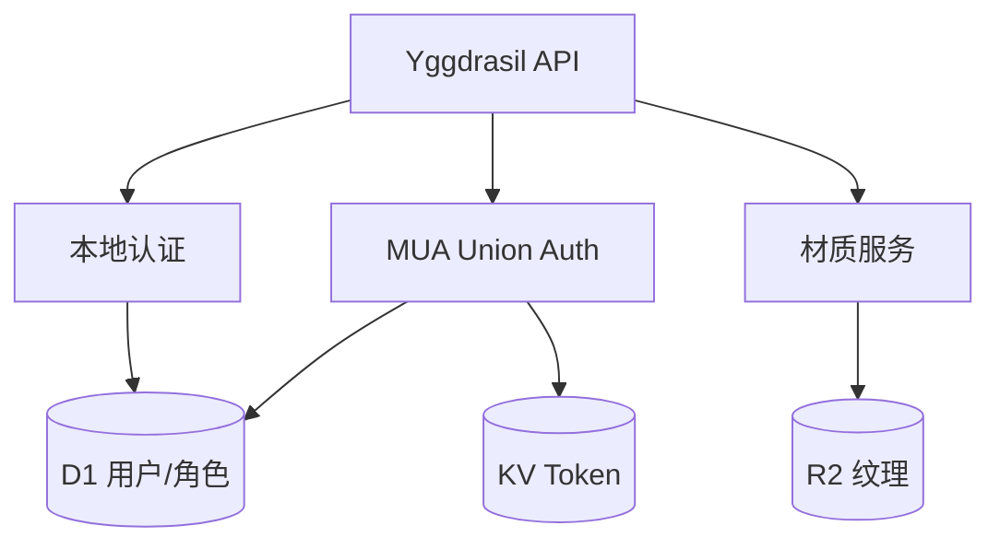
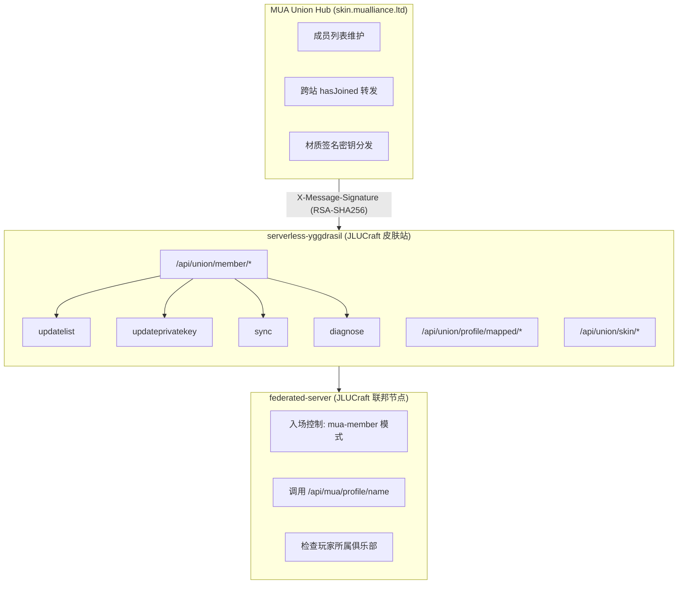

# 无服务器皮肤站

皮肤站是系统的**身份入口**：提供 Yggdrasil 认证、MUA Union 联合认证集成、皮肤/披风存储，为 Minecraft 客户端和服务器提供玩家身份验证与材质分发。

基于 Cloudflare Workers 的 serverless 实现，零运维、自动伸缩。

## 模块构成

| 模块 | 职责 |
| --- | --- |
| Yggdrasil API | Authlib-Injector 标准协议 (authserver / sessionserver) |
| MUA Union Auth | Union 联合认证协议 (member 端点、跨站 profile、签名验证) |
| 本地认证 | 邮箱域名验证注册、JWT 签发、PeerID 绑定 |
| 材质服务 | 皮肤/披风上传、存储、分发 |

## MUA Union Auth 集成

皮肤站集成了 [MUA Union 联合认证协议](https://docs.mualliance.cn/zh/dev/union/auth)，作为**成员皮肤站**接入 Union 系统。

### 集成架构

### 实现文件

| 文件 | 职责 |
| --- | --- |
| `src/routes/union.ts` | Union 协议全部路由（member 端点、profile mapped、skin） |
| `src/routes/mua.ts` | MUA profile 查询、binding 管理、机器间 s2s 端点 |
| `src/routes/yggdrasil.ts` | Yggdrasil API (authserver / sessionserver) |
| `src/routes/auth.ts` | 本地认证、mua-peer-bind |
| `src/services/union.ts` | Union 业务逻辑：服务器列表管理、密钥存储、sync 触发、UUID 重映射 |
| `src/services/mua.ts` | MUA 跨站查询、信任站点管理、binding CRUD |
| `src/middleware/union-verify.ts` | Union Hub 请求的 RSA 签名验证中间件 |
| `src/middleware/auth.ts` | JWT Bearer 令牌验证中间件 |
| `src/utils/crypto.ts` | Ed25519 验证、RSA-PKCS1v1.5 SHA-256 签名验证 |

### Union Member 端点

`/api/union/member/*` 系列端点由 MUA Union Hub 调用，均需通过 RSA-SHA256 签名验证后方可访问。验证所需的三项请求头由 Union Hub 在每次请求中携带。

| 端点 | 方法 | 说明 |
| --- | --- | --- |
| `/` | GET | 返回站点信息与 API 版本，供 Hub 发现 |
| `/updatelist` | POST | 接收全量 Union 成员服务器列表 |
| `/updateprivatekey` | POST | 接收共享材质签名私钥（用于统一材质签名） |
| `/updatebackendkey` | POST | 接收后端通信密钥与 Union Hub 公钥 |
| `/sync` | POST | 触发本地玩家数据全量同步至 Union Hub |
| `/remapuuid` | POST | 处理多站点间的 UUID / 角色名冲突映射 |
| `/updateplugin` | POST | 插件自动更新通知（serverless 部署下无实际操作） |
| `/diagnose` | POST | 连通性与配置诊断，返回各密钥配置状态 |
| `/queryemail` | GET | 根据邮箱地址反查玩家，用于跨站点去重 |

### 签名验证

Union Hub 发往成员站每个请求的验证流程：

1. **请求头提取** — `X-Message-Signature`（Base64 编码的 RSA 签名）、`X-Message-Timestamp`（Unix 秒级时间戳）、`X-Message-Nonce`（随机一次性值）
2. **时间窗口验证** — 服务端时钟与 Timestamp 偏差需在 `[-10s, +30s]` 区间内，超出则拒绝
3. **重放防护** — Nonce 写入 KV 存储并设 60 秒过期，重复出现即判定为重放攻击
4. **签名核验** — 用存储在 `union_secrets` 表中的 Union Hub 公钥（首次从 `MUA_UNION_ENDPOINT` 拉取），对 `{请求体原文}{Timestamp}{Nonce}` 拼接串执行 RSA-PKCS1v1.5 SHA-256 验签
5. **通过后放行** — 进入业务逻辑处理

### 跨站 Profile 查询

federated-server 等组件需要查询某个玩家所属的 MUA 站点，以便执行实例入场控制（如 `mua-member` 模式）。皮肤站提供两类查询端点：

**面向用户**（HTML/JS UI 消费）：返回 `{ code, message, data }` 的 `success()` 包装格式，字段使用 `camelCase`。

**面向机器**（federated-server / Union Hub 消费）：返回 flat JSON（无外层包装），字段使用 `snake_case`。端点路径为 `/api/mua/s2s/*`。

此外，`/api/mua/profile/*` 端点通过检测请求头中是否携带有效的 `X-MUA-API-Key` 自动判断调用方类型——有有效 Key 时返回机器格式，否则返回用户格式。

| 调用方 | 端点示例 | 响应格式 |
| --- | --- | --- |
| 前端 UI | `GET /api/mua/profile/name/Alice` | `{ code, message, data: { name, source_name, ... } }` |
| federated-server | `GET /api/mua/profile/name/Alice` (带 `X-MUA-API-Key`) | `{ id, name, source, source_name }` |
| Union Hub / 其他成员站 | `GET /api/union/profile/mapped/byuuid/<uuid>` | MUA 标准 mapped 格式 |

### 接入 Union 流程

1. 管理员在后台配置 `MUA_UNION_ENDPOINT`、站点代码和站点名称
2. 联系 Union 管理员完成审批，Union Hub 将站点加入成员列表
3. Union Hub 通过 `/member/updatebackendkey` 下发后端密钥与 Union 公钥，此后所有成员端点请求均可验签
4. Union Hub 通过 `/member/updatelist` 下发全量成员列表，皮肤站据此配置信任站点
5. Union Hub 通过 `/member/sync` 触发首次玩家数据全量同步
6. 此后 Union Hub 定期调用 `/member/diagnose` 检测连通性，并按需调用 `/member/updateprivatekey` 轮转材质签名密钥

### 身份分层

皮肤站用户遵循三级角色制：

| 角色 | Yggdrasil 登录 | MUA 绑定 | 管理员功能 |
| --- | :-: | :-: | :-: |
| Guest | ✅ | ✅ | ❌ |
| Member | ✅ | ✅ | ❌ |
| Admin | ✅ | ✅ | ✅ |

- **Guest**：完成邮箱验证的新注册用户，可登录 Yggdrasil、绑定 MUA 角色，不可操作管理接口
- **Member**：经管理员提升的正式成员，当前权限与 Guest 一致，预留未来治理功能
- **Admin**：站点管理员，可管理用户角色/状态、配置信任站点、修改 MUA 参数
