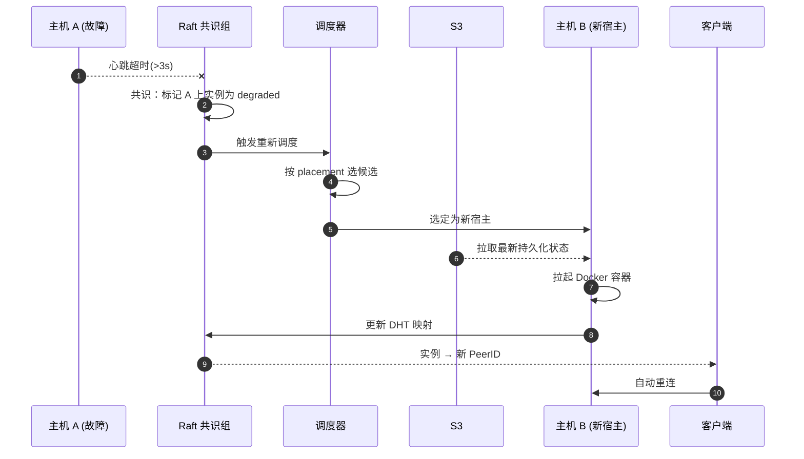

# 业务层

业务层将网络层和 HAL 的能力组装成"产品级"功能：实例生命周期管理、自动恢复、持久化策略。上层（管理终端、启动器）直接对接业务层。

## 实例编排引擎

| 方法 | 类别 | 功能 |
| ---- | ---- | ---- |
| create_instance | 生命周期 | 按规格和调度约束创建实例 |
| migrate_instance | 生命周期 | 迁移实例到其他主机 |
| destroy_instance | 生命周期 | 销毁实例 |
| list_instances | 查询 | 按筛选条件查询实例列表 |
| instance_status | 查询 | 查询单个实例状态 |
| watch_instances | 事件流 | 订阅实例变更事件 |

## 自动恢复流程

主机宕机后服务在 30 秒内重新可用：

::: info 恢复时间目标 (RTO)
主机离线到服务恢复 **< 30 秒**(取决于 Docker 镜像拉取和 S3 读取速度)。
:::

## S3 存储策略

S3 是**唯一可靠的持久化后端**。本地磁盘仅作缓存。

| 数据类别 | 写入策略 | S3 路径 |
| -------- | -------- | ------- |
| 世界数据 | 增量备份，每 5 分钟一次 | `worlds/{world_id}/snapshots/{timestamp}/` |
| 配置 | 每次修改即时写入 | `configs/{service_id}/` |
| 玩家数据 | 玩家离线时写入 | `players/{uuid}/` |
| WAL（预写日志） | 服务运行时持续写入，崩溃恢复的最后保障 | `wal/{instance_id}/` |

兼容 S3 协议的后端均可接入：**AWS S3 / Cloudflare R2 / MinIO**。
