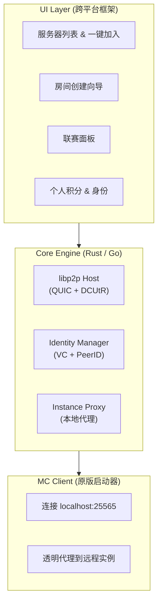
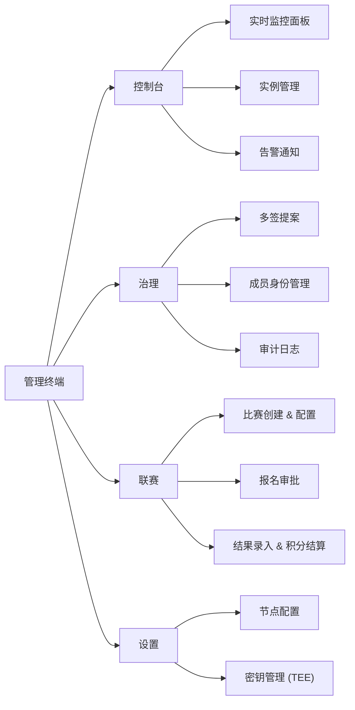
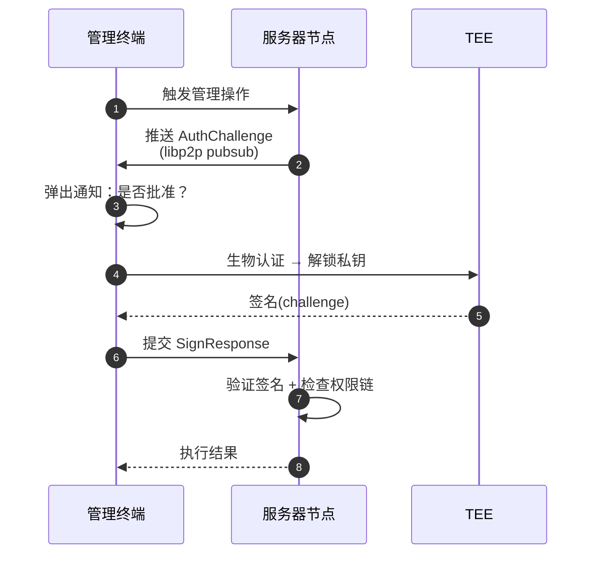

# 客户端架构

客户端分两种：面向玩家的**启动器**，以及面向管理员的**管理终端**。两者共用底层网络与身份能力，UI 和权限模型不同。

## 启动器架构



启动器本体的功能划分见 [启动器组件文档](../components/launcher/index.md)。

### 本地代理机制

```mermaid
sequenceDiagram
    autonumber
    participant MC as MC Client
    participant Proxy as Instance Proxy
    participant DHT
    participant Host as 目标主机

    MC->>Proxy: 连接 localhost:25565
    Proxy->>Proxy: 解析 MC 握手包，获取 instance_id
    Proxy->>DHT: 查询 instance_id
    DHT-->>Proxy: peerID + multiaddr
    Proxy->>Host: 建立 libp2p QUIC stream
    Host-->>Proxy: 已就绪
    Proxy<->>MC: 透传 MC 协议数据
```

玩家选中服务器点击"加入"即可，**不需要手动输入 IP:端口**。

## 管理终端

独立于启动器，面向管理员。完整功能模块见 [管理终端组件文档](../components/manager/index.md),顶层结构如下：



### 推送授权机制

管理终端与服务器节点之间的敏感操作都走"推送 + TEE 签名"流程：



## TEE 密钥管理

- 管理员的 ed25519 私钥在 **TEE** 中生成
- macOS:Secure Enclave;Windows:TPM 2.0;Android/iOS:各自安全芯片
- 私钥永不离开 TEE，签名在 TEE 内完成
- TEE 生成的公钥注册到链上，与管理员身份绑定

::: warning 优势
设备被盗也无法导出私钥。遗失时通过多签操作吊销对应公钥即可。
:::
