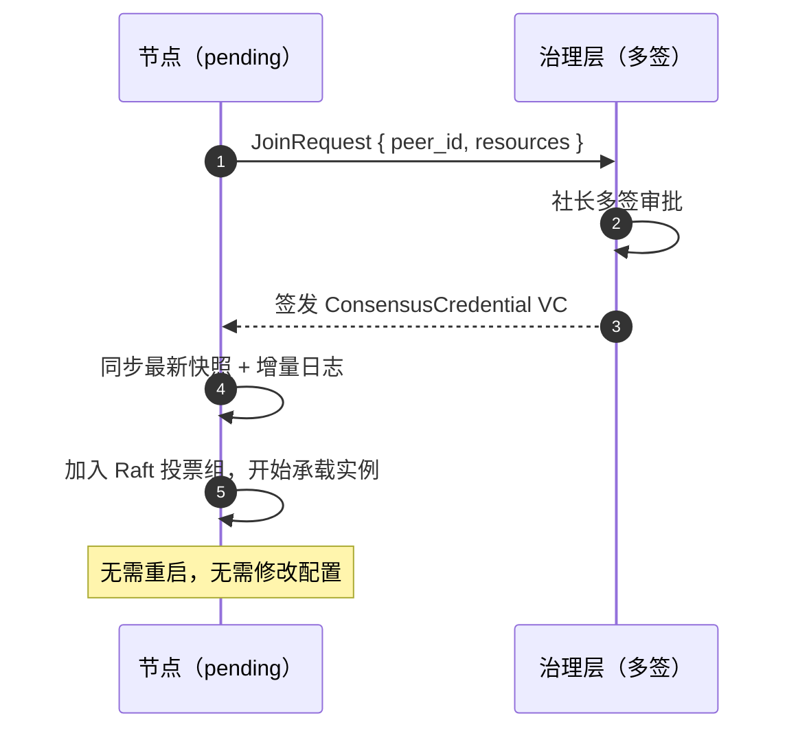
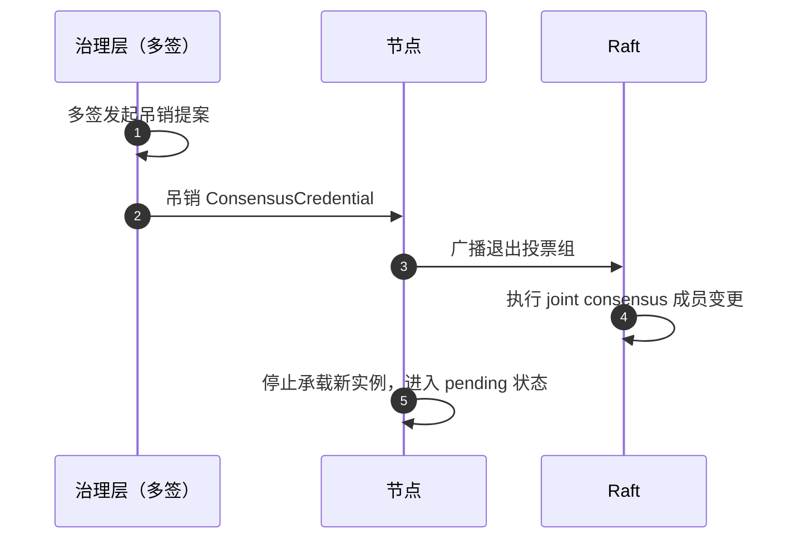

# 多方共识层

关键决策（调度、治理、积分）需要不可篡改的多方一致记录。本系统采用 **Raft** 作为共识协议——比 PBFT 简单，适合 3–7 节点的小规模可信集群。

## 零配置与防篡改

::: warning 核心安全原则
节点软件不包含任何角色配置项。物理机控制者无法通过修改本地配置将自己提升为共识成员——**加入 Raft 投票组的唯一途径是持有治理层多签签发的 `ConsensusCredential` VC**。

这意味着：
- 攻击者控制一台物理机，最多能做的是关机或断网，无法伪造投票
- 新节点加入网络自动对等，不需要管理员手动分配角色
- 撤销共识资格只需吊销对应 VC，无需登录目标机器修改配置
:::

## 共识组成员管理

节点启动后自动发送 `JoinRequest`，进入 **pending** 状态。pending 期间节点仅在 DHT 上可见，不承载实例、不参与投票，对系统没有任何影响。

### 加入流程

新加入节点先同步日志至 leader 进度，再参与选举，避免因日志落后导致投票发散。

### 退出 / 撤销流程

吊销后节点退回 pending 状态，已运行的实例由共识层调度迁移到其他节点。

### 共识组规模

- 规模：3 / 5 / 7 节点（奇数），允许 `(n-1)/2` 节点故障
- 成员变更使用 Raft joint consensus，保证变更过程中系统不中断

## 共识范围

| 决策类型 | 说明 |
| -------- | ---- |
| 实例调度 | 根据各节点上报的资源富余决定实例落点 |
| 节点加入 / 退出 | 记录 ConsensusCredential 签发与吊销事件 |
| 治理操作 | 多签指令执行记录 |
| 预言机积分发放 | 日度积分结算上链 |
| 节点信誉分更新 | 由预言机提交，共识层记录 |

## 节点信誉系统 (Node Score)

信誉分由预言机客观采集，共识层记录，不依赖节点自报。

| 维度 | 权重 | 含义 |
| ---- | ---- | ---- |
| uptime_score | 0.4 | 过去 30 天在线率（0–100） |
| performance_score | 0.4 | 服务质量和延迟（0–100） |
| governance_score | 0.2 | 参与共识投票率（0–100，仅共识成员有此项） |
| penalty | — | 恶意行为扣分，直接减 |

最终分数 = 各维度加权求和后减去惩罚分。

### 信誉分影响

- **调度权重**：高分节点获得更多实例
- **中继优先级**：高分节点优先被选为中继
- **治理投票权**：低于阈值则暂时失去投票权（即使持有 ConsensusCredential）

## Raft 实现要点

- 持有 `ConsensusCredential` 的节点完整参与 Raft 日志复制和选举
- 不持有该 VC 的节点仅观察日志，不参与投票，但可承载实例
- 每 10000 条日志生成快照，存储到 S3
- 新节点从 S3 拉取快照 + 增量日志快速同步，无需人工干预
- 共识日志条目可通过哈希追溯，任何节点可独立验证

::: tip 为什么选 Raft
社团 3–7 节点，共识成员由多签授权，假定不会主动作恶。拜占庭行为的成本由[治理层](./governance)多签和[预言机](./oracle)反作弊机制处理。若未来节点规模扩大或信任模型改变，可迁移至 BFT 类协议。
:::
