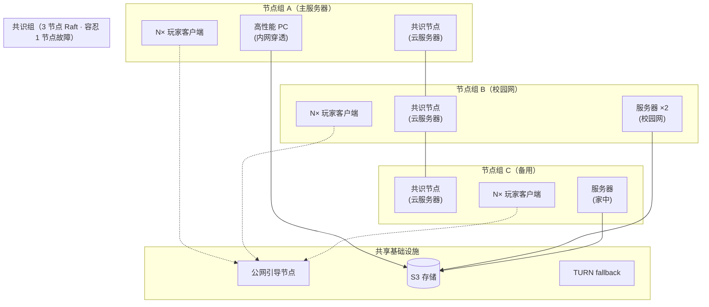
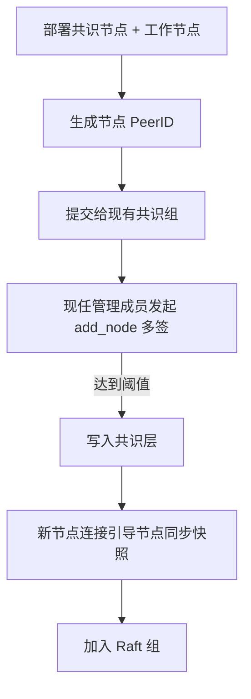

# 部署拓扑

以下是一个**典型社团部署**的参考拓扑，可作为新节点接入的模板。

## 基础组件清单

| 组件 | 数量 | 说明 |
| ---- | ---- | ---- |
| 引导节点 (Bootstrap) | 1 ~ N | 公网 VPS，仅作 DHT 入口 |
| 共识节点 (Consensus) | 至少 1 | 加入 Raft 组，参与调度与治理 |
| 工作节点 (Worker) | 任意 | 仅运行实例，不参与共识 |
| S3 存储 | 1 套 | 持久化层（AWS S3 / R2 / MinIO 自建均可） |
| TURN fallback | 0 ~ 1 | 极端情况下的中转 |
| 联合大厅桥接节点 (Lobby Bridge) | 0 ~ N 候选 / 1 活跃 | 可选。接入 MUA 联合大厅时启用，对外兼容大厅接入协议，对内桥接到 P2P 网络 |

## 多节点参考部署

## 节点角色与位置选型

| 节点角色 | 推荐位置 | 关键考量 |
| -------- | -------- | -------- |
| 引导节点 | 公网 VPS，廉价小内存即可 | 必须有公网 IP，带宽足够支撑 DHT 查询 |
| 共识节点 | 社团云服务器 | 在线率 ≥ 99%、低延迟、稳定 |
| 工作节点 | 校园网 / 宿舍 PC | 性能优先，内网穿透由网络层处理 |
| TURN fallback | 公网 VPS | 仅打洞失败时启用，带宽消耗大 |

## 网络与穿透

详细策略见 [网络层 — NAT 穿透策略](./network#nat-穿透策略)，拓扑层面确保：

- **每个节点组至少有一台公网节点**：用于自身内网节点对外打洞，也可担任其他节点组的中继备选。
- **引导节点冗余 ≥ 2**：防止单点宕机导致新节点无法接入。
- **S3 存储跨区域备份**：唯一可靠持久化层，本身需要高可用。

## 联合大厅接入部署（可选）

当社团希望把实例接入 MUA 联合大厅时，需要在现有去中心化服务器集群中额外启用一个**逻辑上的桥接入口**。它对外表现为兼容 MUA 大厅的 `frpc` / 代理接入端，对内仍然走本系统的 DHT、共识和 libp2p/QUIC 数据面。

这个桥接入口**不建议做多活暴露**：MUA 侧的远端端口映射和 trusted entry 语义天然更适合单活。因此推荐做法是“**多候选节点 + 共识选主 + 单活接管**”。

| 项 | 推荐值 | 说明 |
| --- | --- | --- |
| 桥接候选节点 | 2 ~ 3 台 | 选择带公网 IP、长期在线的 `consensus` 或 `relay` 节点 |
| 活跃桥接节点 | 1 台 | 由共识层 lease 选出，唯一持有对 MUA `frps` 的活动连接 |
| 备用节点 | ≥ 1 台 | 持续同步 Union API 元数据，但不建立外部映射 |
| 外部依赖 | Union API + MUA `frps` | 这是接入联合大厅时保留的中心化边界 |
| 内部状态 | 共识层 + 本地缓存 | lease、目标实例映射、forced host 配置由共识层统一管理 |

部署时需要落实以下约束：

1. **准备 Union 凭据**：包括 `Union Member Key`、Union API 根地址，以及 MUA 下发的大厅配置片段。
2. **选择桥接候选节点**：这些节点必须具备稳定公网连通性，且能访问 Union API 与 MUA `frps`。
3. **启用桥接兼容模式**：Agent 需要实现与 MUA 大厅兼容的 `frp` 控制面 / 数据面、trusted entry 同步和转发元数据解析。
4. **把桥接状态写入共识层**：包括当前活跃桥接者、目标标签到 `instance_id` 的映射、forced host 规则与准入策略版本号。
5. **验证接入链路**：通过联合大厅 `/hub` 或指定标签名进入，确认实例解析、准入检查和跨节点桥接都工作正常。

桥接节点本身不承载持久化状态：

- 与联合大厅相关的配置版本、标签映射、lease 状态放在共识层。
- trusted entry 列表和临时连接上下文只缓存在本地，可随时重建。
- 若活跃桥接节点宕机，备用节点获取 lease 后重新连接 MUA `frps` 即可接管。

## 扩展接入流程

新节点加入网络的步骤：

::: warning 新管理成员公钥
若新管理成员公钥需注册到 genesis，要全体核心成员同意并发布新二进制（物理边界，见 [安全边界](./security)）。
:::
