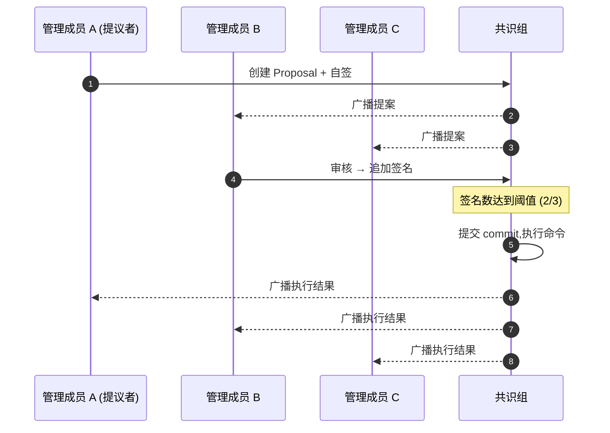
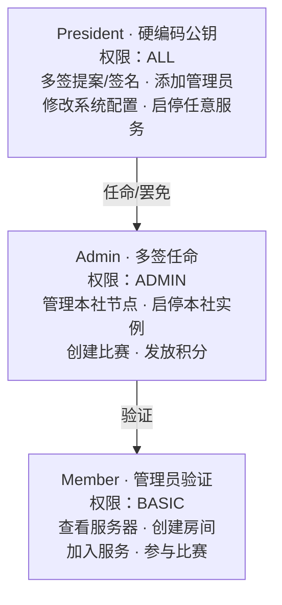
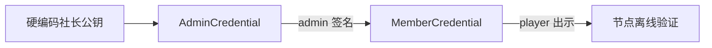

# 治理层

治理层用密码学固化"谁有权做什么"的规则。**硬编码公钥 + 多签 + W3C VC** 三件套构成完整的信任链。

## 硬编码公钥与多签

Genesis 配置（硬编码于源码）包含核心管理成员公钥和**默认多签阈值 2/3**。多签阈值及各类提案的门槛可通过 `update_governance_params` 提案动态调整，该类型提案本身需要 **≥ 3/4 社长签名（或全体一致）+ 48 小时冷静期**。

### 多签指令流程

提案包含以下字段：

| 字段 | 类型 | 说明 |
| ---- | ---- | ---- |
| id | UUID | 提案唯一标识 |
| type | 枚举 | add_node / remove_node / update_config / grant_admin / revoke_admin / payout_reward / update_governance_params |
| payload | 任意 | 提案具体参数 |
| proposer | PeerID | 提议者身份 |
| expires_at | 时间戳 | 过期时间 |
| signatures | 签名数组 | 至少包含提议者自己的签名 |

## 角色体系

## 身份凭证：W3C Verifiable Credential

社员 VC 包含以下信息：

| 字段 | 内容 |
| ---- | ---- |
| 凭证类型 | VerifiableCredential + MCMemberCredential |
| 签发者 | 社团 DID(如 did:mc:club-a) |
| 持有者 | 玩家 DID(did:mc:player-uuid) |
| 声明 | 角色(role)、社团(club)、生效时间(since) |
| 证明 | Ed25519Signature2020 签名 |

### 验证链

玩家登录时出示 VC，**任何节点可离线验证链上信任关系**。

::: warning 吊销机制
吊销列表通过 DHT 全网同步。VC 的有效性在首次连接任意服务器节点时验证，本地缓存吊销列表降低延迟。
:::
