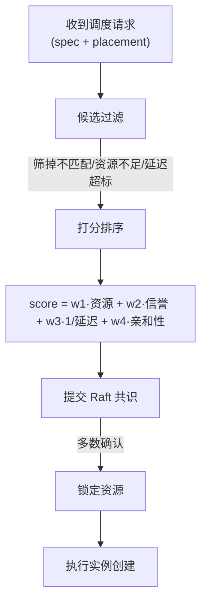

# 主机抽象层

HAL 以统一的 `Instance` 概念抽象"运行 MC 服务"，屏蔽 Docker、网络、存储的差异，向业务层提供简洁的生命周期 API。

## 核心抽象：`Instance`

Instance 包含五组信息：

**标识**：UUID (`id`) + 用户自定义的易记名称 (`name`)，如 `"生存服·R1"` 或 `"社团空岛联赛决赛"`。`name` 面向玩家和管理员展示，`id` 用于机器寻址。命名无全局唯一性约束——允许不同社团各自的"主服"。

**运行时描述**：Docker 镜像（如 itzg/minecraft-server:java21）、资源规格（CPU/内存/磁盘）、环境变量、挂载卷（S3 映射）。

**调度约束**：优先调度的主机列表、亲和性规则（不与其他实例共存）、对玩家的最大延迟限制。

**准入控制**：决定谁可以进入该实例玩游戏。支持四种模式：

| 模式 | 说明 | 典型场景 |
|------|------|---------|
| `public` | 任何人可加入 | 公开宣传服务器、新人体验服 |
| `vc_only` | 仅持有有效 VC 的玩家 | 社团内部训练、私有存档 |
| `club_only` | 仅指定学校的 VC 持有者 | 单校联赛预选赛 |
| `mua_member` | MUA 任意成员皮肤站的用户均可 | 跨校友谊赛、联合活动 |

`mua_member` 模式下可进一步限定 `allowed_clubs`（如仅允许 `jlu` + `zju` 两校），实现"部分 MUA 成员互通"。

**状态信息**：当前状态（provisioning / running / degraded / migrating / stopped）、所在主机、迁移目标。

## "房间" vs "服务"

两种类型在生命周期、调度策略、存储后端上的差异：

| 维度 | 房间（Room） | 服务（Service） |
| ---- | ----------- | -------------- |
| 生命周期 | 临时，玩家下线即销毁 | 持久运行 |
| 调度策略 | 优先低延迟主机 | 优先稳定主机 |
| 存储 | ephemeral，不持久化 | persistent，S3 后端 |
| 迁移 | 不迁移，玩家退出即关 | 支持热迁移 |
| 创建者 | 任意玩家 | 仅管理员 |

## 主机能力模型

每个服务器节点向 DHT 公布其能力：

| 信息 | 内容 |
| ---- | ---- |
| 标识 | PeerID |
| 资源总量 | CPU 核心数、内存(GB)、磁盘(GB)、GPU |
| 可用资源 | CPU 核心数、内存(GB)、磁盘(GB) |
| 网络 | NAT 类型(public / cone / symmetric)、上下行带宽、到引导节点延迟 |
| 标签 | 社团、硬件等级、特殊能力等 |
| 信誉分 | 共识层计算的节点评分 |

## 实例调度算法

调度器**运行在每个服务器节点上**（去中心化），流程如下：

调度细节对接 [业务层的实例编排引擎](./business#实例编排引擎)。
