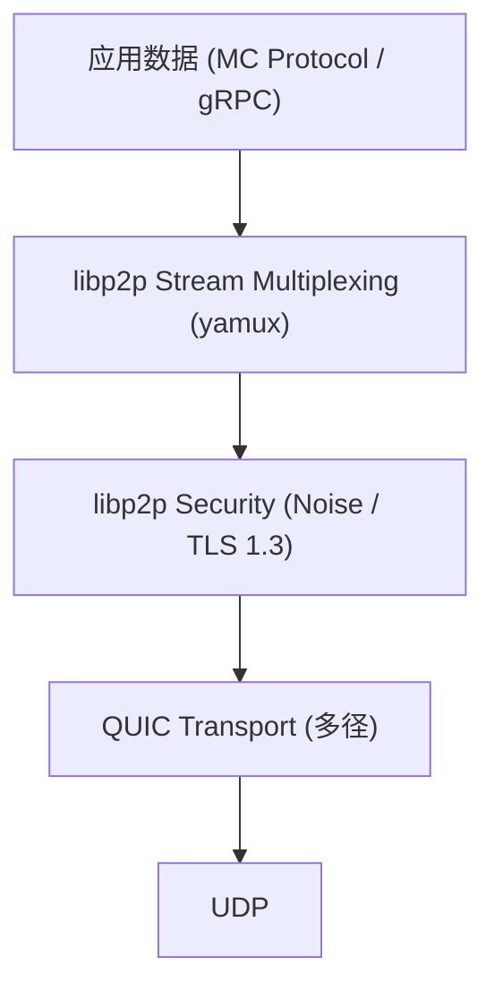
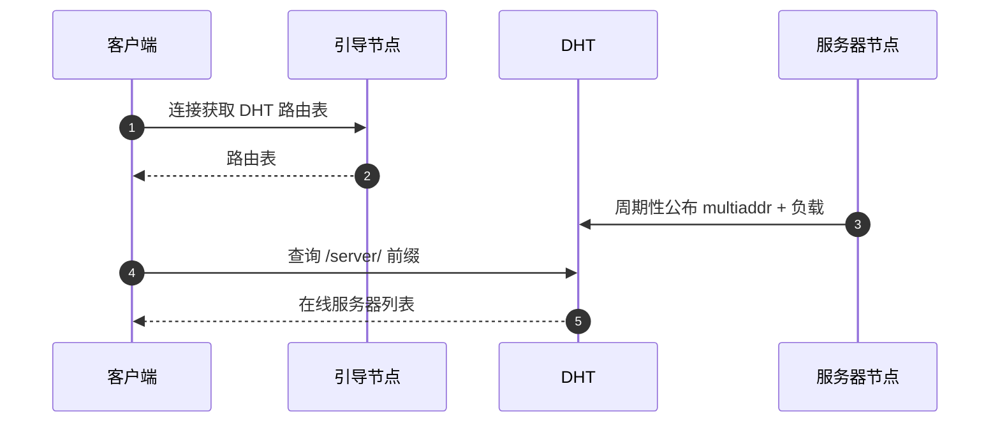
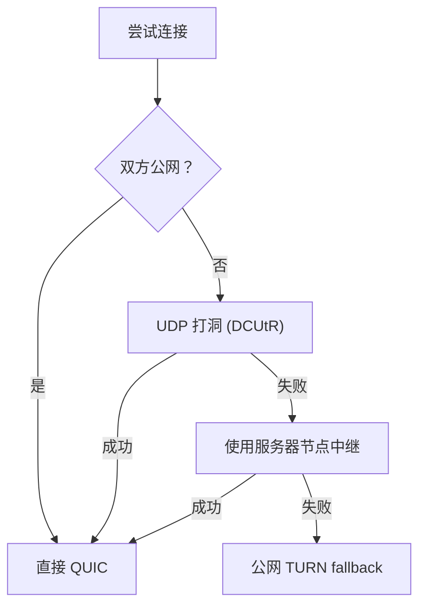

# 网络层

JLUCraft 的网络层用 **libp2p + QUIC** 构建，把分散在校园网与公网的节点拼成一张可寻址、可穿透、低延迟的对等网。

## 核心协议栈

### 设计决策

- **QUIC 而非 TCP**：支持连接迁移，NAT 重绑定时不断连；多径支持适合"校园网+内网穿透"场景。
- **Noise 握手**：轻量级，比 TLS 握手更快，适合 MC 这种延迟敏感场景。
- **yamux 多路复用**：单连接承载多条逻辑流（游戏数据、控制指令、心跳分通道走）。

## 寻址与节点分类

三类节点，各有不同的 PeerID 前缀约定：

| 节点类型 | PeerID 前缀 | 典型部署位置 | 角色 |
| -------- | ----------- | ------------ | ---- |
| **引导节点** (Bootstrap) | `/bootstrap/` | 公网 VPS(仅作 DHT 入口) | DHT 种子，不承载业务 |
| **服务器节点** (Server) | `/server/` | 社团服务器 / 高性能 PC | 运行 Docker 服务实例 |
| **客户端节点** (Client) | `/client/` | 玩家 PC | 通过启动器接入 |

### DHT 寻址流程

DHT 记录的键为节点 PeerID 的 SHA256 哈希，值为节点签名的 multiaddr 列表、负载和能力的元组。

## NAT 穿透策略

按优先级尝试：

::: tip
**中继节点不解析 MC 协议内容**,只做 L4 转发。数据面端到端加密。
:::

## 多径连接

对于"服务器在校园网 + 用户也在校园网"的场景，用 **QUIC Connection Migration + multipath extension**：

- 客户端同时维护多条路径（WiFi + 有线 / 不同接口）
- 路径探测：每条路径独立发送 keepalive，测量 RTT
- 调度策略：
  - MC 游戏数据走最低延迟路径
  - 文件传输（地图下载等）走最高带宽路径
- 路径故障切换 < 200 ms（QUIC 原生能力）
