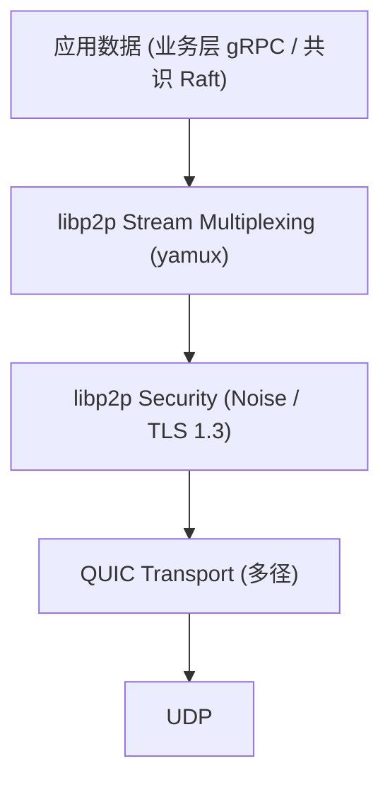
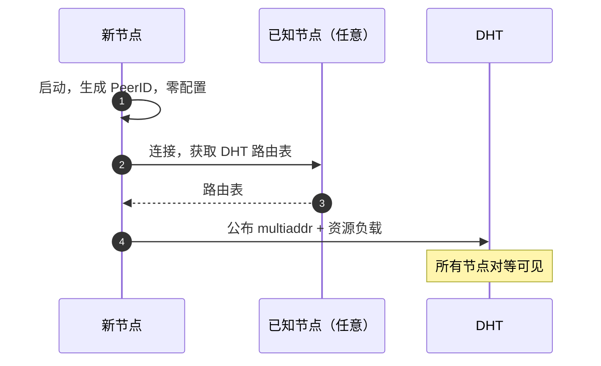
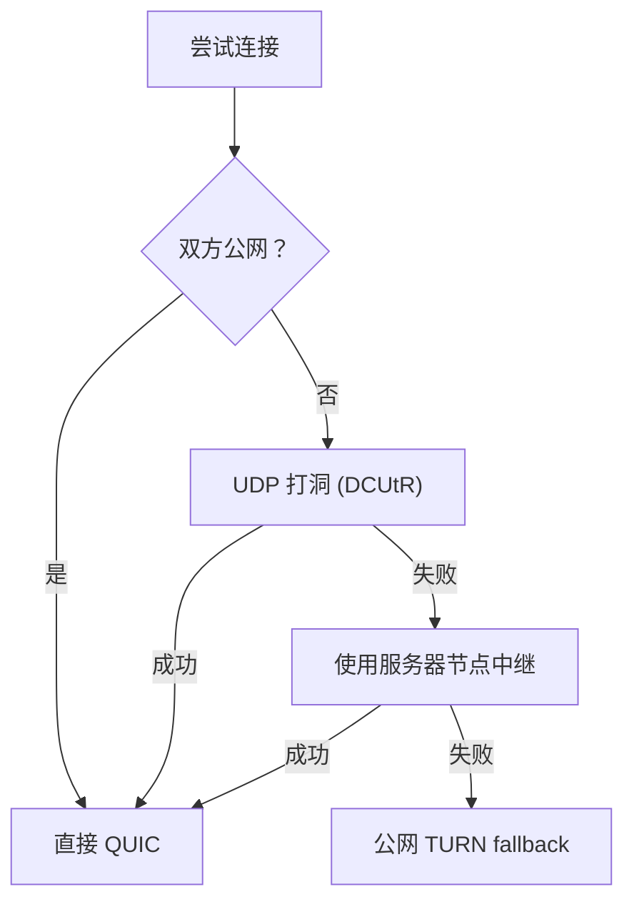
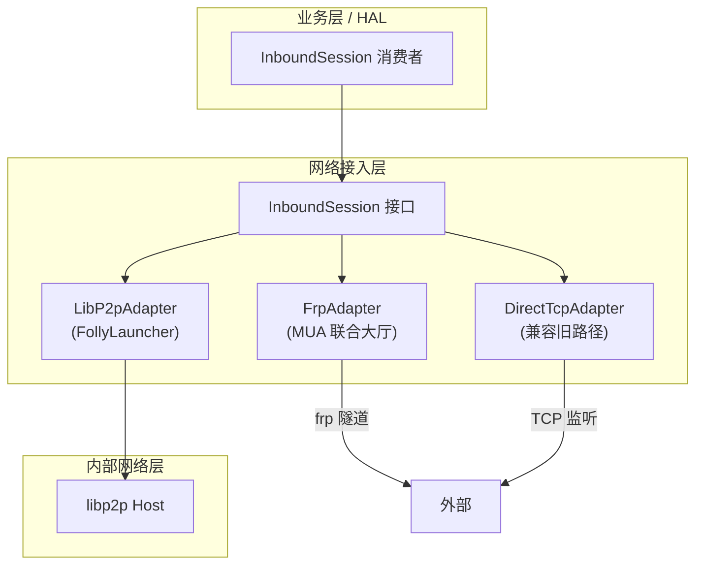
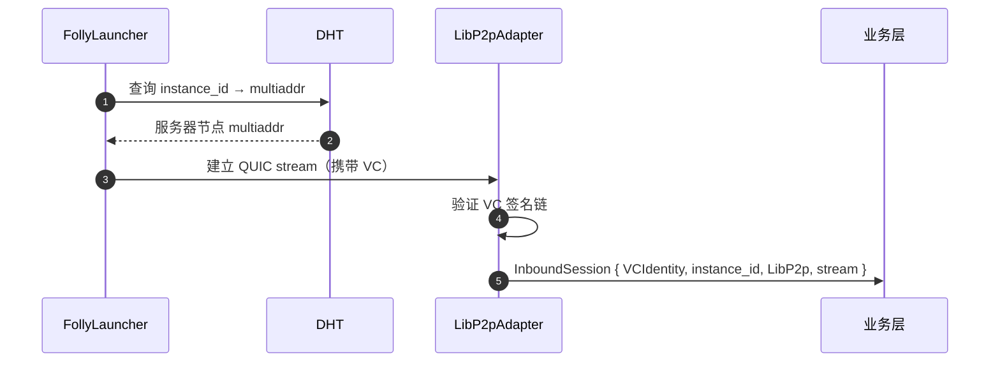
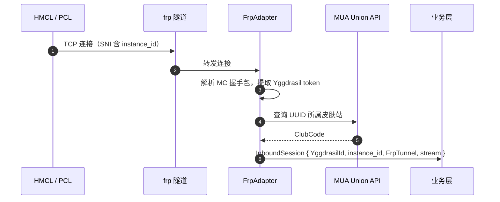

# 网络代理层

网络层分为两个子层，职责正交：

| 子层 | 参与者 | 解决的问题 |
| ---- | ------ | ---------- |
| **内部网络层** | 服务器节点、共识节点、引导节点 | 节点发现、加密传输、NAT 穿透、多路复用 |
| **网络接入层** | 所有外部客户端（FollyLauncher、HMCL/PCL 等） | 统一接入抽象，屏蔽底层传输差异 |

治理权限与网络拓扑正交——FollyLauncher 玩家在拓扑上是外部接入者，但持有 VC 时可参与治理；MUA 访客同样走接入层，但无治理权限。权限判断由业务层根据 VC 有无决定，接入层不感知。

## 内部网络层

内部网络用 **libp2p + QUIC** 构建，将服务器节点、共识节点、引导节点组成一张可寻址、可穿透、低延迟的对等网。**客户端节点不参与内部网络**。

### 核心协议栈

**设计决策：**

- **QUIC**：支持连接迁移，NAT 重绑定时不断连；多径支持适合"校园网+内网穿透"场景。
- **Noise 握手**：轻量级，比 TLS 握手更快，适合延迟敏感场景。
- **yamux 多路复用**：单连接承载多条逻辑流（业务数据、控制指令、心跳分通道走）。

### 节点对等性与寻址

::: warning 零配置原则
节点启动时不配置任何角色。物理机控制者无法通过修改配置来提升自身权限——节点能做什么，完全由它持有的 VC 决定，而 VC 由治理层多签签发。
:::

所有节点地位对等，启动后自动生成 PeerID 并加入 DHT，无需人工指定角色。节点的实际能力由持有的 VC 标记：

| VC 类型 | 签发条件 | 赋予能力 |
| ------- | -------- | -------- |
| 无 VC | 自动（任意节点） | 参与 DHT、承载实例、接受接入层连接 |
| `ConsensusCredential` | 治理层多签授权 | 加入 Raft 投票组 |

DHT 记录的键为节点 PeerID 的 SHA256 哈希，值为节点签名的 multiaddr 列表与当前资源负载。工作负载调度由共识层根据各节点上报的资源富余决定，不依赖角色标签。

### NAT 穿透策略

按优先级尝试（仅内部节点间）：

::: tip
中继节点不解析业务协议内容，只做 L4 转发。数据面端到端加密。
:::

### 多径连接

服务器节点都在校园网时，用 **QUIC Connection Migration + multipath extension**：

- 同时维护多条路径（WiFi + 有线 / 不同接口）
- 路径探测：每条路径独立发送 keepalive，测量 RTT
- 调度策略：
  - 实时业务数据走最低延迟路径
  - 文件传输（地图同步等）走最高带宽路径
- 路径故障切换 < 200 ms（QUIC 原生能力）

## 网络接入层

网络接入层是外部客户端进入系统的统一入口。所有接入方式最终都被抽象为 `InboundSession`，业务层和 HAL 只与该接口交互，不感知底层传输。

### InboundSession 接口

接入层向上层暴露统一的会话抽象，包含四个字段：

- **peer_identity**：对端身份。FollyLauncher 玩家通过 VC 验证，对应 `VCIdentity`；MUA 访客通过皮肤站查询，对应 `YggdrasilId`；未认证请求在接入层直接拒绝
- **instance_id**：目标实例标识，从 MC 握手包或 frp 路由规则中解析
- **transport**：标记底层传输来源（LibP2p、FrpTunnel、DirectTcp），仅用于日志和监控，不影响业务逻辑
- **stream**：双向字节流，业务层直接透传 MC 协议

业务层根据对端身份的变体决定治理权限，与传输来源无关。

### 接入适配器

#### LibP2pAdapter

FollyLauncher 客户端本地运行 libp2p host，通过内部网络层的 DHT 查询到目标服务器节点的 multiaddr，建立 QUIC stream。适配器从 stream 元数据中提取 VC，包装为 `VCIdentity`。

::: tip
FollyLauncher 客户端在拓扑上是外部接入者，不参与内部 DHT 路由。DHT 查询只读，不写入。
:::

#### FrpAdapter

MUA 联合大厅的玩家使用标准启动器（HMCL/PCL），通过 frp 隧道接入。frp 的虚拟主机名或 SNI 携带 `instance_id`，适配器负责：

1. 从 frp 路由规则中提取 `instance_id`
2. 解析 MC 握手包，获取 Yggdrasil token
3. 向 MUA Union API 查询 UUID → 皮肤站归属（`ClubCode`）
4. 包装为 `YggdrasilId`，交给业务层

#### DirectTcpAdapter

兼容当前"服务器节点直接监听 TCP"的旧路径，逻辑与 FrpAdapter 相同，差异仅在传输来源。新部署应优先使用 FrpAdapter；DirectTcp 在完成迁移后可移除。

### 横向扩展

新增接入方式只需在接入层注册一个适配器实现，暴露统一的会话接口即可。业务层不感知底层传输变化，无需任何改动。

未来可扩展的方向：WireGuard overlay、其他高校 MUA 联合大厅、WebSocket 接入（浏览器客户端）等。
