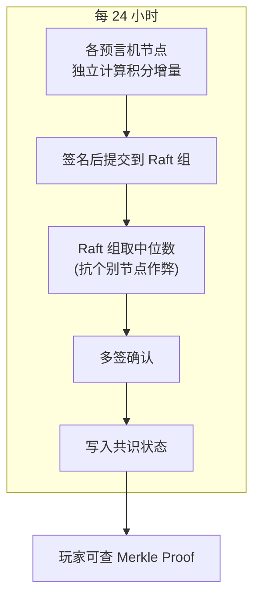
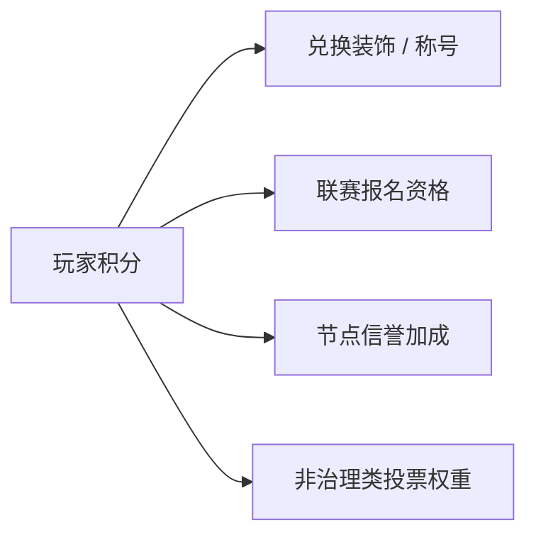

# 预言机 & 积分系统

预言机**客观度量玩家活跃度**，触发积分奖励，避免人工主观判断成为治理瓶颈。

## 预言机设计

### 数据采集

每个服务器节点运行预言机模块，从运行中的 MC 实例采集：

| 指标 | 采集方式 | 权重 |
| ---- | -------- | ---- |
| 在线时长 | MC 服务器日志 + 心跳 | 0.35 |
| 活跃行为 | 方块放置/破坏、移动距离 | 0.30 |
| 社交行为 | 聊天频率、玩家互动 | 0.15 |
| 建设贡献 | 建筑规模变化量(区块差异) | 0.20 |

### 工作流

### 抗作弊机制

- **取中位数而非平均数** — 防极端值。
- **至少 50% 节点一致** — 防少数节点串通。
- **异常波动检测** — 某玩家积分突增 > 3σ → 标记审查。
- **原始日志保留 7 天** — 提交的指标附带原始日志的 Merkle root,任何节点可验证。

## 积分模型

玩家积分是每日积分增量的累加。每日增量由四个维度加权求和：在线时长(权重 0.35)、活跃行为(0.30)、社交行为(0.15)、建设贡献(0.20)。

### 积分用途

::: tip 与共识层的关系
预言机数据本身不在共识协议下产生，但**数据落账走 Raft 共识**——保证所有节点对最终积分状态达成一致。数据可信性由预言机反作弊机制保证，数据一致性由 [Raft](./consensus.md) 保证。
:::
