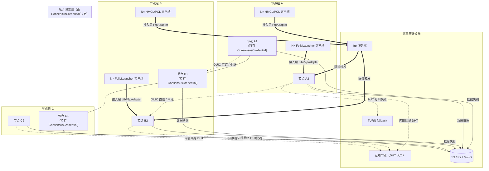
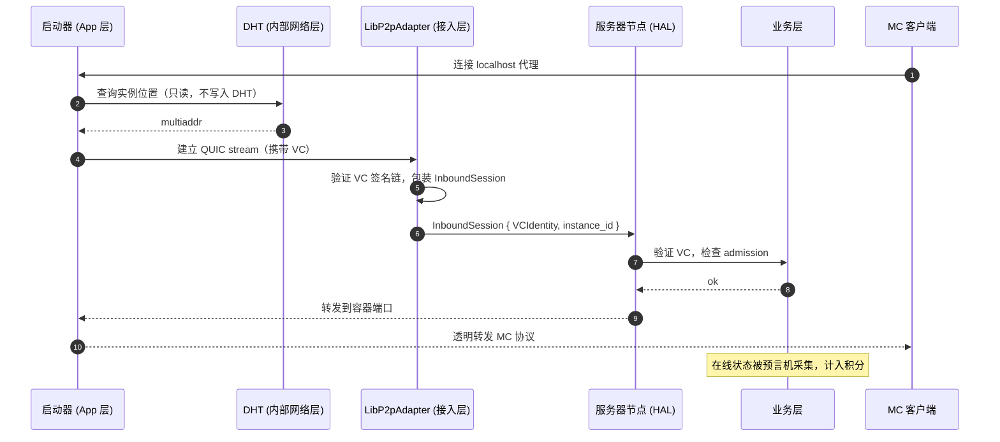
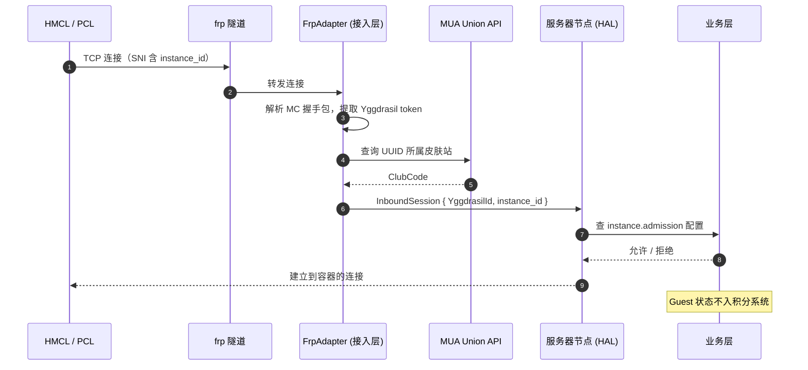

# 总体架构

本系统采用五层架构，**每层去中心化，都有明确的信任锚点**。

## 核心设计原则

- **去中心化**：不依赖中心服务。任意单节点宕机不影响系统运行。
- **零配置防篡改**：节点启动时不配置任何角色，物理机控制者无法通过修改配置提升权限。节点能做什么完全由治理层签发的 VC 决定。
- **信任锚点明确**：硬编码社长公钥是唯一根信任，其余权限通过签名链派生。
- **持久化与运行分离**：节点无状态，数据在 S3 + 共识日志，宕机重启即可恢复。
- **客观度量优先**：预言机用算法采集数据，降低治理摩擦。
- **平面对等**：所有节点地位平等，工作负载按资源富余调度，无预设主从之分。

## 分层视图

| 层 | 关键能力 | 详见 |
| ---- | --------- | ------ |
| 应用层 | 启动器 / 管理终端 / 联赛系统 | [客户端](./client) · [联赛](./tournament) |
| 业务层 | 实例编排 / 预言机 / 多签治理 | [业务层](./business) · [预言机](./oracle) · [治理](./governance) |
| HAL | Instance 抽象 / Docker 运行时 / 健康检查 | [HAL](./hal) |
| 网络接入层 | 统一 InboundSession 接口 / LibP2p·Frp·DirectTcp 适配器 | [网络层](./network#网络接入层) |
| 内部网络层 | libp2p + QUIC 多径 / DHT / NAT 穿透 / 中继 | [网络层](./network#内部网络层) |

## 拓扑结构

- **实线**：Raft 投票组内部通信，成员资格由 `ConsensusCredential` VC 决定，非配置项
- **虚线**：内部网络层——DHT 发现 / 节点间 libp2p 数据流（QUIC 多径，打洞失败走 TURN）
- **粗线**：网络接入层——外部客户端通过适配器接入，统一抽象为 InboundSession

::: tip 节点部署建议
所有节点软件相同，零配置启动。高在线率的机器（云服务器）适合申请 `ConsensusCredential`；高性能机器自然获得更多实例调度权重。这是建议，不是强制分工。
:::

## 端到端工作流

### 方式一：FollyLauncher（VC 玩家）

### 方式二：标准启动器（MUA 访客）

任一层故障都有兜底：接入层切换适配器、网络层切中继、HAL 触发实例迁移、共识层重新调度。
