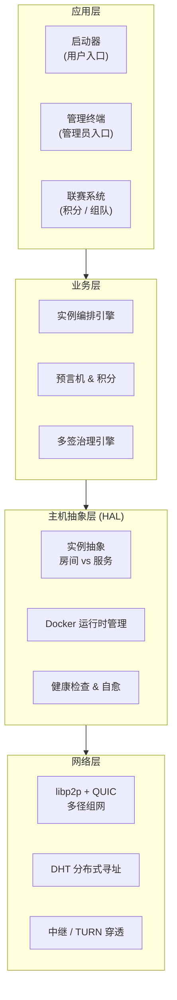
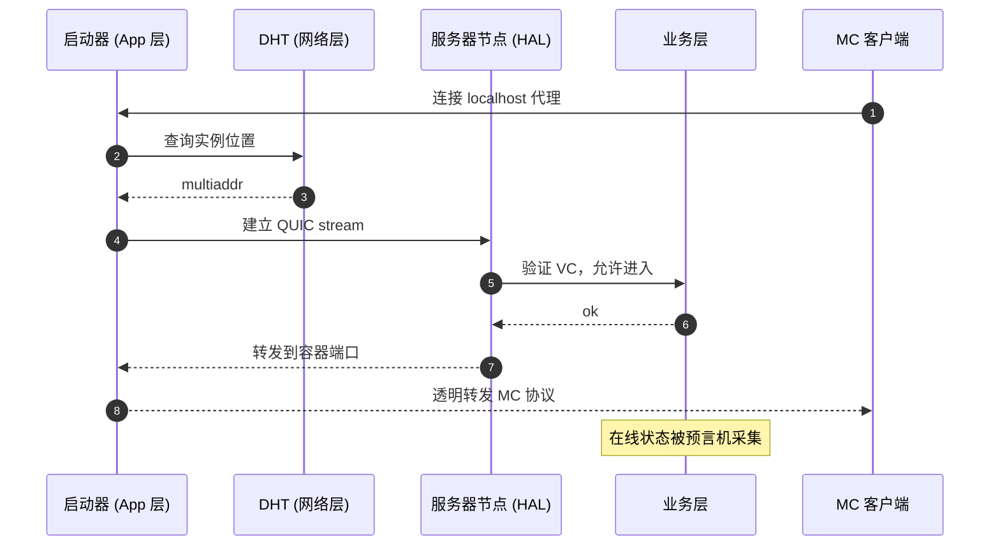

# 总体架构

JLUCraft 基础设施采用四层架构，**每层去中心化，都有明确的信任锚点**。

## 分层视图

| 层 | 关键能力 | 详见 |
| ---- | --------- | ------ |
| 应用层 | 启动器 / 管理终端 / 联赛系统 | [客户端](./client.md) · [联赛](./tournament.md) |
| 业务层 | 实例编排 / 预言机 / 多签治理 | [业务层](./business.md) · [预言机](./oracle.md) · [治理](./governance.md) |
| HAL | Instance 抽象 / Docker 运行时 / 健康检查 | [HAL](./hal.md) |
| 网络层 | libp2p + QUIC 多径 / DHT / 中继 | [网络层](./network.md) |

## 架构总图

## 端到端的一次"加入服务器"

玩家点击"加入"后发生的事，串起所有层：

任一层故障都有兜底：网络层切中继、HAL 触发实例迁移、共识层重新调度。

## 核心设计原则

- **去中心化**：不依赖中心服务。引导节点宕机只影响新节点加入。
- **信任锚点明确**：硬编码社长公钥是唯一根信任，其余权限通过签名链派生。
- **持久化与运行分离**：节点无状态，数据在 S3 + 共识日志，宕机重启即可恢复。
- **客观度量优先**：预言机用算法而非人工统计，降低治理摩擦。
- **平面对等**：各节点地位平等，无主从之分。
