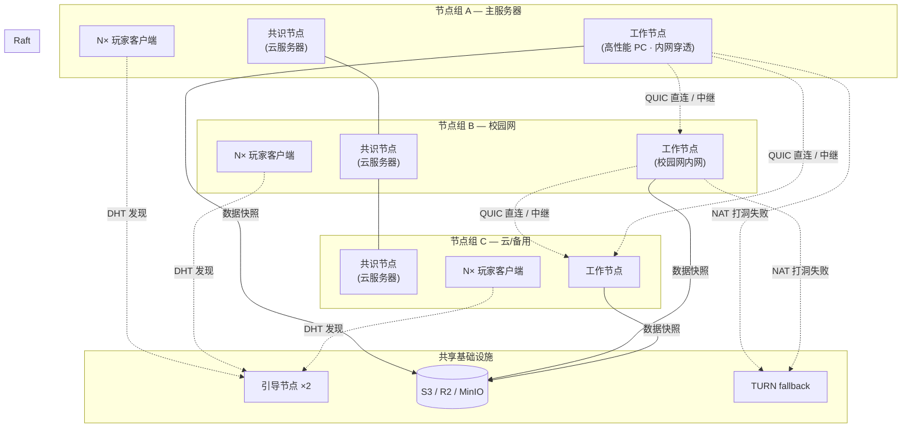
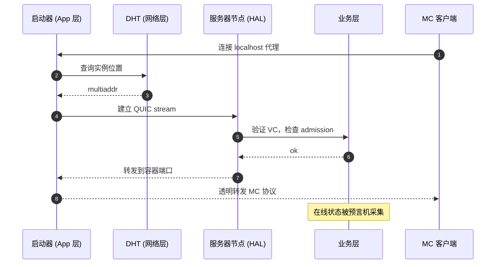
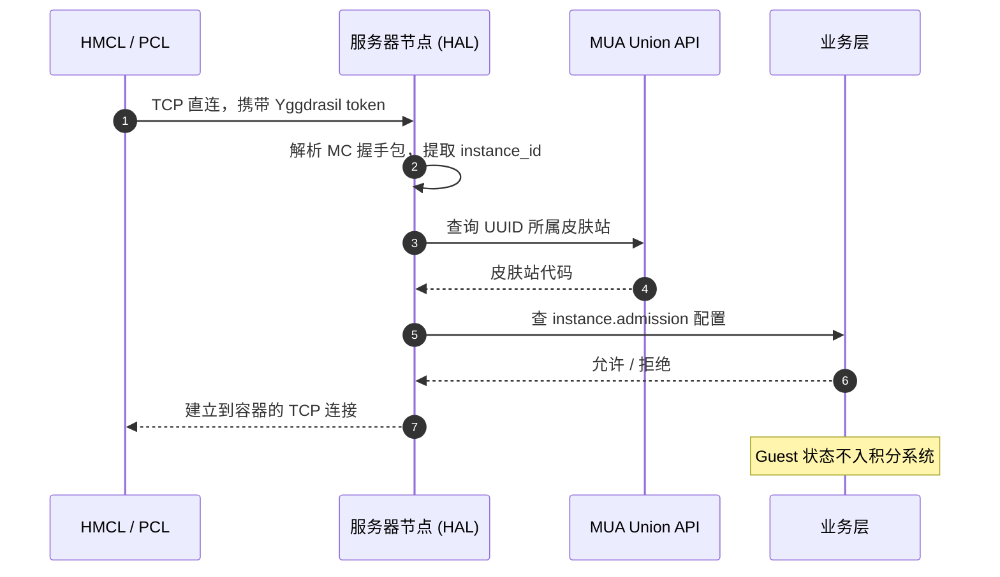

# 总体架构

本系统采用四层架构，**每层去中心化，都有明确的信任锚点**。

## 核心设计原则

- **去中心化**：不依赖中心服务。引导节点宕机只影响新节点加入。
- **信任锚点明确**：硬编码社长公钥是唯一根信任，其余权限通过签名链派生。
- **持久化与运行分离**：节点无状态，数据在 S3 + 共识日志，宕机重启即可恢复。
- **客观度量优先**：预言机用算法采集数据，降低治理摩擦。
- **平面对等**：各节点地位平等，无主从之分。

## 分层视图

| 层 | 关键能力 | 详见 |
| ---- | --------- | ------ |
| 应用层 | 启动器 / 管理终端 / 联赛系统 | [客户端](./client) · [联赛](./tournament) |
| 业务层 | 实例编排 / 预言机 / 多签治理 | [业务层](./business) · [预言机](./oracle) · [治理](./governance) |
| HAL | Instance 抽象 / Docker 运行时 / 健康检查 | [HAL](./hal) |
| 网络层 | libp2p + QUIC 多径 / DHT / 中继 | [网络层](./network) |

## 拓扑结构

- **实线**：共识组之间的 Raft 通信（低延迟、高可靠）
- **虚线**：DHT 发现 / 节点间 libp2p 数据流（QUIC 多径，打洞失败走 TURN）
- **引导节点**：仅作 DHT 入口，不转发游戏数据

| 节点角色 | 推荐位置 | 关键考量 |
| -------- | -------- | -------- |
| 引导节点 | 公网 VPS，廉价小内存即可 | 必须有公网 IP，带宽足够支撑 DHT 查询 |
| 共识节点 | 社团云服务器 | 在线率 ≥ 99%、低延迟、稳定 |
| 工作节点 | 校园网 / 宿舍 PC | 性能优先，内网穿透由网络层处理 |
| TURN fallback | 公网 VPS | 仅打洞失败时启用，带宽消耗大 |

## 端到端工作流

### 方式一：FollyLauncher（VC 玩家）

### 方式二：标准启动器（MUA 访客）

任一层故障都有兜底：网络层切中继、HAL 触发实例迁移、共识层重新调度。
