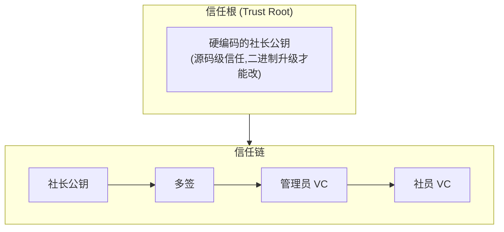

# 安全边界

**信任根硬编码、信任链密码学验证、威胁靠分层机制兜底**。

## 信任模型概览

所有操作都可追溯到多签或有效 VC 的身份。

## 威胁分类与应对

| 威胁 | 来源 | 应对机制 | 详见 |
| ---- | ---- | -------- | ---- |
| 单一社团背叛 | 内部 | 多签门槛 (2/3) | [治理](./governance.md) |
| 管理员越权 | 内部 | 社长多签确认 | [治理](./governance.md) |
| 社员身份冒充 | 外部 | VC 链 + 吊销列表 | [治理](./governance.md) |
| 节点作恶 / 离线 | 内部 | 信誉分 + Raft 多数 | [共识](./consensus.md) |
| 预言机作弊 | 内部 | 中位数 + 3σ 检测 | [预言机](./oracle.md) |
| 网络窃听 | 外部 | QUIC 端到端加密 | [网络层](./network.md) |
| 中继窥探 | 外部 | 中继仅转发密文 | [网络层](./network.md) |
| 私钥泄露 | 物理 | TEE 保护 + 多签吊销 | [客户端架构](./client.md) |

## 关键边界

- **信任根**:三个社长公钥硬编码,任意修改需要三方都重新发布二进制——物理边界。
- **执行边界**:任何"破坏式"操作(停服、更换管理员、改预言机权重)都必须穿过多签 → Raft commit → 全网广播,单点无法直接执行。
- **数据边界**:玩家私有数据(密钥、VC 私钥)永不上链;链上记录的是公钥与签名摘要。
- **观察边界**:中继节点只看到加密的 QUIC 报文,不能区分游戏数据、聊天、文件传输。

## 故障假设

- **容忍** ≤ 1 个共识节点离线 (3 节点组),≤ 2 个 (5 节点组),≤ 3 个 (7 节点组)。
- **不假设容忍** ≥ 2 个社长串谋(因为这达到了多签阈值,本质上不再是"作恶")。
- **不假设容忍** 全部预言机节点同时被攻陷(取中位数无法纠正所有节点同步作弊)。

::: warning 二进制信任
信任根硬编码意味着**信任二进制本身**:

- 二进制构建走 reproducible build,任何节点可以验证。
- 节点首次接入时从多个公开源比对哈希。
:::
