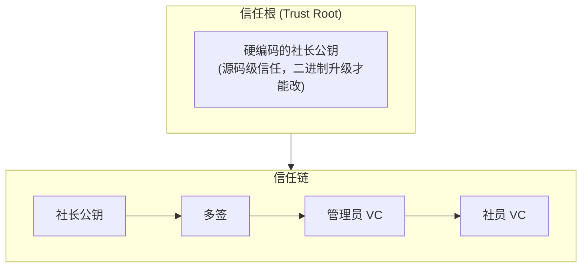
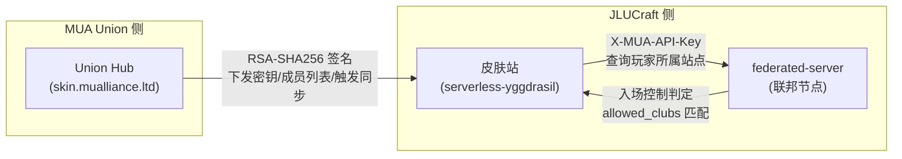

# 安全边界

**信任根硬编码，信任链密码学验证，威胁靠分层机制兜底**。

## 信任模型概览

所有操作都可追溯到多签签名或有效 VC 的身份。

## 威胁分类与应对

| 威胁 | 来源 | 应对机制 | 详见 |
| ---- | ---- | -------- | ---- |
| 单一社团背叛 | 内部 | 多签门槛 (2/3) | [治理](./governance) |
| 管理员越权 | 内部 | 社长多签确认 | [治理](./governance) |
| 社员身份冒充 | 外部 | VC 链 + 吊销列表 | [治理](./governance) |
| 节点作恶 / 离线 | 内部 | 信誉分 + Raft 多数 | [共识](./consensus) |
| 预言机作弊 | 内部 | 中位数 + 3σ 检测 | [预言机](./oracle) |
| 网络窃听 | 外部 | QUIC 端到端加密 | [网络层](./network) |
| 中继窥探 | 外部 | 中继仅转发密文 | [网络层](./network) |
| 私钥泄露 | 物理 | TEE 保护 + 多签吊销 | [客户端架构](./client) |
| MUA 访客越权 | 外部 | 实例准入控制 + 无 VC = 无治理权 | [HAL](./hal) |

## 身份分层边界

平台采用**游戏身份**与**治理身份**分离的双层模型：

- **游戏层（Yggdrasil）**：由皮肤站签发，解决"谁能进服务器玩游戏"
- **治理层（VC）**：由社长多签控制，解决"谁有权限投票、创建服务、管理联赛"

关键原则：**Guest（纯 Yggdrasil 玩家）在任何情况下都不能获得治理权限**。即使 MUA 皮肤站被攻破，攻击者最多只能以 Guest 身份进入标记为 `mua_member` 或 `public` 的实例，无法影响共识、无法签发 VC、无法操作实例生命周期。

### 身份入口：皮肤站

皮肤站（[serverless-yggdrasil](https://github.com/JLUCraft/serverless-yggdrasil)）基于 Cloudflare Workers 部署，是系统的**身份入口**，提供游戏层全部认证能力：

| 协议 | 用途 | 受众 |
| --- | --- | --- |
| Yggdrasil API | 标准 Minecraft 登录 / 会话 / 材质 | 所有启动器 |
| MUA Union Member API | 跨站点身份互通、联合认证 | Union Hub / federated-server |

皮肤站不在四层架构内——它是独立的 serverless 服务，通过 API 与联邦节点协作。

### MUA Union 联合认证原理

皮肤站作为 [MUA Union](https://docs.mualliance.cn/zh/dev/union/auth) 的**成员皮肤站**，遵循 Union 联合认证协议，实现跨站点身份互通。核心原理如下：

1. **成员注册与密钥握手**：皮肤站管理员配置站点信息后联系 Union 管理员审批。Union Hub 通过 `/member/updatebackendkey` 下发后端通信密钥与 Union 公钥，此后所有 member 端点请求均需 RSA-SHA256 签名验证方可放行。

2. **成员列表同步**：Union Hub 通过 `/member/updatelist` 下发全量成员站点列表。皮肤站据此建立信任站点白名单，用于跨站 profile 查询的去重与路由。

3. **签名验证链**：Union Hub 发往皮肤站的每个请求携带 `X-Message-Signature`（RSA 签名）、`X-Message-Timestamp`（时间戳）、`X-Message-Nonce`（一次性值）。皮肤站验证时间窗口 ±10s/+30s、Nonce 60s 重放防护、RSA-PKCS1v1.5 SHA-256 验签，三重校验确保请求来源真实。

4. **跨站身份查询**：federated-server 在实例入场控制时，通过 `/api/mua/profile/name/<username>` 查询玩家所属皮肤站，携带 `X-MUA-API-Key` 进行机器间认证。皮肤站返回玩家 UUID 与所属站点代码，federated-server 据此匹配 `allowed_clubs` 配置决定准入。

**信任链**：MUA Union Hub（根信任）→ 皮肤站（成员站点，签名验证）→ federated-server（入场控制，身份查询）。每跳均有密码学验证，不存在裸信任传递。

> 实现细节（端点列表、签名验证流程、跨站查询格式等）见 [皮肤站 — MUA Union Auth 集成](../components/skin-station/#mua-union-auth-集成)。

## 关键边界

- **信任根**：核心管理成员公钥硬编码，任意修改需要全体核心成员重新发布二进制——物理边界。
- **执行边界**：任何"破坏式"操作（停服、更换管理员、改预言机权重）都必须穿过多签 → Raft commit → 全网广播，单点无法直接执行。
- **数据边界**：玩家私有数据（密钥、VC 私钥）永不上链；链上记录的是公钥与签名摘要。
- **观察边界**：中继节点只看到加密的 QUIC 报文，不能区分游戏数据、聊天、文件传输。
- **准入边界**：实例级别的 `admission` 配置由管理员在创建时设定，写入 Raft 日志。节点执行入站代理时必须按此配置校验，不能擅自放宽。

## 故障假设

- **容忍** ≤ 1 个共识节点离线（3 节点组），≤ 2 个（5 节点组），≤ 3 个（7 节点组）。
- **不假设容忍** ≥ 2 个管理成员串谋（因为这达到了多签阈值，本质上不再是"作恶"）。
- **不假设容忍** 全部预言机节点同时被攻陷（取中位数无法纠正所有节点同步作弊）。

::: warning 二进制信任
信任根硬编码意味着**信任二进制本身**:

- 二进制构建走可重现构建（reproducible build），任何节点可以验证。
- 节点首次接入时从多个公开源比对哈希。
:::
