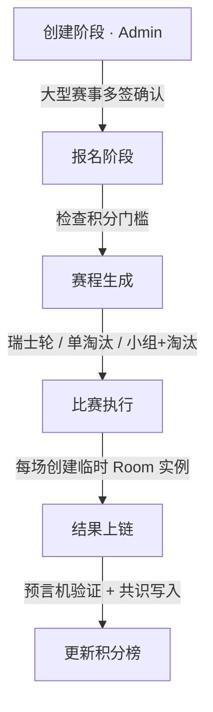

# 联赛系统

联赛系统建立在底层系统之上，用 Instance + 共识 + 预言机搭建带积分约束的 PvP 和创意比赛流程。

## 数据模型

联赛数据模型包含三个核心对象：

**赛事（Tournament）** 定义比赛的基本信息：名称、游戏类型（skywars / bedwars / parkour / build_battle）、比赛模式（单人 / 双人 / 四人组队）、赛程安排（报名起止时间、各轮次时间和地图）、计分规则（胜利/击杀/生存奖励）、参赛门槛（要求的最低积分）、最大参赛人数、状态（draft / registration / ongoing / completed）。

**比赛（Match）** 是赛事中的一场具体对局：所属赛事、轮次、参赛者列表、关联的临时 MC 实例、比赛结果（排名、得分、击杀数）、状态（scheduled / live / finished / disputed）。

**队伍（Team）** 由 2–4 名玩家组成：队伍名称、成员列表、队内总积分、参加过的赛事列表。

## 比赛流程

各阶段细节：

- **创建阶段** —— 管理员选择游戏类型、地图、赛制、积分规则；设置报名窗口；大型赛事走多签确认。
- **报名阶段** —— 玩家在启动器联赛面板报名，自动检查积分门槛；单人赛直接报，组队赛队长报。
- **赛程生成** —— 根据报名人数自动生成赛程表，推送到所有参赛者。
- **比赛执行** —— 每场自动创建临时 MC 实例（"房间"类型），参赛者通过启动器一键加入；服务器端自动记录比赛数据（击杀、死亡、胜利条件）；比赛结束自动结算积分、生成排名。
- **结果上链** —— 比赛结果经预言机节点验证，写入共识层不可篡改，更新玩家/队伍赛季积分。

## 赛季 & 排行榜

**赛季(Season)** 包含名称(如"2026 Spring")、起止日期、关联赛事列表、排行榜(分单人榜和队伍榜，记录总积分和参赛次数)。排行榜实时从共识状态读取，无额外共识开销。

## 与其他层的协作

| 阶段 | 协作的层 |
| ---- | -------- |
| 创建大型赛事 | [治理层](./governance) — 需要多签确认 |
| 创建临时 MC 实例 | [HAL](./hal) — Room 类型 Instance |
| 自动采集比赛数据 | [预言机](./oracle) — 客观指标 |
| 结果上链 | [共识层](./consensus) — Raft 写入 |
